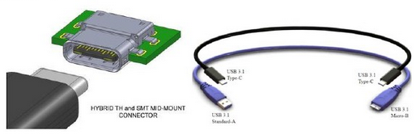
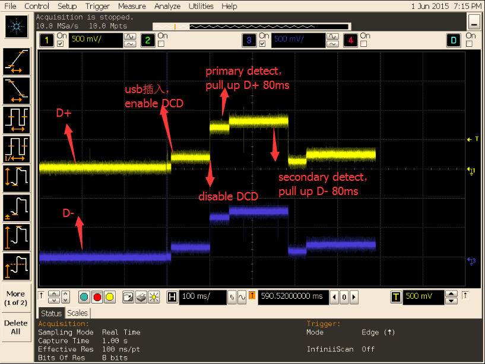

# Rockchip Linux USB Developer Guide

ID: RK-KF-YF-097

Release Version: V1.2.2

Release Date: 2020-02-19

Security Level: □Top-Secret   □Secret   □Internal   ■Public

---

**DISCLAIMER**

THIS DOCUMENT IS PROVIDED “AS IS”. FUZHOU ROCKCHIP ELECTRONICS CO., LTD.(“ROCKCHIP”)DOES NOT PROVIDE ANY WARRANTY OF ANY KIND, EXPRESSED, IMPLIED OR OTHERWISE, WITH RESPECT TO THE ACCURACY, RELIABILITY, COMPLETENESS,MERCHANTABILITY, FITNESS FOR ANY PARTICULAR PURPOSE OR NON-INFRINGEMENT OF ANY REPRESENTATION, INFORMATION AND CONTENT IN THIS DOCUMENT. THIS DOCUMENT IS FOR REFERENCE ONLY. THIS DOCUMENT MAY BE UPDATED OR CHANGED WITHOUT ANY NOTICE AT ANY TIME DUE TO THE UPGRADES OF THE PRODUCT OR ANY OTHER REASONS.

**Trademark Statement**

"Rockchip", "瑞芯微", "瑞芯" shall be Rockchip’s registered trademarks and owned by Rockchip. All the other trademarks or registered trademarks mentioned in this document shall be owned by their respective owners.

**All rights reserved. ©2019. Fuzhou Rockchip Electronics Co., Ltd.**

Beyond the scope of fair use, neither any entity nor individual shall extract, copy, or distribute this document in any form in whole or in part without the written approval of Rockchip.

Fuzhou Rockchip Electronics Co., Ltd.

No.18 Building, A District, No.89, software Boulevard Fuzhou, Fujian,PRC

Website:     [www.rock-chips.com](http://www.rock-chips.com)

Customer service Tel:  +86-4007-700-590

Customer service Fax:  +86-591-83951833

Customer service e-Mail:  [fae@rock-chips.com](mailto:fae@rock-chips.com)

---

**Preface**

**Overview**

The purpose of this manual is to show you the hardware circuits of USB, how to configure the USB in Kernel, and help you to develop and debug the driver of USB PHYs and Controllers quickly.

**Product version**

| Chipset name                                                 |    Kernel version     |
| :----------------------------------------------------------- | :-------------------: |
| RK3399、RK3368、RK3366、RK3328、RK3288、RK312X、RK3188、RK30XX、RK3308、RK3326、PX30 | Linux-4.4、Linux-4.19 |

**Intended Audience**

This document (this guide) is mainly intended for:

Technical support engineers
Software development engineers
Hardware development engineers

**Revision history**

| Date       | Version | Author                 | Revision description                                         |
| ---------- | ------- | ---------------------- | ------------------------------------------------------------ |
| 2017-12-22 | v1.0    | william.wu, frank.wang | The initial version                                          |
| 2018-06-08 | v1.1    | william.wu             | Support RK3308、RK3326、PX30<br />Correct formats and errors |
| 2019-03-11 | v1.2    | william.wu             | Fix style issues by markdownlint                             |
| 2019-11-12 | v1.2.1  | william.wu             | Modify document name，support Linux-4.19                     |
| 2020-02-19 | v1.2.2  | william.wu             | Add DISCLAIMER，Trademark Statement, etc.                    |

---
[TOC]

## 1 Overview

### 1.1 USB Controllers IP

Rockchip SOC usually has several USB controllers built in, and different controllers are independent of each other. Please get detailed information in the chip TRM. Because some USB controllers have limitations on usage, it is important to clarify the requirements of the scheme and the limitations of the controller before determining the design scheme of USB. The built-in USB controllers of each chip are shown in Table 1-1.

Table 1‑1 USB Controllers List

| **Chip** | **USB 2.0 HOST（EHCI&OHCI）** | **USB HSIC（EHCI）** | **USB 2.0/3.0 OTG（DWC3/XHCI）** | **USB 2.0 OTG （DWC2）** |
| :------: | :---------------------------: | :------------------: | :------------------------------: | :----------------------: |
|  RK3399  |              ×2               |          ×1          |                ×2                |            0             |
|  RK3368  |              ×1               |          ×1          |                0                 |            ×1            |
|  RK3366  |              ×1               |          0           |                ×1                |            ×1            |
|  RK3328  |              ×1               |          0           |                ×1                |            ×1            |
|  RK3288  |               0               |          ×1          |                0                 |      ×2（HOST+OTG）      |
|  RK312X  |              ×1               |          0           |                0                 |            ×1            |
|  RK3188  |              ×1               |          ×1          |                0                 |            ×1            |
|  RK30XX  |              ×1               |          0           |                0                 |            ×1            |
|  RK3308  |              ×1               |          0           |                0                 |            x1            |
|  RK3326  |               0               |          0           |                0                 |            x1            |
|   PX30   |              x1               |          0           |                0                 |            x1            |

### 1.2 USB 2.0 Host

Compatible Specification

- Universal Serial Bus Specification, Revision 2.0

- Enhanced Host Controller Interface Specification(EHCI), Revision 1.0

- Open Host Controller Interface Specification(OHCI), Revision 1.0a

Features

- Support high-speed(480Mbps), full-speed(12Mbps) andlow-speed(1.5Mbps)


Figure 1-1 USB 2.0 Host Controller Block Diagram


Figure 1-2 USB 2.0 PHY Block Diagram

### 1.3 USB 2.0 OTG

Compatible Specification

- Universal Serial Bus Specification, Revision 2.0

Features

- Operates in High-Speed and Full-Speed mode

- Support 9 channels in host mode

- 9 Device mode endpoints in addition to control endpoint 0, 4 in, 3 out and 2 IN/OUT

- Built-in one 1024x35 bits FIFO

- Internal DMA with scatter/gather function

- Supports packet-based, dynamic FIFO memory allocation for endpoints for flexible, efficient use of RAM

- Support dynamic FIFO sizing

- Support Battery Charge in device role

- Support Uart Bypass Mode


Figure 1‑3 USB 2.0 OTG Block Diagram

### 1.4 USB 2.0 PHY

Host Port: used for USB 2.0 host controller

OTG Port: used for USB 3.0 OTG controller with TypeC PHY to compriseas fully feature TypeC

### 1.5 USB 3.0 OTG

Compatible Specification

- Universal Serial Bus 3.0 Specification, Revision 1.0

- Universal Serial Bus Specification, Revision 2.0

- eXtensible Host Controller Interface for Universal Serial Bus(xHCI), Revision 1.1

DWC3 Features

- Support Control/Bulk(including stream)/Interrupt/IsochronousTransfer

- Simultaneous IN and OUT transfer for USB 3.0, up to 8Gbps bandwidth

- Descriptor Caching and Data Pre-fetching

- USB 3.0 Device Features

- Up to 7 IN endpoints, including control endpoint 0

- Up to 6 OUT endpoints, including control endpoint 0

- Up to 13 endpoint transfer resources, each one for each endpoint

- Flexible endpoint configuration for multiple applications/USBset-configuration modes

- Hardware handles ERDY and burst

- Stream-based bulk endpoints with controller automatically initiatingdata movement

- Isochronous endpoints with isochronous data in data buffers

- Flexible Descriptor with rich set of features to support bufferinterrupt moderation, multiple transfers, isochronous, control, and scatteredbuffering support

USB 3.0 xHCI Host Features

- Support up to 64 devices

- Support 1 interrupter

- Support 1 USB 2.0 port and 1 Super-Speed port

- Concurrent USB 3.0/USB 2.0 traffic, up to 8.48Gbps bandwidth

- Support standard or open-source xHCI and class driver

- Support xHCI Debug Capability

- USB 3.0 Dual-Role Device (DRD) Features

- Static Device operation

- Static Host operation

- USB 3.0/USB 2.0 OTG A device and B device basing on ID

- UFP/DFP and Data Role Swap Defined in USB TypeC Specification

- Not support USB 3.0/USB 2.0 OTG session request protocol(SRP), hostnegotiation protocol(HNP) and Role Swap Protocol(RSP)


Figure 1‑4 USB 3.0 OTG Block Diagram

### 1.6 Type-C USB 3.0 PHY

- Support USB 3.0 (SuperSpeed only)

- Support DisplayPort 1.3 (RBR, HBR and HBR2 data rates only)

- Support DisplayPort AUX channel

- Support USB TypeC and DisplayPort Alt Mode

- Support DisplayPort Alt Mode on TypeC A, B, C, D, E and F pinassignments

- Support Normal and Flipped orientation


Figure 1‑5 TypeC PHY Block Diagram

---

## 2 Hardware Circuits and Signals

### 2.1 USB 2.0 HOST Hardware Circuits

This chapter introduces the hardware circuit design and signal of USB 2.0 HOST. According to the type of USB 2.0 PHY used, it can be divided into common USB 2.0 HOST hardware circuit and USB 2.0 HSIC hardware circuit.

#### 2.1.1 Common USB 2.0 HOST Hardware Circuit

USB 2.0 works at 480MHz clock, it is suggested that the width of USB 2.0 DP/DM lines should be 7-8 MIL and 90 Ω impedance differential. It is better to layout on the surface layer and cover the ground, and no interference source on the edge and no other signal line on the right upper and lower layers.

The hardware signal reference circuit of USB 2.0 HOST controller is shown in Figure 2-1, and the VBUS control circuit and interface circuit of USB 2.0 HOST are shown in Figure 2-2（Reference to RK3399 EVB）.


Figure 2‑1 USB 2.0 HOST pin in SoC


Figure 2‑2 USB 2.0 HOST VBUS control circuit and interface circuit

#### 2.1.2 USB 2.0 HSIC Hardware Circuit

HSIC (High Speed Inter Chip) uses 240 MHz DDR signal, so the transmission rate is 480 Mbps, the same as USB 2.0, and the typical line impedance is 50 Ω. It is suggested that the maximum length of the line should not exceed 10 cm on the PCB.

As shown in Figure 2-3, USIC_STROBE is 240MHz DDR signal line, USIC_DATA is data line. The power supply voltage is only 0.9V and 1.2V, and standard voltage of signal transmission is 1.2V, which has lower power consumption than USB 2.0 PHY.


Figure 2‑3 USB 2.0 HSIC pin in SoC

### 2.2 USB 2.0/3.0 OTG Hardware Circuits

#### 2.2.1 USB 2.0 OTG Hardware Circuit

The complete USB 2.0 OTG reference circuit is shown in Figures 2-4 ～ 2-7（Reference to PX30 EVB）.


Figure 2-4 USB 2.0 OTG pin in SoC


Figure 2-5  USB 2.0 OTG Micro-Interface


Figure 2-6  USB 2.0 OTG_DET circuit


Figure 2-7 USB 2.0 OTG_DRV circuit

- OTG_DP/OTG_DM: USB differential signal D+/D-, need to place 2.2Ω series resistance on each signal line.
- USB_DET: Input signal, used for OTG Peripheral mode to determine whether to connect to Host or USB charger. Default is low level 0V. If connect to Host or USB charger, the high level is 3.0 ~ 3.2 V.
- USB_ID: Input signal, used to determine whether to switch to Host mode or Peripheral mode. Default is high level 1.8V (pull-up inside chip), and OTG works as Peripheral mode. The USB_ID will be pull-down to the ground if connect with OTG-Host cable, and the USB driver will swith OTG to Host mode if the USB_ID level changes from high to low voltage.
- USB_RBIAS: Base resistance of USB 2.0 PHY. Because the resistance of the resistor will affect the amplitude of the USB signal, so please strictly follow the resistance design of the SDK reference schematic diagram.
- VCC5V0_OTG:  When OTG work as Peripheral mode, it's the input origin signal of USB_DET. When OTG work as Host mode, it's supply VBUS 5V for USB Devices.
- USB_AVDD_1V0/USB_AVDD_1V8/USB_AVDD_3V3: Power supply for USB 2.0 PHY.

#### 2.2.2 USB 3.0 OTG Hardware Circuit

The maximum transmission rate of USB 3.0 OTG is 5Gbps, which is downward compatible with USB 2.0 OTG function. The physical interface is Type-C or Type-A. The USB 3.0 OTG supports 4-wire differential signal lines up to 3 meters and 11-inch PCB. In order to avoid interference and reduce electromagnetic interference, the 5Gbps signal is transmitted by differential signal on long cable.

Figure 2-8 ~ 2-13 is the Type-C USB 3.0 related circuit design of RK3399 platform.




Figure 2‑8 Type-C interface definition


Figure 2‑9 USB 3.0 OTG pin in SoC


Figure 2‑10 USB 3.0 OTG Type-C interface


Figure 2‑11 USB 3.0 Type-C CC detection circuit（FUSB302）


Figure 2‑12 USB 3.0 VBUS Control Circuit-1（Control by GPIO）


Figure 2‑13 USB 3.0 VBUS Control-2（Control by RK818）

---
## 3 Kernel USB CONFIG

The configuration and saving of the USB module is the same as the other kernel modules.

Import the default configuration：

```sh
make ARCH=arm64 rockchip_defconfig
```

Select kernel configuration：

```sh
make ARCH=arm64 menuconfig
```

Save the configuration：

```sh
make ARCH=arm64 savedefconfig
```

Use the defconfig instead of the rockchip_defconfig

### 3.1 USB PHY CONFIG

```makefile

Device Drivers  --->
	PHY Subsystem  --->
		...
		<*>	Rockchip INNO USB2PHY Driver
		...
		<*>	Rockchip TYPEC PHY Driver
		...
		<*>	Rockchip INNO USB 3.0 PHY Driver

```

"Rockchip INNO USB2PHY Driver" is used for USB 2.0 PHY with Innosilicon IP block；

“Rockchip TYPEC PHY Driver” is used for USB 3.0 PHY IP block, e.g. RK3399;

"Rockchip INNO USB 3.0 PHY Driver" is used for USB 3.0 PHY with Innosilicon IP block, e.g. RK3328；

### 3.2 USB HOST CONFIG

```makefile

Device Drivers  --->
		[*] USB support  --->
		-*-	Support for Host-side USB
		...
		<*>	xHCI HCD (USB 3.0) support
		-*-	Generic xHCI driver for a platform device
		...
		<*>	EHCI HCD (USB 2.0) support
		[ ]		Root Hub Transaction Translators
		[*]		Improved Transaction Translator scheduling
		<*>	Generic EHCI driver for a platform device
		...
		<*>	OHCI HCD (USB 1.1) support
		< >		OHCI support for PCI-bus USB controllers
		<*>		Generic OHCI driver for a platform device

```

Select the "USB support" first to add core support for USB.

Select the "Supportfor Host-side USB" to add core support for USB HOST.

Select the OHCI configurations to support USB 1.1 HOST.

Select the EHCI configurations to support USB 2.0 HOST.

Seletc the xHCI configurations to support USB 3.0 HOST.

Note: In order to cut the Kernel core, the rk3308_linux_defconfig used for RK3308 doesn't support USB HOST. But actually, RK3308 SoC integrates one USB 2.0 Host controller (EHCI&OHCI). Select the OHCI/EHCI configurations and the related device class drivers if you want to use USB 2.0 HOST interface on RK3308 Board.

### 3.3 USB OTG CONFIG

Select the “DesignWare USB2 DRD Core Support” and the mode for USB 2.0 OTG controller driver.

Select the “DesignWare USB3 DRD Core Support“ and the mode for USB 3.0 OTG Controller driver.

```makefile

Device Drivers  --->
	-*-	Support for Host-side USB
	[*] USB support  --->
		...
		<*>	DesignWare USB2 DRD Core Support
				DWC2 Mode Selection (Dual Role mode)
		...
		<*>	DesignWare USB3 DRD Core Support
				DWC3 Mode Selection (Dual Role mode)

```

### 3.4 USB Gadget CONFIG

Rockchip platforms support the USB Gadget ACM、RNDIS、MSC、MTP、PTP、Accessory、ADB、MIDI、Audio function by default. Developers can enable more USB Gadget functions according to actual product requirements, but at the same time, init files in Android system need to be modified.（init.rk30board.usb.rc and init.usb.configfs.rc）。

```makefile

DeviceDrivers  --->
	[*]USB support  --->
		[*] USB Gadget Support  --->
			...
			USBGadget Drivers (USB functions configurable through configfs)  --->
  				[ ]       Generic serial bulk in/out
  				[*]       Abstract Control Model (CDC ACM)
  				[ ]       Object Exchange Model (CDC OBEX)
  				[ ]       Network Control Model (CDC NCM)
  				[ ]       Ethernet Control Model (CDC ECM)
  				[ ]       Ethernet Control Model (CDC ECM) subset
  				[*]       RNDIS
  				[ ]       Ethernet Emulation Model (EEM)
  				[*]       Mass storage
  				[ ]       Loopback and sourcesink function (for testing)
  				[*]       Function filesystem (FunctionFS)
  				[*]       MTP gadget
  				[*]         PTP gadget
  				[*]       Accessory gadget
  				[*]         Audio Source gadget
  				[*]       Uevent notification of Gadget state
  				[ ]       Audio Class 1.0
  				[ ]       Audio Class 2.0
  				[*]       MIDI function
  				[ ]       HID function
  				[ ]       USB Webcam function
  				[ ]       Printer function

```

### 3.5 USB Device Class Driver CONFIG

#### 3.5.1 Mass Storage Class CONFIG

The U disk belongs to SCSI device, so the SCSI options need to be configured before enable the USB Mass Storage configuration.

```makefile

Device Drivers --->
	SCSI device support --->
		<*> SCSI device support
		[ ] SCSI: use blk-mq I/O path by default
		[*] legacy /proc/scsi/ support
			*** SCSI support type (disk, tape, CD-ROM) ***
		<*> SCSI disk support
		< > SCSI tape support
		< > SCSI OnStream SC-x0 tape support
		< > SCSI CDROM support
		<*> SCSI generic support
		<*> SCSI media changer support
		[*] Verbose SCSI error reporting (kernel size +=75K)
		[*] SCSI logging facility
		[*] Asynchronous SCSI scanning
			SCSI Transports  --->
		[*] SCSI low-level drivers  --->
		[ ] PCMCIA SCSI adapter support  ----
		[ ] SCSI Device Handlers  ----

```

After add SCSI Device Support, you can enable the "USB Mass Storage support" in "USB Support".

```makefile

Device Driver --->
	[*] USB support  --->
		<*> USB Mass Storage support

```

#### 3.5.2 USB Serial Converter CONFIG

- Support USB 3G Modem

```makefile

Device Driver --->
	[*] USB support  --->
		<*> USB Serial Converter support  --->
			<*>   USB driver for GSM and CDMA modems

```

```makefile

Device Driver --->
	[*] Network device support  --->
		<*>   PPP (point-to-point protocol) support
			<*>     PPP BSD-Compress compression
			<*>     PPP Deflate compression
			[*]     PPP filtering
			<*>     PPP MPPE compression (encryption)
			[*]     PPP multilink support
			<*>     PPP over Ethernet
			<*>     PPP over L2TP
			<*>     PPP on L2TP Access Concentrator
			<*>     PPP on PPTP Network Server
			<*>     PPP support for async serial ports
			<*>     PPP support for sync tty ports

```

- Support PL2303

Select the following configuration for PL203, and disable the "USB driver for GSM and CDMA modems" configuration at the same time. Otherwise, PL2303 may be misidentified as USB 3G modem.

```makefile

Device Driver --->
	[*] USB support  --->
		<*> USB Serial Converter support  --->
			<*> USB Prolific 2303 Single Port Serial Driver

```

- Support USB GPS (e.g. u-blox 6 - GPS Receiver)

 ```makefile

Device Drivers	--->
	[*]	USB support	--->
		[*] USB Modem (CDC ACM) support

 ```

#### 3.5.3 USB HID CONFIG

Select the following HID configuration to support generic USB Mouse and Keyboard.

```makefile

Device Drivers	--->
	[*]	HID support
		[*] USB HID transport layer
		[ ] PID device support
		[*] /dev/hiddev raw HID device support

```

#### 3.5.4 USB Net CONFIG

- USB Bluetooth CONFIG

```makefile

[*] Networking support  --->
	...
	<*>	Bluetooth subsystem support  --->
		Bluetooth device drivers  --->
			...
			<*> HCI USB driver
			[*]   Broadcom protocol support (NEW)
			[*]   Realtek protocol support (NEW)
			...

```

- USB WIFI CONFIG

Need to add WIFI Vendor special driver.

- USB Ethernet CONFIG

```makefile

Device Driver --->
	[*] Network device support  --->
		<*>	USB Network Adapters  --->
			<*>	USB CATC NetMate-based Ethernet device support
			<*>	USB KLSI KL5USB101-based ethernet device support
			<*>	USB Pegasus/Pegasus-II based ethernet device support
			<*>	USB RTL8150 based ethernet device support
			<*>	Realtek RTL8152/RTL8153 Based USB Ethernet Adapters
			< >	Microchip LAN78XX Based USB Ethernet Adapters
			<*>	Multi-purpose USB Networking Framework
			<*>		ASIX AX88xxx Based USB 2.0 Ethernet Adapters
			<*>		ASIX AX88179/178A USB 3.0/2.0 to Gigabit Ethernet
			-*-	CDC Ethernet support (smart devices such as cable modems)
			<*>	CDC EEM support
			-*-	CDC NCM support
			< >	Huawei NCM embedded AT channel support
			<*>	CDC MBIM support
			<*>	Davicom DM96xx based USB 10/100 ethernet devices
			< >	CoreChip-sz SR9700 based USB 1.1 10/100 ethernet devices
			< >	CoreChip-sz SR9800 based USB 2.0 10/100 ethernet devices
			<*>	SMSC LAN75XX based USB 2.0 gigabit ethernet devices
			<*>	SMSC LAN95XX based USB 2.0 10/100 ethernet devices
			<*>	GeneSys GL620USB-A based cables
			<*>	NetChip 1080 based cables (Laplink, ...)
			<*>	Prolific PL-2301/2302/25A1/27A1 based cables
			<*>	MosChip MCS7830 based Ethernet adapters
			<*>	Host for RNDIS and ActiveSync devices
			<*>	Simple USB Network Links (CDC Ethernet subset)
			[*]		ALi M5632 based 'USB 2.0 Data Link' cables
			[*]		AnchorChips 2720 based cables (Xircom PGUNET, ...)
			[*]		eTEK based host-to-host cables (Advance, Belkin, ...)
			[*]		Embedded ARM Linux links (iPaq, ...)
			[*]		Epson 2888 based firmware (DEVELOPMENT)
			[*]		KT Technology KC2190 based cables (InstaNet)
			<*>	Sharp Zaurus (stock ROMs) and compatible
			<*>	Conexant CX82310 USB ethernet port
			<*>	Samsung Kalmia based LTE USB modem
			<*>	QMI WWAN driver for Qualcomm MSM based 3G and LTE modems
			<*>	Option USB High Speed Mobile Devices
			<*>	Intellon PLC based usb adapter
			<*>	Apple iPhone USB Ethernet driver
			<*>	USB-to-WWAN Driver for Sierra Wireless modems
			< >	LG VL600 modem dongle
			< >	QingHeng CH9200 USB ethernet support

```

#### 3.5.5 USB Camera CONFIG

```makefile

Device Driver --->
	<*> Multimedia support  --->
		[*]   Media USB Adapters  --->
			*** Webcam devices ***
			<*>	USB Video Class (UVC)
			[*]	UVC input events device support

```

#### 3.5.6 USB Audio CONFIG

```makefile

Device Driver --->
	<*> Sound card support	--->
		<*>	Advanced Linux Sound Architecture --->
			...
			[*]	USB sound devices	--->
				[*]	USB Audio /MIDI driver

```

#### 3.5.7 USB HUB CONFIG

Disable the configuration “Disable external HUBs” to support the external USB HUB.

```makefile

Device Drivers --->
	[*]	USB support	--->
		-*-	Support for Host-side USB
		...
		[ ]		Disable external hubs

```

There are many other USB devices that may be used, such as GPS, Printer, etc. It may need Vendor customized driver or standard Class driver. If you need to support these USB devices, you can search methods via internet to support them. Rockchip platforms have no special requirements, you can directly refer to those methods.

---
## 4 USB Device Tree Development

It cancels the traditional device files since Linux-3.x and replaces them with the Device Tree (DT). Therefore, now the information about hardware description of the kernel needs to be configurated in DT. This chapter introduces how to develop the USB DT.  

### 4.1 USB 2.0/3.0 PHY DTS

USB 2.0 PHY configuration mainly includes PHY clock, interrupt configuration and VBUS Supply configuration.

USB 3.0 PHY configuration mainly includes PHY clock, interrupt configuration, Reset and Type-C PHY status register address.

#### 4.1.1 USB 2.0 PHY DTS

```
Documentation/devicetree/bindings/phy/phy-rockchip-inno-usb2.txt
```

Example (RK3399 USB 2.0 PHY0 DTS):

USB 2.0 PHY parent node: RK3399 USB 2.0 PHY registers are in GRF, so use GRF node as the parent of USB 2.0 PHY, and use the base address of GRF.

USB 2.0 PHY node: RK3399 USB 2.0 PHY is a combphy, it comprises with a Host port and a OTG port. And both of these two port use the same reference input clock and the same 480MHz out clock. And also use the same address offset of GRF for USB PHY configuration.

USB 2.0 PHY sub-nodes: A sub-node is required for each port the phy provides. The sub-node name is used to identify Host or OTG port, "otg-port " is the name of otg port, "host-port" is the name of host port. These two port has different interrupts.

```c

grf: syscon@ff770000 {
	compatible = "rockchip,rk3399-grf", "syscon", "simple-mfd";
	reg = <0x0 0xff770000 0x0 0x10000>;
	#address-cells = <1>;
	#size-cells = <1>;

	u2phy0: usb2-phy@e450 {
		compatible = "rockchip,rk3399-usb2phy";
		reg = <0xe450 0x10>;
		clocks = <&cru SCLK_USB2PHY0_REF>;
		clock-names = "phyclk";
		#clock-cells = <0>;
		clock-output-names = "clk_usbphy0_480m";
		status = "disabled";

		u2phy0_host: host-port {
			#phy-cells = <0>;
			interrupts = <GIC_SPI 27 IRQ_TYPE_LEVEL_HIGH 0>;
			interrupt-names = "linestate";
			status = "disabled";
		};

		u2phy0_otg: otg-port {
			#phy-cells = <0>;
			interrupts = <GIC_SPI 103 IRQ_TYPE_LEVEL_HIGH 0>,
						 <GIC_SPI 104 IRQ_TYPE_LEVEL_HIGH 0>,
						 <GIC_SPI 106 IRQ_TYPE_LEVEL_HIGH 0>;
			interrupt-names = "otg-bvalid", "otg-id",
							  "linestate";
			status = "disabled";
		};
	};
};

```

For Host port and OTG port host mode, we may need to config regulator for USB VBUS 5V in board DTS, it's

an optional property.

Example (RK3399 USB 2.0 HOST VBUS regulator property in DTS)

```c

vcc5v0_host: vcc5v0-host-regulator {
	compatible = "regulator-fixed";
	enable-active-high;
	gpio = <&gpio4 25 GPIO_ACTIVE_HIGH>;
	pinctrl-names = "default";
	pinctrl-0 = <&host_vbus_drv>;
	regulator-name = "vcc5v0_host";
	regulator-always-on;
};

usb2 {
	host_vbus_drv: host-vbus-drv {
		rockchip,pins =
				<4 25 RK_FUNC_GPIO &pcfg_pull_none>;
	};
};

```

Set the “phy-supply” property to the regulator “vcc5v0_host“ that provides power to VBUS 5V.

```c
u2phy0_host: host-port {
	phy-supply = <&vcc5v0_host>;
	status = "okay";
};
```

#### 4.1.2 USB 3.0 PHY DTS

```
Documentation/devicetree/bindings/phy/phy-rockchip-typec.txt
```

Example (RK3399 Type-C0 USB 3.0 PHY)：

Type-C PHY is a combination of USB 3.0 SuperSpeed PHY and DisplayPort Transmit PHY. So the tcphy0 has two sub-nodes "tcphy0_dp" and "tcphy0_usb3".

rockchip,grf : phandle to the syscon managing the "general register files" .

rockchip,typec-conn-dir : the register of type-c connector direction.

rockchip,usb3tousb2-en : the register of type-c force usb3 to usb2 enable.

rockchip,external-psm : the register of type-c phy external psm clock.

rockchip,pipe-status : the register of type-c phy pipe status.

rockchip,uphy-dp-sel : the register of type-c phy selection for DP.

```c

tcphy0: phy@ff7c0000 {
	compatible = "rockchip,rk3399-typec-phy";
	reg = <0x0 0xff7c0000 0x0 0x40000>;
	rockchip,grf = <&grf>;
	#phy-cells = <1>;
	clocks = <&cru SCLK_UPHY0_TCPDCORE>,
			 <&cru SCLK_UPHY0_TCPDPHY_REF>;
	clock-names = "tcpdcore", "tcpdphy-ref";
	assigned-clocks = <&cru SCLK_UPHY0_TCPDCORE>;
	assigned-clock-rates = <50000000>;
	power-domains = <&power RK3399_PD_TCPD0>;
	resets = <&cru SRST_UPHY0>,
			 <&cru SRST_UPHY0_PIPE_L00>,
			 <&cru SRST_P_UPHY0_TCPHY>;
	reset-names = "uphy", "uphy-pipe", "uphy-tcphy";
	rockchip,typec-conn-dir = <0xe580 0 16>;
	rockchip,usb3tousb2-en = <0xe580 3 19>;
	rockchip,usb3-host-disable = <0x2434 0 16>;
	rockchip,usb3-host-port = <0x2434 12 28>;
	rockchip,external-psm = <0xe588 14 30>;
	rockchip,pipe-status = <0xe5c0 0 0>;
	rockchip,uphy-dp-sel = <0x6268 19 19>;
	status = "disabled";

	tcphy0_dp: dp-port {
		#phy-cells = <0>;
	};

	tcphy0_usb3: usb3-port {
		#phy-cells = <0>;
	};
};

```

**Note:**

*There are 2 type-c phys for RK3399, and they are almost identical.*

### 4.2 USB 2.0 Controller DTS

There are there different architectures controllers:

- EHCI (Enhanced Host Controller Interfac, only support USB 2.0)
- OHCI (Open Host Controller Interface, support USB 1.1 & 1.0)
- DWC2 (DesignWare Cores USB 2.0 Hi-Speed On-The-Go (OTG), support USB 2.0 & 1.1 & & 1.0)

#### 4.2.1 USB 2.0 HOST Controller DTS

EHCI controller DTS

Example (RK3399 USB 2.0 Host0)

```c

usb_host0_ehci: usb@fe380000 {
	compatible = "generic-ehci";
 	reg = <0x0 0xfe380000 0x0 0x20000>;
	interrupts = <GIC_SPI 26 IRQ_TYPE_LEVEL_HIGH 0>;
	clocks = <&cru HCLK_HOST0>, <&cru HCLK_HOST0_ARB>,
			 <&cru SCLK_USBPHY0_480M_SRC>;
	clock-names = "hclk_host0", "hclk_host0_arb", "usbphy0_480m";
	phys = <&u2phy0_host>;
	phy-names = "usb";
	power-domains = <&power RK3399_PD_PERIHP>;
	status = "disabled";
};

```

OHCI controller DTS

Example (RK3399 USB 2.0 Host0)

```c

usb_host0_ohci: usb@fe3a0000 {
	compatible = "generic-ohci";
	reg = <0x0 0xfe3a0000 0x0 0x20000>;
	interrupts = <GIC_SPI 28 IRQ_TYPE_LEVEL_HIGH 0>;
	clocks = <&cru HCLK_HOST0>, <&cru HCLK_HOST0_ARB>,
			 <&cru SCLK_USBPHY0_480M_SRC>;
	clock-names = "hclk_host0", "hclk_host0_arb", "usbphy0_480m";
	phys = <&u2phy0_host>;
	phy-names = "usb";
	power-domains = <&power RK3399_PD_PERIHP>;
	status = "disabled";
};

```

#### 4.2.2 USB 2.0 OTG Controller DTS

```
Documentation/devicetree/bindings/usb/dwc2.txt
Documentation/devicetree/bindings/usb/generic.txt
```

DWC2 controller DTS

Example (RK3328 USB 2.0 OTG)

- dr_mode: shall be one of "host", "peripheral" and "otg" ( Refer to usb/generic.txt).
- g-rx-fifo-size: size of rx fifo size in gadget mode.

- g-np-tx-fifo-size: size of non-periodic tx fifo size in gadget mode.
- g-tx-fifo-size: size of tx fifo per endpoint (except ep0) in gadget mode.
- g-use-dma: enable dma usage in gadget driver.
- phys: phy provider specifier.
- phy-names: shall be "usb2-phy".

```c

usb20_otg: usb@ff580000 {
	compatible = "rockchip,rk3328-usb", "rockchip,rk3066-usb",
			     "snps,dwc2";
	reg = <0x0 0xff580000 0x0 0x40000>;
	interrupts = <GIC_SPI 23 IRQ_TYPE_LEVEL_HIGH>;
	clocks = <&cru HCLK_OTG>, <&cru HCLK_OTG_PMU>;
	clock-names = "otg", "otg_pmu";
	dr_mode = "otg";
	g-np-tx-fifo-size = <16>;
	g-rx-fifo-size = <275>;
	g-tx-fifo-size = <256 128 128 64 64 32>;
	g-use-dma;
	phys = <&u2phy_otg>;
	phy-names = "usb2-phy";
	status = "disabled";
};

```

### 4.3 USB 3.0 Controller DTS

#### 4.3.1 USB 3.0 HOST Controller DTS

USB 3.0 HOST controller is xHCI, integrated in DWC3 OTG IP, so it is not necessary to configure DTS separately for xHCI. We only need to configure DWC3 DTS, and set the "dr_mode" attribute of DWC3 to "otg" or "host".

#### 4.3.2 USB 3.0 OTG Controller DTS

```
Documentation/devicetree/bindings/usb/dwc3-rockchip.txt
```

Example (RK3328 SoC)：

```c

usbdrd3: usb@ff600000 {
	compatible = "rockchip,rk3328-dwc3";
	clocks = <&cru SCLK_USB3OTG_REF>, <&cru SCLK_USB3OTG_SUSPEND>,
			 <&cru ACLK_USB3OTG>;
	clock-names = "ref_clk", "suspend_clk",
			      "bus_clk";
	#address-cells = <2>;
	#size-cells = <2>;
	ranges;
	status = "disabled";

	usbdrd_dwc3: dwc3@ff600000 {
		compatible = "snps,dwc3";
		reg = <0x0 0xff600000 0x0 0x100000>;
		interrupts = <GIC_SPI 67 IRQ_TYPE_LEVEL_HIGH>;
		dr_mode = "host";
		phys = <&u3phy_utmi>, <&u3phy_pipe>;
		phy-names = "usb2-phy", "usb3-phy";
		phy_type = "utmi_wide";
		snps,dis_enblslpm_quirk;
		snps,dis-u2-freeclk-exists-quirk;
		snps,dis_u2_susphy_quirk;
		snps,dis-u3-autosuspend-quirk;
		snps,dis_u3_susphy_quirk;
		snps,dis-del-phy-power-chg-quirk;
		snps,tx-ipgap-linecheck-dis-quirk;
		status = "disabled";
	};
};

```

## 5 USB Driver Development

### 5.1 USB PHY Drivers

#### 5.1.1 USB 2.0 PHY Driver

USB 2.0 PHY Driver code (For Innosilicon IP):

`drivers/phy/phy-rockchip-inno-usb2.c`

USB 2.0 PHY Driver code (For Synopsis IP, only used for RK3188/RK3288):

`drivers/phy/rockchip/phy-rockchip-usb.c`

For the time being, most of SoCs except RK3188/RK3288 use Innosilicon IP, it supports the following feature:

- Fully compliant with USB specification Rev 2.0
- Support 480Mbps/12Mbps/1.5Mbps serial data transmission
- Support all test modes defined in USB2.0 Specification
- Support one port of one PHY, or two ports of one PHY (Comprises with one OTG port and one Host port)
- OTG Port support dual-role device, fully support Battery Charge 1.2 Specification

The USB 2.0 PHY driver need to exclusively configure  PHY for different SoCs with a special *_phy_cfgs.

Example  (RK3399 USB 2.0 PHY configurations):

RK3399  supports two independent USB 2.0 PHYs. Each PHY comprises with one OTG port and one Host port. OTG port is used for USB3.0 OTG controller with Type-C USB 3.0 PHY to comprise as fully feature Type-C. Host port is used for USB2.0 host controller.

- reg: the address offset of grf for usb-phy config.
- num_ports: specify how many ports that the phy has.
- phy_tuning: used for phy default parameters tunning.
- clkout_ctl: keep on/turn off output 480MHz clk of phy.
- chg_det: charger detection registers, used for charger detection.
- USB2PHY_PORT_OTG: index of OTG port.
- USB2PHY_PORT_HOST: index of Host port.

```c
static const struct rockchip_usb2phy_cfg rk3399_phy_cfgs[] = {
        {
                .reg            = 0xe450,
                .num_ports      = 2,
                .phy_tuning     = rk3399_usb2phy_tuning,
                .clkout_ctl     = { 0xe450, 4, 4, 1, 0 },
                .port_cfgs      = {
                        [USB2PHY_PORT_OTG] = {
                                .phy_sus = { 0xe454, 8, 0, 0x052, 0x1d1 },
                                .bvalid_det_en  = { 0xe3c0, 3, 3, 0, 1 },
                                .bvalid_det_st  = { 0xe3e0, 3, 3, 0, 1 },
                                .bvalid_det_clr = { 0xe3d0, 3, 3, 0, 1 },
                                .bypass_dm_en   = { 0xe450, 2, 2, 0, 1 },
                                .bypass_sel     = { 0xe450, 3, 3, 0, 1 },
                                .idfall_det_en  = { 0xe3c0, 5, 5, 0, 1 },
                                .idfall_det_st  = { 0xe3e0, 5, 5, 0, 1 },
                                .idfall_det_clr = { 0xe3d0, 5, 5, 0, 1 },
                                .idrise_det_en  = { 0xe3c0, 4, 4, 0, 1 },
                                .idrise_det_st  = { 0xe3e0, 4, 4, 0, 1 },
                                .idrise_det_clr = { 0xe3d0, 4, 4, 0, 1 },
                                .ls_det_en      = { 0xe3c0, 2, 2, 0, 1 },
                                .ls_det_st      = { 0xe3e0, 2, 2, 0, 1 },
                                .ls_det_clr     = { 0xe3d0, 2, 2, 0, 1 },
                                .utmi_avalid    = { 0xe2ac, 7, 7, 0, 1 },
                                .utmi_bvalid    = { 0xe2ac, 12, 12, 0, 1 },
                                .utmi_iddig     = { 0xe2ac, 8, 8, 0, 1 },
                                .utmi_ls        = { 0xe2ac, 14, 13, 0, 1 },
                                .vbus_det_en    = { 0x449c, 15, 15, 1, 0 },
                        },
                        [USB2PHY_PORT_HOST] = {
                                .phy_sus        = { 0xe458, 1, 0, 0x2, 0x1 },
                                .ls_det_en      = { 0xe3c0, 6, 6, 0, 1 },
                                .ls_det_st      = { 0xe3e0, 6, 6, 0, 1 },
                                .ls_det_clr     = { 0xe3d0, 6, 6, 0, 1 },
                                .utmi_ls        = { 0xe2ac, 22, 21, 0, 1 },
                                .utmi_hstdet    = { 0xe2ac, 23, 23, 0, 1 }
                        }
                },
                .chg_det = {
                        .opmode         = { 0xe454, 3, 0, 5, 1 },
                        .cp_det         = { 0xe2ac, 2, 2, 0, 1 },
                        .dcp_det        = { 0xe2ac, 1, 1, 0, 1 },
                        .dp_det         = { 0xe2ac, 0, 0, 0, 1 },
                        .idm_sink_en    = { 0xe450, 8, 8, 0, 1 },
                        .idp_sink_en    = { 0xe450, 7, 7, 0, 1 },
                        .idp_src_en     = { 0xe450, 9, 9, 0, 1 },
                        .rdm_pdwn_en    = { 0xe450, 10, 10, 0, 1 },
                        .vdm_src_en     = { 0xe450, 12, 12, 0, 1 },
                        .vdp_src_en     = { 0xe450, 11, 11, 0, 1 },
                },
        },
        {
                .reg            = 0xe460,
                .num_ports      = 2,
                .phy_tuning     = rk3399_usb2phy_tuning,
                .clkout_ctl     = { 0xe460, 4, 4, 1, 0 },
                .port_cfgs      = {
                        [USB2PHY_PORT_OTG] = {
                                .phy_sus = { 0xe464, 8, 0, 0x052, 0x1d1 },
                                .bvalid_det_en  = { 0xe3c0, 8, 8, 0, 1 },
                                .bvalid_det_st  = { 0xe3e0, 8, 8, 0, 1 },
                                .bvalid_det_clr = { 0xe3d0, 8, 8, 0, 1 },
                                .idfall_det_en  = { 0xe3c0, 10, 10, 0, 1 },
                                .idfall_det_st  = { 0xe3e0, 10, 10, 0, 1 },
                                .idfall_det_clr = { 0xe3d0, 10, 10, 0, 1 },
                                .idrise_det_en  = { 0xe3c0, 9, 9, 0, 1 },
                                .idrise_det_st  = { 0xe3e0, 9, 9, 0, 1 },
                                .idrise_det_clr = { 0xe3d0, 9, 9, 0, 1 },
                                .ls_det_en      = { 0xe3c0, 7, 7, 0, 1 },
                                .ls_det_st      = { 0xe3e0, 7, 7, 0, 1 },
                                .ls_det_clr     = { 0xe3d0, 7, 7, 0, 1 },
                                .utmi_avalid    = { 0xe2ac, 10, 10, 0, 1 },
                                .utmi_bvalid    = { 0xe2ac, 16, 16, 0, 1 },
                                .utmi_iddig     = { 0xe2ac, 11, 11, 0, 1 },
                                .utmi_ls        = { 0xe2ac, 18, 17, 0, 1 },
                                .vbus_det_en    = { 0x451c, 15, 15, 1, 0 },
                        },
                        [USB2PHY_PORT_HOST] = {
                                .phy_sus        = { 0xe468, 1, 0, 0x2, 0x1 },
                                .ls_det_en      = { 0xe3c0, 11, 11, 0, 1 },
                                .ls_det_st      = { 0xe3e0, 11, 11, 0, 1 },
                                .ls_det_clr     = { 0xe3d0, 11, 11, 0, 1 },
                                .utmi_ls        = { 0xe2ac, 26, 25, 0, 1 },
                                .utmi_hstdet    = { 0xe2ac, 27, 27, 0, 1 }
                        }
                },
                .chg_det = {
                        .opmode         = { 0xe464, 3, 0, 5, 1 },
                        .cp_det         = { 0xe2ac, 5, 5, 0, 1 },
                        .dcp_det        = { 0xe2ac, 4, 4, 0, 1 },
                        .dp_det         = { 0xe2ac, 3, 3, 0, 1 },
                        .idm_sink_en    = { 0xe460, 8, 8, 0, 1 },
                        .idp_sink_en    = { 0xe460, 7, 7, 0, 1 },
                        .idp_src_en     = { 0xe460, 9, 9, 0, 1 },
                        .rdm_pdwn_en    = { 0xe460, 10, 10, 0, 1 },
                        .vdm_src_en     = { 0xe460, 12, 12, 0, 1 },
                        .vdp_src_en     = { 0xe460, 11, 11, 0, 1 },
                },
        },
        { /* sentinel */ }
};

```

**USB 2.0 PHY debug interface:**

```sh

rk3326_evb:/sys/devices/platform/ff2c0000.syscon/ff2c0000.syscon:usb2-phy@100 # ls
driver          extcon   of_node  phy   subsystem
driver_override modalias otg_mode power uevent

```

**otg_mode:** Show & store the current value of otg mode for otg port, used to force OTG to Host mode or Peripheral mode.

For example, force mode for RK3326 board USB:

1. Force host mode

```sh
echo host > /sys/devices/platform/<u2phy dev name>/otg_mode
```

2. Force peripheral mode

```sh
echo peripheral > /sys/devices/platform/<u2phy dev name>/otg_mode
```

3. Force otg mode

```sh
echo otg > /sys/devices/platform/<u2phy dev name>/otg_mode
```

Legacy Usage:

1. Force host mode

```sh
echo 1 > /sys/devices/platform/<u2phy dev name>/otg_mode
```

2. Force peripheral mode

```sh
echo 2 > /sys/devices/platform/<u2phy dev name>/otg_mode
```

3. Force otg mode

```sh
echo 0 > /sys/devices/platform/<u2phy dev name>/otg_mode
```

#### 5.1.2 USB 3.0 PHY Drivers

USB 3.0 PHY Driver code (For Type-C IP, RK3399):

`drivers/phy/rockchip/phy-rockchip-typec.c`

USB 3.0 PHY Driver code (For USB 3.0 IP, RK3228H/RK3328):

`drivers/phy/rockchip/phy-rockchip-inno-usb3.c`

USB 3.0 PHY Driver code (For USB 3.0 Combphy IP, RK1808):

`drivers/phy/rockchip/phy-rockchip-inno-combphy.c`

1. Example (RK3399 Type-C PHY):

Type-C PHY is a combination of USB 3.0 SuperSpeed PHY and DisplayPort Transmit PHY. Type-C PHY supports the following features:

- Support USB3.0 (SuperSpeed only)
- Support USB TypeC and DisplayPort Alt Mode
- Support Normal and Flipped orientation

Type-C PHY driver create independent PHY and phy_ops for USB 3.0 and DP.

Important USB 3.0 phy_ops:

- rockchip_usb3_phy_power_on: used for USB 3.0 Controller to power on Type-C USB 3.0 PHY.
- rockchip_usb3_phy_power_off: used for USB 3.0 Controller to power off Type-C USB 3.0 PHY.

Other important functions for USB 3.0:

- tcphy_cfg_usb3_to_usb2_only: used to force USB 3.0 works on USB 2.0 only.
- tcphy_cfg_usb3_pll: config PHY PLL for USB 3.0.

2. Example (RK3328 USB 3.0 PHY):

RK3328 USB 3.0 PHY is  combination of USB 3.0 PHY and USB 2.0 PHY. Some key features of the USB3.0 PHY are:

- Supports 5.0Gb/s serial data transmission rate
- Utilizes 8-bit, 16-bit or 32- bit parallel interface to transmit and receive USB SuperSpeed data
- Allows integration of high speed components into a single functional block as seen by the device designer
- Data and clock recovery from serial stream on the USB SuperSpeed bus
- Holding registers to stage transmit and receive data
- Supports direct disparity control for use in transmitting compliance pattern
- 8b/10b encode/decode and error indication

USB 3.0 Driver use U3PHY_TYPE_UTMI for index of USB 2.0 PHY and use U3PHY_TYPE_PIPE for index of USB 3.0 PHY.

Important USB 3.0 phy_ops:

- rockchip_u3phy_power_on: used for USB 3.0 Controller to power on the USB 2.0 and USB 3.0 block.
- rockchip_u3phy_power_off: used for USB 3.0 Controller to power off the USB 2.0 and USB 3.0 block.

Other important functions for USB 3.0:

- rockchip_u3phy_usb2_only_fops: used to force USB 3.0 to works on USB 2.0 only via "**u3phy_mode**" in debugfs.
- rockchip_u3phy_on_init/rockchip_u3phy_on_shutdown/rockchip_u3phy_on_disconnect: used for USB core and USB controller to reinit PHY/shutdown PHY/disconnect PHY. Generally, the USB 3.0 PHY hardware needs to detect the disconnection by itself, however, RK3328/RK3228H  lost the ability to detect the disconnection.

3. Example (RK1808 USB 3.0 Comb-PHY):

RK1808 USB 3.0 combphy is a combination of USB 3.0 SuperSpeed PHY and PCIe PHY, and the USB 3.0 PHY and PCIe PHY can't works at the same time.

For USB 3.0 PHY, it only supports SuperSpeed, and it works with USB 2.0 PHY OTG port to comprise as fully feature USB 3.0/2.0/1.1/1.0.

Important USB 3.0 phy_ops:

- rockchip_combphy_init: prepare PHY reference clock, set PHY type and init PHY regitsters
- rockchip_combphy_exit: unprepare PHY reference clock
- rockchip_combphy_power_on: used for USB 3.0 controller to power on USB 3.0 PHY block
- rockchip_combphy_power_off: used for USB 3.0 controller to power off USB 3.0 PHY block to save power

Other important functions for USB 3.0:

- rk1808_combphy_low_power_control: used for lower power control for USB 3.0 PHY when system enter

   deepsleep

- u3phy_mode_store/u3phy_mode_show: used to force USB 3.0 to works on USB 2.0 only via "**u3phy_mode**" in sysfs.

  It needs to reinit the xHCI when switch between USB 2.0 only and USB 2.0/3.0 mode dynamically. In order to reinit the xHCI, we use the "**otg_mode**" node in sysfs to remove/add xHCI HCD.

  ```sh
  1. Default is USB 3.0 OTG mode, config to USB 2.0 only mode
     echo u2 > /sys/devices/platform/<u3phy dev name>/u3phy_mode
     echo host > /sys/devices/platform/<u2phy dev name>/otg_mode

  2. Default is USB 3.0 Host mode, config to USB 2.0 only mode
     echo otg > /sys/devices/platform/<u2phy dev name>/otg_mode
     echo u2 > /sys/devices/platform/<u3phy dev name>/u3phy_mode
     echo host > /sys/devices/platform/<u2phy dev name>/otg_mode

  3. Default is USB 2.0 only Host mode, config to USB 3.0 mode
     echo otg > /sys/devices/platform/<u2phy dev name>/otg_mode
     echo u3 > /sys/devices/platform/<u3phy dev name>/u3phy_mode
     echo host > /sys/devices/platform/<u2phy dev name>/otg_mode
  ```

### 5.2 USB Controller Drivers

#### 5.2.1 USB 3.0 OTG Driver

##### 5.2.1.1 USB 3.0 OTG  Driver Overview

USB 3.0 OTG Driver code:
​`drivers/usb/dwc3/*` （USB 3.0 OTG Global  core and Peripheral driver）
​`drivers/usb/host/xhci*` （USB 3.0 Host driver）

USB 3.0 OTG Controller is Synopsys DesignWare Core USB 3.0 Controller integrated with xHCI USB 3.0 host controller. It can act as static host, static device, USB2.0/3.0 OTG A device or B device basing on the status of input ID from USB2.0 PHY or DFP/UFP/Data Role Swap defined in USB TypeC specification. It can perform data transmission between host and device as host or device for Super-Speed/High-Speed/Full-Speed/Low-Speed.

Important driver files:

`drivers/usb/dwc3/core.c`  allocate common resource, initialize core registers and setup phy.

`drivers/usb/dwc3/gadget.c, ep0.c` allocate device resource, handle device transmission.

`drivers/usb/dwc3/host.c` allocate host resource, register xHCI device.

`drivers/usb/dwc3/dwc3-rockchip.c` rockchip vendor special driver for RK3399, RK1808 and so on.

`drivers/usb/dwc3/dwc3-rockchip-inno.c` rockchip vendor special driver only for RK3228H/RK3328.

`drivers/usb/dwc3/debug.c,debugfs.c, trace.c` create debug interface and trace for dwc3.

`drivers/usb/host/xhci.c` initialize xhci_hc_driver to provide basic operation, e.g. xhci_run, xhci_stop, urb_enqueue, urb_dequeue, etc.

`drivers/usb/host/xhci-dbg.c, xhci-debugfs.c, xhci-trace.c` create debug interface and trace.

`drivers/usb/host/xhci-hub.c` handle xHCI root hub control and state.

`drivers/usb/host/xhci-mem.c` allocate memory resource (segments, stream...) for xHCI.

`drivers/usb/host/xhci-ring.c`  prepare and handle TRB ring, handle xHCI irq.

`drivers/usb/host/xhci-plat.c` xHCI host controller driver platform Bus Glue.

Important Gadget Structure:

```c

static const struct usb_gadget_ops dwc3_gadget_ops = {
	.get_frame		= dwc3_gadget_get_frame,
	.wakeup			= dwc3_gadget_wakeup,
	.set_selfpowered	= dwc3_gadget_set_selfpowered,
	.pullup			= dwc3_gadget_pullup,
	.udc_start		= dwc3_gadget_start,
	.udc_stop		= dwc3_gadget_stop,
};

```

Important Host Structure:

```c

static const struct hc_driver xhci_hc_driver = {
	.description =		"xhci-hcd",
	.product_desc =		"xHCI Host Controller",
	.hcd_priv_size =	sizeof(struct xhci_hcd *),
	/*
	 * generic hardware linkage
	 */
	.irq =			xhci_irq,
	.flags =		HCD_MEMORY | HCD_USB3 | HCD_SHARED,
	/*
	 * basic lifecycle operations
	 */
	.reset =		NULL, /* set in xhci_init_driver() */
	.start =		xhci_run,
	.stop =			xhci_stop,
	.shutdown =		xhci_shutdown,
	/*
	 * managing i/o requests and associated device resources
	 */
	.urb_enqueue =		xhci_urb_enqueue,
	.urb_dequeue =		xhci_urb_dequeue,
	.alloc_dev =		xhci_alloc_dev,
	.free_dev =		xhci_free_dev,
	.alloc_streams =	xhci_alloc_streams,
	.free_streams =		xhci_free_streams,
	.add_endpoint =		xhci_add_endpoint,
	.drop_endpoint =	xhci_drop_endpoint,
	.endpoint_reset =	xhci_endpoint_reset,
	.check_bandwidth =	xhci_check_bandwidth,
	.reset_bandwidth =	xhci_reset_bandwidth,
	.address_device =	xhci_address_device,
	.enable_device =	xhci_enable_device,
	.update_hub_device =	xhci_update_hub_device,
	.reset_device =		xhci_discover_or_reset_device,
	/*
	 * scheduling support
	 */
	.get_frame_number =	xhci_get_frame,
	/*
	 * root hub support
	 */
	.hub_control =		xhci_hub_control,
	.hub_status_data =	xhci_hub_status_data,
	.bus_suspend =		xhci_bus_suspend,
	.bus_resume =		xhci_bus_resume,
	/*
	 * call back when device connected and addressed
	 */
	.update_device =        xhci_update_device,
	.set_usb2_hw_lpm =	xhci_set_usb2_hardware_lpm,
	.enable_usb3_lpm_timeout =	xhci_enable_usb3_lpm_timeout,
	.disable_usb3_lpm_timeout =	xhci_disable_usb3_lpm_timeout,
	.find_raw_port_number =	xhci_find_raw_port_number,
};

```

##### 5.2.1.2 USB 3.0 OTG Debug Interface

Example (RK3399 USB 3.0 OTG0)

```sh

rk3399_box:/sys/kernel/debug/usb@fe800000 # ls
host_testmode     rk_usb_force_mode

rk3399_box:/sys/kernel/debug/fe800000.dwc3 # ls
ep0in  ep1in  ep2in  ep3in  ep4in  ep5in  ep6in      mode    testmode
ep0out ep1out ep2out ep3out ep4out ep5out link_state regdump

rk3399_box:/sys/kernel/debug/fe800000.dwc3/ep0in # ls
descriptor_fetch_queue rx_info_queue    trb_ring
event_queue            rx_request_queue tx_fifo_queue
rx_fifo_queue          transfer_type    tx_request_queue

```

- **host_testmode**

  Enables USB2/USB3 HOST Test Modes (U2: J, K SE0 NAK, Test_packet,Force Enable; U3: Compliance mode)

  For example， set testmodes for RK3399 board USB:

1. set Test packet for Type-C0 USB2 HOST:

```sh
echo test_packet > /sys/kernel/debug/usb@fe800000/host_testmode
```

2. set compliance mode for Type-C0 USB3 HOST normal orientation:

```sh
echo test_u3 > /sys/kernel/debug/usb@fe800000/host_testmode
```

3. set compliance mode for Type-C0 USB3 HOST flip orientation:

```sh
echo test_flip_u3 > /sys/kernel/debug/usb@fe800000/host_testmode
```

4. check the testmode status:

```sh
cat /sys/kernel/debug/usb@fe800000/host_testmode
```

The log maybe like this:
​U2: test_packet     /* means that U2 in test mode */
​U3: compliance mode /* means that U3 in test mode */

- **rk_usb_force_mode**

  force dr_mode of DWC3 controller

  (**Note: the dr_mode of DTS must be "otg" and extcon of DTS must be config to null**).

  For example， set force mode for RK3399 board USB:

1. Force host mode:

```sh
echo host > sys/kernel/debug/usb@fe800000/rk_usb_force_mode
```

2. Force peripheral mode:

```sh
echo peripheral > sys/kernel/debug/usb@fe800000/rk_usb_force_mode
```

3. Force otg mode:

```sh
echo otg > sys/kernel/debug/usb@fe800000/rk_usb_force_mode
```

- **ep*in/out:** Directory of EP debug files
- **mode:** dr_mode read or store
- **link_state:** Link state read or store
- **regdump:** Dump registers of DWC3
- **descriptor_fetch_queue:** Dump the available DescFetchQ space of EP
- **rx_info_queue:** Dump the available RXInfoQ space of EP
- **trb_ring:** Dump the TRB pool of EP
- **event_queue:** Dump the avaliable EventQ space of EP
- **rx_request_queue:** Dump the avaliable RxReqQ space of EP
- **tx_fifo_queue:** Dump the avaliable TxFIFO space of EP
- **rx_fifo_queue:** Dump the avaliable RxFIFO  space of EP
- **transfer_type:** Print the Transfer Type of EP
- **tx_request_queue:** Dump the abaliable TxReqQ space of EP

**Note:**

*The xHCI driver has no debug interface, but you can open debug information by adding CONFIG_DYNAMIC_DEBUG to the config file*

#### 5.2.2 USB 2.0 OTG Driver

##### 5.2.2.1 USB 2.0 OTG Driver Overview

USB 2.0 OTG Drivers：

`drivers/usb/dwc2/*`

`drivers/usb/dwc_otg_310/*` (Legacy driver, only used for RK3288/RK3368)

USB OTG 2.0 is a Dual-Role Device controller, which supports both device and host functions
and is fully compliant with OTG Supplement to USB2.0 specification, and support high-speed
(480Mbps), full-speed (12Mbps), low-speed (1.5Mbps) transfer.

Important driver files:

`drivers/usb/dwc2/core.c` The Core code provides basic services for accessing and managing the  DWC_otg hardware. These services are used by both the Host Controller Driver and the Peripheral Controller Driver.

`drivers/usb/dwc2/core_intr.c` This file contains the common interrupt handlers.

`drivers/usb/dwc2/gadget.c` This file contains the core PCD code, and implements the Linux usb_ep_ops API and usb_gadget_ops API.

`drivers/usb/dwc2/hcd.c` This file contains the core HCD code, and implements the Linux hc_driver API.

`drivers/usb/dwc2/hcd_intr.c` This file contains the interrupt handlers for Host mode.

`drivers/usb/dwc2/hcd_ddma.c` This file contains the Descriptor DMA implementation for Host mode.

`drivers/usb/dwc2/platform.c` This file contains core params for different Vendor SoCs, and creates the driver components required to control the device (core, HCD, and PCD) and initializes the device.

`drivers/usb/dwc2/debugfs.c` This file contains the debugfs for both Host mode and Device mode.

##### 5.2.2.2 USB 2.0 OTG Debug Interface

1. DWC2 Driver Debug Interface

   Example (RK3328 SoC):

   ```sh

   rk3328_box:/sys/kernel/debug/ff580000.usb # ls
   ep0   ep2out ep4out ep6out ep8in  ep9in  fifo    state
   ep1in ep3in  ep5in  ep7in  ep8out ep9out regdump testmode

   ```

   **ep*in/out:** Shows the state of the given endpoint (one is registered for each available).

   **fifo:** Show the FIFO information for the overall fifo and all the periodic transmission FIFOs.

   **state:** shows the overall state of the hardware and some general information about each of the endpoints available to the system.

   **regdump:** Gets register values of core.

   **testmode:** Modify the current usb test mode.

2. DWC_OTG_310 Driver Debug Interface

   Example (RK3288 SoC):

   ```sh

   rk3288:/sys/devices/platform/ff580000.usb # ls
   busconnected  fr_interval gsnpsid   modalias       regoffset     uevent
   buspower      gadget      guid      mode           regvalue      usb5
   bussuspend    ggpio       gusbcfg   mode_ch_tim_en remote_wakeup wr_reg_test
   devspeed      gnptxfsiz   hcd_frrem pools          spramdump
   disconnect_us gotgctl     hcddump   power          subsystem
   driver        gpvndctl    hprt0     rd_reg_test    test_sq
   enumspeed     grxfsiz     hptxfsiz  regdump        udc

   rk3328_box:/sys/devices/platform/ff580000.usb/driver # ls
   bind       dwc_otg_conn_en force_usb_mode uevent vbus_status
   debuglevel ff580000.usb    op_state       unbind versio

   ```

   **busconnected:** Gets or sets the Core Control Status Register.

   **fr_interval:** On read, shows the value of HFIR Frame Interval. On write, dynamically reload HFIR register during runtime. The application can write a value to this register only after the Port Enable bit of the Host Port Control and Status register (HPRT.PrtEnaPort) has been set.

   **gsnpsid:** Gets the value of the Synopsys ID Regester.

   **regoffset:** Sets the register offset for the next Register Access.

   **buspower:**  Gets or sets the Power State of the bus (0 - Off or 1 - On).

   **guid:** Gets or sets the value of the User ID Register.

   **regvalue:** Gets or sets the value of the register at the offset in the regoffset attribute.

   **bussuspend:** Suspends the USB bus.

   **ggpio:** Gets the value in the lower 16-bits of the General Purpose IO Register or sets the upper 16 bits.

   **gusbcfg:** Gets or sets the Core USB Configuration Register.

   **mode_ch_tim_en:** This bit is used to enable or disable the host core to wait for 200 PHY clock cycles at the end of Resume to change the opmode signal to the PHY to 00 after Suspend or LPM.

   **remote_wakeup:** On read, shows the status of Remote Wakeup. On write, initiates a remote wakeup of the host. When bit 0 is 1 and Remote Wakeup is enabled, the Remote Wakeup signalling bit in the Device Control Register is set for 1 milli-second.

   **wr_reg_test:** Displays the time required to write the GNPTXFSIZ register many times (the output shows the number of times the register is written).

   **devspeed:** Gets or sets the device speed setting in the DCFG register.

   **gnptxfsiz:** Gets or sets the non-periodic Transmit Size Register.

   **spramdump:** Dumps the contents of core registers.

   **disconnect_us:** On read, shows the status of disconnect_device_us. On write, sets disconnect_us which causes soft disconnect for 100us. Applicable only for device mode of operation.

   **gotgctl:** Gets or sets the Core Control Status Register.

   **hcddump:** Dumps the current HCD state.

   **gpvndctl:** Gets or sets the PHY Vendor Control Register.

   **hprt0:** Gets or sets the value in the Host Port Control and Status Register.

   **rd_reg_test:** Displays the time required to read the GNPTXFSIZ register many times (the output shows the number of times the register is read).

   **test_sq:** Gets or sets the usage of usb controler test_sq attribute.

   **enumspeed:** Gets the device enumeration Speed.

   **grxfsiz:** Gets or sets the Receive FIFO Size Register.

   **hptxfsiz:** Gets the value of the Host Periodic Transmit FIFO.

   **regdump:** Dumps the contents of core registers.

   **dwc_otg_conn_en:** Enable or disable connect to PC in device mode.

   **force_usb_mode:** Force work mode of core (0 - Normal, 1 - Host, 2 - Device).

   **vbus_status:** Gets the Voltage of VBUS.

   **debuglevel:** Gets or sets the driver Debug Level.

   **op_state:** Gets or sets the operational State, during transations (a_host>>a_peripherial and b_device=>b_host) this may not match the core but allows the software to determine transitions.

   **version:** Gets the Driver Version.

#### 5.2.3 USB 2.0 HOST Driver

##### 5.2.3.1 USB 2.0 HOST Driver Overview

USB 2.0 Host Driver code：

`drivers/usb/host/ehci*` （USB 2.0 Host Driver）

`drivers/usb/host/ohci*` （USB 1.1/1.0 Host Driver）

Important driver files:

`drivers/usb/host/ehci-dbg.c, ohci-dbg.c` create debug interface for EHCI and OHCI.

`drivers/usb/host/ehci-hcd.c, ohci-hcd.c` initialize ehci_hc_driver and ohci_hc_driver to provide basic operation, e.g. reset, start, stop, urb_enqueue, urb_dequeue, etc.

`drivers/usb/host/ehci-hub.c, ohci-hub.c` handle EHCI/OHCI root hub control and state.

`drivers/usb/host/ehci-mem.c, ohci-mem.c` allocate memory resource and qtd for EHCI/OHCI.

`drivers/usb/host/ehci-q.c, ohci-q.c` EHCI/OHCI hardware queue manipulation.

`drivers/usb/host/ehci-sched.c` handle EHCI scheduled transaction.

`drivers/usb/host/ehci-platform.c, ohci-platform.c` EHCI/OHCI host controller driver platform Bus Glue.

Important EHCI Structure:

```c

static const struct hc_driver ehci_hc_driver = {
	.description =		hcd_name,
	.product_desc =		"EHCI Host Controller",
	.hcd_priv_size =	sizeof(struct ehci_hcd),
	/*
	 * generic hardware linkage
	 */
	.irq =			ehci_irq,
	.flags =		HCD_MEMORY | HCD_USB2 | HCD_BH,
	/*
	 * basic lifecycle operations
	 */
	.reset =		ehci_setup,
	.start =		ehci_run,
	.stop =			ehci_stop,
	.shutdown =		ehci_shutdown,
	/*
	 * managing i/o requests and associated device resources
	 */
	.urb_enqueue =		ehci_urb_enqueue,
	.urb_dequeue =		ehci_urb_dequeue,
	.endpoint_disable =	ehci_endpoint_disable,
	.endpoint_reset =	ehci_endpoint_reset,
	.clear_tt_buffer_complete =	ehci_clear_tt_buffer_complete,
	/*
	 * scheduling support
	 */
	.get_frame_number =	ehci_get_frame,
	/*
	 * root hub support
	 */
	.hub_status_data =	ehci_hub_status_data,
	.hub_control =		ehci_hub_control,
	.bus_suspend =		ehci_bus_suspend,
	.bus_resume =		ehci_bus_resume,
	.relinquish_port =	ehci_relinquish_port,
	.port_handed_over =	ehci_port_handed_over,
	/*
	 * device support
	 */
	.free_dev =		ehci_remove_device,
};

```

Important OHCI Structures:

```c

static const struct hc_driver ohci_hc_driver = {
	.description =          hcd_name,
	.product_desc =         "OHCI Host Controller",
	.hcd_priv_size =        sizeof(struct ohci_hcd),
	/*
	 * generic hardware linkage
	*/
	.irq =                  ohci_irq,
	.flags =                HCD_MEMORY | HCD_USB11,
	/*
	* basic lifecycle operations
	*/
	.reset =                ohci_setup,
	.start =                ohci_start,
	.stop =                 ohci_stop,
	.shutdown =             ohci_shutdown,
	/*
	 * managing i/o requests and associated device resources
	*/
	.urb_enqueue =          ohci_urb_enqueue,
	.urb_dequeue =          ohci_urb_dequeue,
	.endpoint_disable =     ohci_endpoint_disable,
	/*
	* scheduling support
	*/
	.get_frame_number =     ohci_get_frame,
	/*
	* root hub support
	*/
	.hub_status_data =      ohci_hub_status_data,
	.hub_control =          ohci_hub_control,
#ifdef CONFIG_PM
	.bus_suspend =          ohci_bus_suspend,
	.bus_resume =           ohci_bus_resume,
#endif
	.start_port_reset =	ohci_start_port_reset,
};

```

##### 5.2.3.2 USB 2.0 HOST Debug Interface

1. **EHCI Driver Debug Interface**

（Need to enable CONFIG_DYNAMIC_DEBUG）

```sh

rk3399_box:/sys/kernel/debug/usb/ehci/fe380000.usb # ls
async bandwidth periodic registers

```

**async:** Dump a snapshot of the Async Schedule.

**bandwidth:** Dump the HS Bandwidth Table.

**periodic:** Dump a snapshot of the Periodic Schedule.

**registers:** Dump Capability Registers, Interrupt Params and Operational Registers.

2. **OHCI Driver Debug Interface**

（Need to enable CONFIG_DYNAMIC_DEBUG）

```sh

rk3399_box:/sys/kernel/debug/usb/ohci/fe3a0000.usb # ls
async periodic registers

```

**async:** Display Control and Bulk Lists together, for simplicity

**periodic:** Dump a snapshot of the Periodic Schedule (and load)

**registers:** Dump driver info, then registers in Spec order and other registers mostly affect Frame Timings

---
## 6 Android USB Gadget Configuration

Since Linux-3.11, USB Gadgets have been configured in the framework of ConfigFS, and the android.c file in the Gadget directory has been deleted from the kernel.

For instructions on how to use Android ConfigFS Gadgets, please refer to Linaro's official website:

[https://wiki.linaro.org/LMG/Kernel/AndroidConfigFSGadgets](https://wiki.linaro.org/LMG/Kernel/AndroidConfigFSGadgets)

### 6.1 USB Gadget CONFIG

Refer to [3.4 USB Gadget CONFIG](#3.4 USB Gadget CONFIG)

### 6.2 USB Gadget Init Script

USB-related scripts in Android include:

```

init.usb.rc
init.usb.configfs.rc
init.rk30board.usb.rc
fstab.rk30board.bootmode.emmc

```

1. init.usb.rc: Android standard RC files, no need change.
2. fstab.rk30board.bootmode.emmc: Android fstab file, it can be used to configure the mount paths of sdcard and usb storage. On Rockchip platform, the Vold can use wildcard to search and match USB mount paths automatically.

```c

# for USB 2.0
/devices/platform/*.usb*         auto vfat defaults     voldmanaged=usb:auto
# for USB 3.0
/devices/platform/usb@*/*.dwc3*    auto vfat defaults     voldmanaged=usb:auto

```

3. init.rk30board.usb.rc and init.usb.configfs.rc: used for usb functions configuration.

```shell

on boot
    mkdir /dev/usb-ffs 0770 shell shell
    mkdir /dev/usb-ffs/adb 0770 shell shell
    mount configfs none /config
    mkdir /config/usb_gadget/g1 0770 shell shell
    write /config/usb_gadget/g1/idVendor 0x2207
    write /config/usb_gadget/g1/bcdDevice 0x0310
    write /config/usb_gadget/g1/bcdUSB 0x0200
    mkdir /config/usb_gadget/g1/strings/0x409 0770
    write /config/usb_gadget/g1/strings/0x409/serialnumber ${ro.serialno}
    write /config/usb_gadget/g1/strings/0x409/manufacturer ${ro.product.manufacturer}
    write /config/usb_gadget/g1/strings/0x409/product ${ro.product.model}
    mkdir /config/usb_gadget/g1/functions/accessory.gs2
    mkdir /config/usb_gadget/g1/functions/audio_source.gs3
    mkdir /config/usb_gadget/g1/functions/ffs.adb
    mkdir /config/usb_gadget/g1/functions/mtp.gs0
    mkdir /config/usb_gadget/g1/functions/ptp.gs1
    mkdir /config/usb_gadget/g1/functions/rndis.gs4
    write /config/usb_gadget/g1/functions/rndis.gs4/wceis 1
    mkdir /config/usb_gadget/g1/functions/midi.gs5
    mkdir /config/usb_gadget/g1/configs/b.1 0770 shell shell
    mkdir /config/usb_gadget/g1/configs/b.1/strings/0x409 0770 shell shell
    write /config/usb_gadget/g1/os_desc/b_vendor_code 0x1
    write /config/usb_gadget/g1/os_desc/qw_sign "MSFT100"
    write /config/usb_gadget/g1/configs/b.1/MaxPower 500
    symlink /config/usb_gadget/g1/configs/b.1 /config/usb_gadget/g1/os_desc/b.1
    mount functionfs adb /dev/usb-ffs/adb uid=2000,gid=2000
    setprop sys.usb.configfs 1
    setprop sys.usb.controller "fe800000.dwc3"

on property:sys.usb.config=none && property:sys.usb.configfs=1
    write /config/usb_gadget/g1/os_desc/use 0
    setprop sys.usb.ffs.ready 0

on property:init.svc.adbd=stopped
    setprop sys.usb.ffs.ready 0

on property:sys.usb.config=mtp && property:sys.usb.configfs=1
    write /config/usb_gadget/g1/functions/mtp.gs0/os_desc/interface.MTP/compatible_id "MTP"
    write /config/usb_gadget/g1/os_desc/use 1
    write /config/usb_gadget/g1/idProduct 0x0001

on property:sys.usb.config=mtp,adb && property:sys.usb.configfs=1
    write /config/usb_gadget/g1/functions/mtp.gs0/os_desc/interface.MTP/compatible_id "MTP"
    write /config/usb_gadget/g1/os_desc/use 1
    write /config/usb_gadget/g1/idProduct 0x0011

```

The three attributes of **serialnumber**, **manufacturer** and **product** are dynamically configured by the Android application layer. If the serialnumber is not configured successfully, it may cause ADB to be unusable.

"setprop sys.usb.controller" is used to enable the corresponding USB controller of Gadget. For RK3399, it has two OTG controllers, both of them can support the function of USB Gadget. But because the current architecture of USB Gadget Driver only supports one USB controller, it is necessary to configure the corresponding USB controller according to the actual product requirements, such as RK3399 Android SDK, which configures the Type-C0 as the USB Gadget function by default.

```sh
setprop sys.usb.controller "fe800000.usb"
```

**Note:**

The Kernel USB Gadget Framework only supports one USB Gadget at the same time. And RK3399 supports two Type-C USB 3.0 OTG controllers (Type-C0 and Type-C1). If you want to use Type-C1 USB 3.0 as USB Gadget instead of Type-C0, simply change two configurations:

1. Use Type-C1 controller name "fe900000.usb" instead of “fe800000.usb” in init.rk30board.usb.rc.

   ```shell
   setprop sys.usb.controller "fe900000.usb"
   ```

2. set dr_mode = "otg" in usbdrd_dwc3_1 node in DTS.

### 6.3 USB Gadget Debug Interface

The kernel provides device nodes to view key configuration information for USB Gadgets, as follows:

```sh

root@rk3399:/config/usb_gadget/g1 # ls
UDC          bDeviceProtocol bMaxPacketSize0 bcdUSB  functions idVendor strings
bDeviceClass bDeviceSubClass bcdDevice       configs idProduct os_desc

```

Refer to

```
Documentation/usb/gadget_configfs.txt
```

In order to enable the gadget it must be bound to a UDC (USB Device Controller).

```shell
echo <udc name> > UDC
#where <udc name> is one of those found in /sys/class/udc/*
```

Example:

Bind Type-C0 USB Device Contoller in RK3399 to UDC

```shell
echo fe800000.dwc3 > config/usb_gadget/g1/UDC
```

Unbind USB Device Controller

```
echo none > config/usb_gadget/g1/UDC
```

---

## 7 Analysis of Common USB Questions

### 7.1 Device Enumeration Log

#### 7.1.1 USB 2.0 OTG Normal Boot Log

```c

[    8.764441]otg id chg last id -1 currentid 67108864
[    8.764925] PortPower off
[    8.866923] Using Buffer DMA mode
[    8.867280] Periodic Transfer Interrupt Enhancement- disabled
[    8.867787] Multiprocessor InterruptEnhancement - disabled
[    8.868294] OTG VER PARAM: 0, OTG VER FLAG: 0
[    8.868700] ^^^^^^^^^^^^^^^^^Device Mode

```

#### 7.1.2 USB 2.0 Device Normal Connection Log

```c

[  133.368479] ***vbusdetect*
[ 133.500590] Using Buffer DMA mode
[  133.500886] Periodic Transfer InterruptEnhancement - disabled
[  133.501391] Multiprocessor InterruptEnhancement - disabled
[  133.501875] OTG VER PARAM: 0, OTG VER FLAG: 0
[  133.502255] ^^^^^^^^^^^^^^^^^Device Mode
[  133.502630] ***************softconnect!!!*******************
[  133.618581] USB RESET
[  133.710877] android_work: sent ueventUSB_STATE=CONNECTED
[  133.714269] USB RESET
[  133.947001] configfs-gadget gadget: high-speed config #1: b
[  133.947649] android_work: sent ueventUSB_STATE=CONFIGURED
[  133.995447] mtp_open

```

#### 7.1.3 USB 2.0 Device Disconnect Log

```c

[  187.085682] ********session end ,softdisconnect***********
[  187.086486] android_work: sent ueventUSB_STATE=DISCONNECTED
[  187.087217] mtp_release

```

#### 7.1.4 USB 2.0 HOST Enumerate LS Device Log

```c

[  325.412454] usb 2-1: new low-speed USB device number 2 using ohci-platform
[  325.619507] usb 2-1: New USB device found,idVendor=046d, idProduct=c077
[  325.620116] usb 2-1: New USB device strings:Mfr=1, Product=2, SerialNumber=0
[  325.620809] usb 2-1: Product: USB OpticalMouse
[  325.621222] usb 2-1: Manufacturer: Logitech

```

#### 7.1.5 USB 2.0 HOST Enumerate FS Device Log

```c

[  370.896519] usb 2-1: new full-speed USB device number 3 using ohci-platform
[  371.109574] usb 2-1: New USB device found,idVendor=1915, idProduct=0199
[  371.110183] usb 2-1: New USB device strings:Mfr=1, Product=2, SerialNumber=0
[  371.110832] usb 2-1: Product: Memsartcontroller
[  371.111251] usb 2-1: Manufacturer: Memsart
[  371.123172] input: Memsart Memsart controlleras /

```

#### 7.1.6 USB 2.0 HOST Enumerate HS Device Log

```c

[  405.400521] usb 1-1: new high-speed USB device number 5 using ehci-platform
[  405.536569] usb 1-1: New USB device found,idVendor=0951, idProduct=1687
[  405.537178] usb 1-1: New USB device strings:Mfr=1, Product=2, SerialNumber=3
[  405.537815] usb 1-1: Product: DT R400
[  405.538151] usb 1-1: Manufacturer: Kingston
[  405.538533] usb 1-1: SerialNumber:0018F3D97D02BB91517E017D
[  405.541111] usb-storage 1-1:1.0: USB MassStorage device detected
[  405.542472] scsi host1: usb-storage 1-1:1.0
[  406.584573] scsi 1:0:0:0: Direct-AccessKingston DT R400 PMAP PQ: 0 ANSI: 0 CCS
[  406.586425] sd 1:0:0:0: Attached scsi genericsg0 type 0
[  408.171256] sd 1:0:0:0: [sda] 15646720512-byte logical blocks: (8.01 GB/7.46 GiB)
[  408.172788] sd 1:0:0:0: [sda] Write Protectis off
[  408.173970] sd 1:0:0:0: [sda] No Caching modepage found
[  408.174453] sd 1:0:0:0: [sda] Assuming drivecache: write through
[  408.223001] sda: sda1
[  408.229280] sd 1:0:0:0: [sda] Attached SCSIremovable disk

```

#### 7.1.7 USB 2.0 HOST-LS/FS/HS Device Disconnect Log

```c
[  443.151067] usb 1-1: USB disconnect, devicenumber 3
```

#### 7.1.8 USB 3.0 Device Normal Connection Log

```c

[   72.310531] android_work: sent ueventUSB_STATE=CONNECTED
[   72.689120] configfs-gadget gadget: super-speed config #1: b
[   72.690110] android_work: sent ueventUSB_STATE=CONFIGURED
[   72.767950] mtp_open

```

#### 7.1.9 USB 3.0 HOST Enumerate SS Device Log

```c

[   26.715320] usb 8-1: new SuperSpeed USB device number 2 using xhci-hcd
[   26.732190] usb 8-1: New USB device found,idVendor=0bc2, idProduct=2320
[   26.732812] usb 8-1: New USB device strings:Mfr=2, Product=3, SerialNumber=1
[   26.733515] usb 8-1: Product: Expansion
[   26.733885] usb 8-1: Manufacturer: Seagate
[   26.734263] usb 8-1: SerialNumber: NA45HT1K
[   26.738410] usb-storage 8-1:1.0: USB MassStorage device detected
[   26.740446] scsi host0: usb-storage 8-1:1.0
[   27.745028] scsi 0:0:0:0: Direct-Access     Seagate Expansion        0608 PQ: 0 ANSI:6
[   27.753066] sd 0:0:0:0: [sda] 1953525167512-byte logical blocks: (1.00 TB/932 GiB)
[   27.754245] sd 0:0:0:0: [sda] Write Protectis off
[   27.754982] sd 0:0:0:0: Attached scsi genericsg0 type 0
[   27.755281] sd 0:0:0:0: [sda] Write cache:enabled, read cache: enabled, doesn't support DPO or FUA
[   27.783395] sda: sda1
[   27.791561] sd 0:0:0:0: [sda] Attached SCSIdisk

```

### 7.2 Analysis of Common Questions

#### 7.2.1 USB Hardware Circuit Problem

1. Use multimeter to measure the voltage of PHY power supply, VCC5V0_OTG, USB_DET, USB_ID.
2. Measuring voltage ripple of PHY power supply with oscilloscope.
3. Test USB eye diagram with oscilloscope.

#### 7.2.2 USB Device Problem

**Issue-1**: When the USB is plug in, the PC does not respond, and no usb enumeration log.

First, make sure you have selected "MTP", "PTP" or "ADB" on device side. Second, check if USB controller has worked as Device mode via kernel debug interface. Third, check the USB hardware circuit and the USB D+/D- signals.

**Issue-2:** PC fails to recognize USB device，and dump the following log on device side：

```c

[36.682587] DWC_OTG: ********softconnect!!!*****************************************
[36.688603] DWC_OTG: USB SUSPEND
[36.807373] DWC_OTG: USB RESET

```

Maybe it's USB signal quality problem. Please test USB eye diagram and check the USB hardware circuit.

**Issue-3:** After connecting to PC, the kernel usb enumeration log is normal, but PC cannot access the device

USB driver is OK, maybe it's Andorid USB server issue. Need to dump android log to analysis this issue.

**Issue-4:** When the USB cable is unplugged, the UI status bar still shows "USB Connected", and dump the following log:

```c
[25.330017] DWC_OTG: USB SUSPEND
```

Without the following log:

```c
[25.514407] DWC_OTG: session end intr, softdisconnect
```

This issue is always caused by USB_DET voltage abnormality. Use multimeter to measure the voltage of USB_DET. Normally, the voltage is low (0V) when USB cable is unplugged. If the voltage is still high (~3V) after USB cable is unplugged, it will cause the disconnection issue.

#### 7.2.3 USB Host Problem

**Issue-1：**No USB enumeration log when USB device plug into the USB Host port.

First, use multimeter to measure the voltage of VBUS, normally, the voltage of VBUS must be 5V. Second, check if the Kernel USB driver has support USB Host driver and the USB Class driver. Refer to [3 Kernel USB CONFIG](#3 Kernel USB CONFIG)

**Issue-2：**USB Disk cannot be mounted

First, check if the Kernel has identified the partition information of the U disk. Second, check whether the mount patch in the fstab script is correct.

**Issue-3：**urb transfer_buffer address not align

```c

DWC_OTG:dwc_otg_hcd_urb_enqueue urb->transfer_buffer address not align to 4-byte0xd6eab00a
DWC_OTG:dwc_otg_hcd_urb_enqueue urb->transfer_buffer address not align to 4-byte0xccf6140a

```

The dwc2 otg driver requires the transfer buffer address of urb must be 4 bytes aligned. Generally, the buffer address of urb is allocated in USB class drivers, so try to fix this issue in corresponding USB class driver.

#### 7.2.4 USB Camera Problem

1. USB camera cannot be turned on

   First, check whether there is a camera device node video0 or Video1 in the / dev directory. If not, check whether the kernel is configured correctly. If there are nodes, make sure that USB camera is inserted before the system boots, because Rockchip SDK doesn't support USB camera hot-plug by default. If you want to support USB Camera hot plug-in, please contact the Engineer in charge of Camera to support you. The USB driver doesn't need to be modified.

2. Image jitter, no image and abnormal exit of camera application

   It may be caused by frame loss of USB driver. You need to use USB analyzer to analyze the actual USB communication data.

#### 7.2.5 USB Charge Detection

USB 2.0 PHY supports charging detection of BC1.2 standard. It can detect four charging types: SDP/CDP/standard DCP (D+/D-short connection) and non-standard DCP (D+/D-not short connection).

Refer to `drivers/phy/rockchip/phy-rockchip-inno-usb2.c`

SDP: Standard Downstream Port

According to the USB 2.0 specification, when a USB peripheral is in an un-connected or suspend state, a Standard Downstream Port can provide an average current of no more than 2.5mA to the peripheral; when the peripheral is connected and not sleeping, the current can reach a maximum of 100mA (USB 3.0 150mA); and when the peripheral is configured and not sleeping, the maximum current can be 500 mA (USB 3.0 900 mA).

CDP: Charging Downstream Port

It is compatible with the USB 2.0 specification and optimized downlink USB interface for USB charging. It provides the maximum 1.5A power supply current to meet the needs of high current fast charging.

DCP: Dedicated Charging Port (USB Charger)

BC1.2 spec requires D + and D - in USB Charger to be short connected to match the recognition action of USB peripherals, but it does not have the ability to communicate with USB devices.

The USB charging type detection process is shown in the following figure:


Figure 7‑1 USB Charging Detection Process

In the typical SDP detection process, the D+/D- signals is shown as follows:


Figure 7‑2 SDP detection signals

In the typical DCP detection process, the D+/D- signals is shown as follows:

 

Figure 7‑3 DCP detection signals

If connected to an USB charger, but it is found that charging is slow, may be the DCP is misdetected as SDP, resulting in charging current set to 500 mA. This problem may happens when the USB cable connection is unstable or the charging detection driver is wrong.

Try to fix it step by step:

1. Capture the uart log when connected to the USB charger and judge the charging type by the prompt of the log. The normal charging type log should be DCP.
2. If the log shows that the charge type is SDP, then an error detection has occurred. First, try to change an USB cable, and test again, if this issue still exits, please use oscilloscope to capture D+/D- signals when USB cable plug in, and send both the error kernel log and  D+/D- signals to us.

3. If the connection is a USB charger and the logs show it's DCP, it indicates that the software detects normally, but if the charging is still slow, it may be a problem of charging IC or battery.

### 7.3 About PC USB Driver

The developers often use USB download mode (rockusb) and USB debug mode (ADB) on Rockchip platforms during development stage.

1. PC Windows USB Driver

   Need to install Rockchip vendor special USB driver in Windows. Rockchip provides a tool “DriverAssitant” for you to install Rockchip vendor special USB driver.

2. PC Ubuntu USB Driver

   No need to install vendor special USB driver.

---

## 8 USB Signal Quality Test

Refer to the document《Rockchip-Developer-Guide-USB-SQ-Test》.
