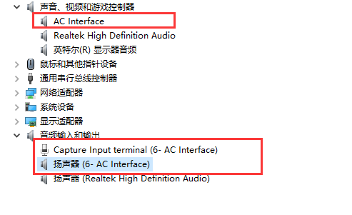
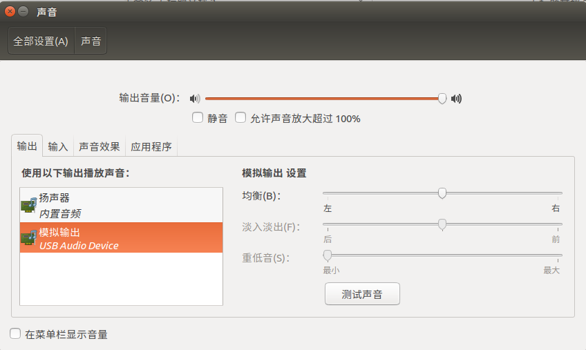
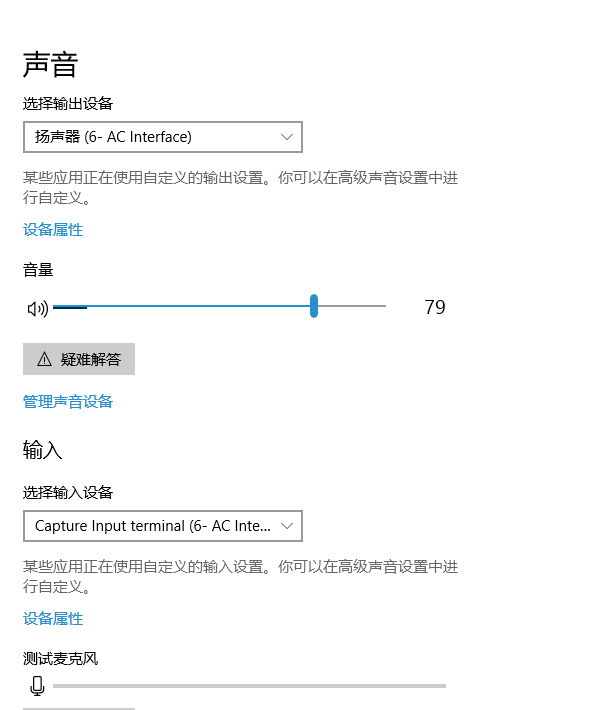
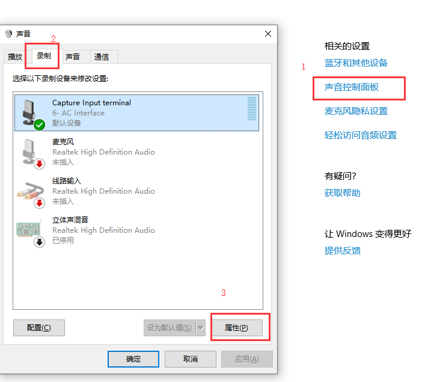
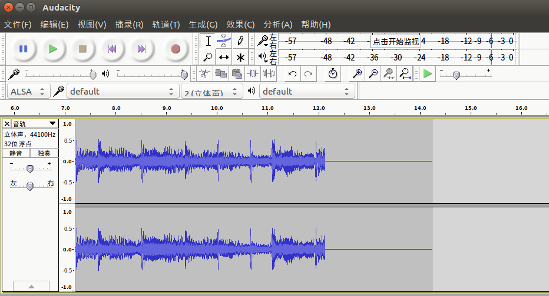
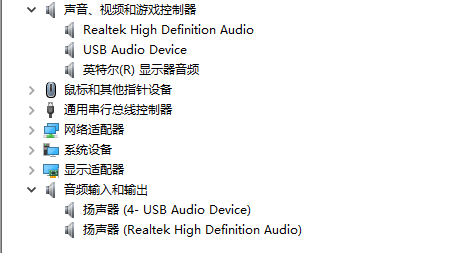

# Rockchip USB Gadget UAC 开发指南

文件标识：RK-KF-YF-098

发布版本：V1.2.0

日期：2021-04-07

文件密级：□绝密   □秘密   □内部资料   ■公开

------

**免责声明**

本文档按“现状”提供，瑞芯微电子股份有限公司（“本公司”，下同）不对本文档的任何陈述、信息和内容的准确性、可靠性、完整性、适销性、特定目的性和非侵权性提供任何明示或暗示的声明或保证。本文档仅作为使用指导的参考。

由于产品版本升级或其他原因，本文档将可能在未经任何通知的情况下，不定期进行更新或修改。

**商标声明**

“Rockchip”、“瑞芯微”、“瑞芯”均为本公司的注册商标，归本公司所有。

本文档可能提及的其他所有注册商标或商标，由其各自拥有者所有。

**版权所有© 2021瑞芯微电子股份有限公司**

超越合理使用范畴，非经本公司书面许可，任何单位和个人不得擅自摘抄、复制本文档内容的部分或全部，并不得以任何形式传播。

瑞芯微电子股份有限公司

Rockchip Electronics Co., Ltd.

地址：     福建省福州市铜盘路软件园A区18号

网址：     [www.rock-chips.com](http://www.rock-chips.com)

客户服务电话： +86-4007-700-590

客户服务传真： +86-591-83951833

客户服务邮箱： [fae@rock-chips.com](mailto:fae@rock-chips.com)

------

**前言**

**概述**

本文档提供 Rockchip 平台基于 Linux 内核的 USB Gadget UAC（USB Audio Class）驱动的使用方法。Rockchip 平台可以支持 UAC1（兼容 USB Audio Class specification 1.0）和 UAC2（兼容 USB Audio Class specification 2.0）驱动，并且，这两个驱动都可以支持基础的录音和放音功能。此外，Rockchip 平台还提供了 UAC1 Legacy （需要实际的声卡支持，只支持放音功能）和 Audio Source（只支持录音功能，但可以支持多达 15 种不同的采样率）。开发人员可以根据产品的实际需求来选择合适的 UAC 驱动。

如果要支持设备端通过物理按键进行音量调节/静音功能，需要添加 HID 的控制，目前发布的 SDK 还没有支持。开发人员可以参考如下的文档，进行 HID 功能的开发。

Kernel/Documentation/usb/gadget-testing.txt （参考 6. HID function）

Kernel/Documentation/ABI/testing/configfs-usb-gadget-hid

[Universal Serial Bus Audio Device Class Specification for Basic Audio Devices](https://usb.org/document-library/audio-device-class-spec-basic-audio-devices-v10-and-adopters-agreement) （参考 8 HID Support in Basic Audio Devices）

**产品版本**

| **芯片名称**                                                 | **内核版本**          |
| ------------------------------------------------------------ | --------------------- |
| RK3399、RK3368、RK3366、RK3328、RK3288、RK312X、RK3188、RK30XX、RK3308、RK3326、PX30、RV1126、RV1109 | Linux-4.4、Linux-4.19 |

**读者对象**
本文档（本指南）主要适用于以下工程师：

软件工程师
技术支持工程师

**修订记录**

| **日期**   | **版本** | **作者**           | **修改说明**                                                 |
| ---------- | -------- | ------------------ | ------------------------------------------------------------ |
| 2019-03-13 | V1.0     | 吴良峰             | 初始版本                                                     |
| 2019-11-11 | V1.1     | 吴良峰             | 修改文档名称，支持Linux-4.19                                 |
| 2020-02-19 | V1.1.1   | 吴良峰             | 增加免责声明，商标声明以及版权声明                           |
| 2021-04-07 | V1.2.0   | 任家宁<br />吴良峰 | 增加 UAC1/UAC2 多采样率的支持，多声道的支持，音量控制，时钟同步的支持等 |

------
[TOC]
------

## Kernel UAC CONFIG

### Related Kernel Commits

如果要正常使用 Kernel-4.4/4.19 的 UAC1/UAC2 的功能，需要先确认所使用的内核已经包含如下的系列补丁，如果未找到补丁，请提交问题到 Rockchip Redmine 平台，或者发邮件给本文档的作者。

- 补丁列表：

```
usb: gadget: f_uac1: set baInterfaceNr of ac_header_desc dynamically
usb: gadget: u_audio: fix dev_dbg information
usb: gadget: f_uac: fix volume control to uevent
usb: gadget: u_audio: disable eps when usb disconnect
usb: gadget: u_audio: add uevent for ppm compensation
usb: gadget: f_uac: update maxpacket in function bind
usb: gadget: f_uac: add pktsize calculating at setting playback srate
usb: gadget: f_uac: add volume and mute feature unit
UPSTREAM: usb: gadget: f_uac2: fix packet size calculation
usb: gadget: u_audio: fix the risk of strcpy out of bounds
usb: gadget: f_uac1: disable IN/OUT ep if unused
usb: gadget: u_audio: add uevent for set_alt and set_srate
FROMLIST: usb: gadget: f_uac*: Support multiple sampling rates
FROMLIST: usb: gadget: f_uac*: Reduce code duplication
FROMLIST: usb: gadget: f_uac1: Fix endpoint reading
```

### Related CONFIGs

CONFIG_USB_CONFIGFS_F_UAC1 (enable UAC1 Function )

CONFIG_USB_CONFIGFS_F_UAC2 (enable UAC2 Function )

CONFIG_USB_CONFIGFS_F_UAC1_LEGACY (enable UAC1 Legacy Function )

CONFIG_USB_CONFIGFS_F_ACC （Audio Source depends on it）

CONFIG_USB_CONFIGFS_F_AUDIO_SRC (enable Audio Source Function)

### Related Documents

- Documentation/usb/gadget_configfs.txt
- Documentation/usb/gadget-testing.txt
- Documentation/ABI/testing/configfs-usb-gadget-uac1
- Documentation/ABI/testing/configfs-usb-gadget-uac1_legacy
- Documentation/ABI/testing/configfs-usb-gadget-uac2

### Support List

表 1-1 Rockchip 平台 UAC1/UAC2 Device 支持的功能

| Function | Uevent 控制 | 多采样率 | 多声道 | Feature Unit 音量控制 | 时钟同步 |
| :------: | :---------: | :------: | :----: | :-------------------: | :------: |
|   UAC1   |     YES     |   YES    |  YES   |          YES          |   YES    |
|   UAC2   |     YES     |   YES    |  YES   |          YES          |   YES    |

**Note:**

*[1] Uevent 控制是指内核通过 uevent 发送打开/关闭 UAC，采样率设置，以及音量调节等事件给应用层 uac_app，以达到控制声卡的目的，详见章节 [Uevent](#Uevent)。*

*[2] UAC2 的  Feature Unit 音量控制在  Windows 平台无法兼容。因此，建议  UAC1 启用 Feature Unit 音量控制，UAC2 关闭 Feature Unit 音量控制。使用方法参考章节 [UAC Usage](#UAC Usage)。*

*[3] 时钟同步功能，是指通过动态调整音频时钟频率，使 USB 主机时钟和 USB 音频设备的时钟同步。当前 SDK 只有 RV1126-Linux-4.19 支持时钟同步。使用方法参考章节 [PPM Compensation](#PPM Compensation)。*

## UAC1/UAC2 Usage and Test

### UAC1 Information

**USB Audio Class 1 standard (1998)**

- This standard allows for 24 bits/96 kHz max.

- The standard itself doesn't impose any limitation on sample rate.

  Class 1 is tied to USB 1 Full Speed = 12 MHz

- Every millisecond a package is send.
  Maximum package size is 1023 bytes.
  2 channel x 24 bit x 96000 Hz sample rate= 4608000 bits/s or 576 Byte/ms
  This fits in the 1023 byte limit.
  Any higher popular sample rate e.g. 176 kHz needs 1056 bytes so in excess of the maximum
  package size.

- All operating systems (Win, OSX, and Linux) support USB Audio Class 1 natively.
  This means you don’t need to install drivers, it is plug&play.
  All support 2 channel audio with 24 bit words and 96 kHz sample rate

Rockchip 平台 UAC1 驱动支持 USB Audio Class specification 1.0，支持录音和放音，并且**不需要实际的声卡**。

UAC1 驱动设置 bInterval=4。

默认支持：

- 速率：High Speed
- 采样率：playback 和 capture 都为 48 KHz
- 声道数：playback 和 capture 都为 2 Channels
- 位深度：playback 和 capture 都为 16 bits

**Note:**

*[1] USB Audio 1.0 Specification 在 USB 2.0 core Specification 之前完成，因此 USB Audio 1.0 Specification 没有高速模式(High Speed)这一概念。可以通过一些经验规则使得 Audio 1.0 兼容设备在特定的操作系统上实现高速模式。比如修改 isochronous endpoint descriptor 的 **bInterval=4**，目前测试可以在各种平台上支持 UAC1 的高速模式。在不同的 Windows 系统版本上,而且兼容性更胜 UAC2。*

*[2] 采样率，声道数，位深度都可以通过内核提供的接口配置，详细使用说明请查看 [UAC Usage](#UAC Usage)。*

### UAC2 Information

**USB Audio Class 2 standard (2009)**

- USB Audio Class 2 additionally supports 32 bit and all common sample rates > 96 kHz
  Class 2 uses High Speed (480 MHz). This requires USB 2 or 3.
  As the data rate of High Speed is 40 X Full speed, recording a 60 channel using 24 bits at 96 kHz  (132 Mbit/s) is not a problem.

- Using High Speed USB for playback  there are no limits in resolution.

- It is downwards compatible with class 1.

- From mid-2010 on USB audio class 2 drivers are available in OSX 10.6.4 and Linux.
  Both support sample rates up to 384 kHz.

- Microsoft simply didn’t support UAC2.

  In April 2017, an update of Win10 finally brought native mode drivers.

  If you use older versions of Win, you still need a third party driver.

Rockchip 平台 UAC2 驱动支持 USB Audio Class specification 2.0，支持录音和放音，并且**不需要实际的声卡**。

默认支持：

- 速率：High Speed
- 采样率：playback 和 capture 都为 48 KHz
- 声道数：playback 和 capture 都为 2 Channels
- 位深度：playback 和 capture 都为 16 bits

**Note:**

*[1] 从 Windows 10（1703 版）开始，Windows 才默认支持 UAC 2.0 驱动程序。*

*[2] Windows 和 Linux 对音频事件的响应流程稍有不同，要做兼容性处理，Linux 和 Android 一样。*

*[3] Windows 会对设备驱动记忆，更改配置后最好卸载驱动，让 Windows 重新识别设备。*

*[4] 采样率，声道数，位深度都可以通过内核提供的接口配置，详细使用说明请查看 [UAC Usage](#UAC Usage)。*

### UAC Usage

目前在 Rockchip 平台，UAC1/UAC2 在配置方法和实现功能上基本一致，只有在兼容性和协议上有所不同

- 添加 defconfig

对于 UAC1，添加 CONFIG_USB_CONFIGFS_F_UAC1=y 到内核的 defconfig

对于 UAC2，添加 CONFIG_USB_CONFIGFS_F_UAC2=y 到内核的 defconfig

- 配置 configfs

以 linux 平台为例，配置 UAC1/UAC2 的脚本参考如下：

```shell
#!/bin/sh

UAC=uac2

USB_ATTRIBUTE=0x409
USB_GROUP=rockchip
USB_SKELETON=b.1

CONFIGFS_DIR=/sys/kernel/config
USB_CONFIGFS_DIR=${CONFIGFS_DIR}/usb_gadget/${USB_GROUP}
USB_STRINGS_DIR=${USB_CONFIGFS_DIR}/strings/${USB_ATTRIBUTE}
USB_FUNCTIONS_DIR=${USB_CONFIGFS_DIR}/functions
USB_CONFIGS_DIR=${USB_CONFIGFS_DIR}/configs/${USB_SKELETON}

function_init()
{
	mkdir ${USB_FUNCTIONS_DIR}/${UAC}.gs0
}

configfs_init()
{
	echo "Debug: configfs_init"
	mkdir /dev/usb-ffs

	mount -t configfs none ${CONFIGFS_DIR}
	mkdir ${USB_CONFIGFS_DIR} -m 0770
	echo 0x2207 > ${USB_CONFIGFS_DIR}/idVendor
	echo 0x0310 > ${USB_CONFIGFS_DIR}/bcdDevice
	echo 0x0200 > ${USB_CONFIGFS_DIR}/bcdUSB
	mkdir ${USB_STRINGS_DIR}   -m 0770
	SERIAL=`cat /proc/cpuinfo | grep Serial | awk '{print $3}'`
	if [ -z $SERIAL ];then
		SERIAL=0123456789ABCDEF
	fi
	echo $SERIAL > ${USB_STRINGS_DIR}/serialnumber
	echo "rockchip"  > ${USB_STRINGS_DIR}/manufacturer
	echo "uac-test"  > ${USB_STRINGS_DIR}/product

	function_init

	mkdir ${USB_CONFIGS_DIR}  -m 0770
	mkdir ${USB_CONFIGS_DIR}/strings/${USB_ATTRIBUTE}  -m 0770
}

parameter_init()
{
	if [ "$UAC" == "uac2" ]; then
		CONFIG_STRING=uac2
		echo "parameter_init ${CONFIG_STRING}"
	elif [ "$UAC" == "uac1" ];then
		CONFIG_STRING=uac1
		echo "parameter_init ${CONFIG_STRING}"
	else
		echo "parameter_init ${UAC} is invalid"
	fi
}

uac_db_raw()
{
	raw=`echo "$1 256" | awk '{printf("%.0f", $1 * $2)}'`

	if [[ $raw -gt 0 ]]; then
		if [[ $raw -gt 32767 ]]; then
			raw=32767
		fi
	else
		if [[ $raw -lt -32767 ]]; then
			raw=-32767
		fi
	fi

	echo $raw
}

config_init()
{
	UAC_GS0=${USB_FUNCTIONS_DIR}/$1.gs0
	echo 3 > ${UAC_GS0}/p_chmask
	echo 2 > ${UAC_GS0}/p_ssize
	echo 8000,16000,44100,48000 > ${UAC_GS0}/p_srate
	echo ${FU} > ${UAC_GS0}/p_feature_unit
	echo `uac_db_raw -64.0` > ${UAC_GS0}/p_volume_min
	echo `uac_db_raw 64.0` > ${UAC_GS0}/p_volume_max
	echo 1 > ${UAC_GS0}/p_volume_res
	echo `uac_db_raw 0` > ${UAC_GS0}/p_volume_cur

	echo 3 > ${UAC_GS0}/c_chmask
	echo 2 > ${UAC_GS0}/c_ssize
	echo 8000,16000,44100,48000 > ${UAC_GS0}/c_srate
	echo ${FU} > ${UAC_GS0}/c_feature_unit
	echo `uac_db_raw -64.0` > ${UAC_GS0}/c_volume_min
	echo `uac_db_raw 0` > ${UAC_GS0}/c_volume_max
	echo 1 > ${UAC_GS0}/c_volume_res
	echo `uac_db_raw 0` > ${UAC_GS0}/c_volume_cur
}

syslink_function()
{
	ln -s ${USB_FUNCTIONS_DIR}/$1 ${USB_CONFIGS_DIR}/f${USB_FUNCTIONS_CNT}
	let USB_FUNCTIONS_CNT=USB_FUNCTIONS_CNT+1
}

bind_functions()
{
	USB_FUNCTIONS_CNT=1

	if [ "$UAC" == "uac2" ]; then
		syslink_function uac2.gs0
	elif [ "$UAC" == "uac1" ];then
		syslink_function uac1.gs0
	else
		echo "parameter_init ${UAC} is invalid"
	fi

	echo ${CONFIG_STRING} > ${USB_CONFIGS_DIR}/strings/${USB_ATTRIBUTE}/configuration
}

program_kill()
{
	P_PID=`ps | grep $1 | grep -v grep | awk '{print $1}'`
	test -z ${P_PID} || kill -9 ${P_PID}
}

usb_device_stop()
{
	echo "none" > ${USB_CONFIGFS_DIR}/UDC
	program_kill adbd
	program_kill mtp-server
	ls ${USB_CONFIGS_DIR} | grep f[0-9] | xargs -I {} rm ${USB_CONFIGS_DIR}/{}
}

case "$1" in
start)
    echo "usb_config in $1"
	DIR=$(cd `dirname $0`; pwd)
	parameter_init
	if [ -z $CONFIG_STRING ]; then
		echo "$0: no function be selected"
		exit 0
	fi
	test -d ${USB_CONFIGFS_DIR} || configfs_init
	echo 0x0019 > ${USB_CONFIGFS_DIR}/idProduct
	config_init
	bind_functions
	sleep 1
	UDC=`ls /sys/class/udc/| awk '{print $1}'`
	echo $UDC > ${USB_CONFIGFS_DIR}/UDC
	;;
stop)
	usb_device_stop
	;;
restart|reload)
	# Do restart usb by udev
	echo "USB_FORCE_CHANGED" >> /tmp/.usb_config
	usb_device_stop
	sleep 1
	$0 start
	# Don't forget to clear "USB_FORCE_CHANGED"
	sed -i "/USB_FORCE_CHANGED/d" /tmp/.usb_config
	;;
*)
	echo "Usage: $0 {start|stop|restart}"
	exit 1
esac

exit 0
```

**Note:**

*[1] 直接运行 uac.sh restart 即可切换到 UAC1/UAC2*

*[2] 修改变量 ${UAC} 可以指定 UAC1 或者 UAC2*

*[3] “idProduct” 可以根据产品自行定义，但不能与产品的其他 USB Function idProduct 冲突*

*[4] Windows 会对设备驱动记忆，更改配置后最好卸载驱动，让 Windows 重新识别设备*

#### Parameters

查看 UAC1/UAC2 的 function 目录，可以发现以下参数接口：

```sh
[root@RV1126_RV1109:/sys/kernel/config/usb_gadget/rockchip/functions/uac1.gs0]# ls
c_chmask        c_volume_cur  p_chmask        p_volume_cur  req_number
c_feature_unit  c_volume_max  p_feature_unit  p_volume_max
c_srate         c_volume_min  p_srate         p_volume_min
c_ssize         c_volume_res  p_ssize         p_volume_res
```

其中 c 代表 capture，注意这里是 USB 虚拟声卡的录音通道，对应 Host 的放音；同理，p 表示 USB 虚拟声卡的 playback 通道，对应 Host 的录音。两个通道互相独立。

常用的参数接口设置如下：

- Sample Rate

  p_srate, c_srate

  默认值为单采样率 48000，支持多采样率配置，采样率之间用逗号隔开，例如：

  `echo 8000,16000,44100,48000 > ${UAC_GS0}/c_srate`

- Channel

  c_chmask, p_chmask

  默认值为 3（双声道），支持多声道或者删除对应声道。

  例如设置 UAC Device 为 5.1 录音声道，且不需要放音功能：

  `echo 0x3F > p_chmask`

  `echo 0 > c_chmask`

- Data deepth

  p_ssize, c_ssize 默认值为 2 (单位：Bytes，即 16 位深度)

- Volume

  c_feature_unit, p_feature_unit 是音量控制的开关，默认是 0（关闭），写 1 可以开启。

  因为 UAC2 的  Feature Unit 音量控制功能在  Windows 平台无法兼容，所以，建议  UAC1 启用 Feature Unit 音量控制，UAC2 关闭 Feature Unit 音量控制。

  下面八个参数分别是设置音量的最大最小当前值和分辨率，单位是 1/256 dB，即写入想要的 dB 值的 256 倍，**注意必须是整数**

  c_volume_res 默认为 1 (1/256 dB)

  c_volume_cur 默认为 0 (0 dB)

  c_volume_max 默认为 0 (0 dB)

  c_volume_min 默认为 -32767 (-128dB)

  p_volume_res 默认为 1 (1/256 dB)

  p_volume_cur 默认为 0 (0 dB)

  p_volume_max 默认为 32767 (128dB)

  p_volume_min 默认为 -32767 (-128dB)

  使用中要根据喇叭的属性合理设置最大最小值，例如：

  ```sh
  uac_db_raw()
  {
	raw=`echo "$1 256" | awk '{printf("%.0f", $1 * $2)}'`

	if [[ $raw -gt 0 ]]; then
		if [[ $raw -gt 32767 ]]; then
			raw=32767
	fi
	else
		if [[ $raw -lt -32767 ]]; then
			raw=-32767
		fi
	fi

	echo $raw
  }

  echo 1 > p_feature_unit
  echo 1 > p_volume_res
  echo `uac_db_raw -64.0` > p_volume_min
  echo `uac_db_raw 64.0` > p_volume_max
  echo `uac_db_raw 0` > p_volume_cur

  echo 1 > c_feature_unit
  echo 1 > c_volume_res
  echo `uac_db_raw -64.0` > c_volume_min
  echo `uac_db_raw 0` > c_volume_max
  echo `uac_db_raw 0` > c_volume_cur
  ```

#### Uevent

为了准确控制音频数据的通断，以及多采样率和音量的设置，应用层 uac_app 需要收到并响应内核的事件。这里我们使用 uevent 事件完成内核到应用层的通知，应用层监控 uac 节点，提取事件中的关键字符串信息。

**start/stop**

```sh
g_audio_work: sent uac uevent USB_STATE=SET_INTERFACE STREAM_DIRECTION=IN STREAM_STATE=OFF
g_audio_work: sent uac uevent USB_STATE=SET_INTERFACE STREAM_DIRECTION=OUT STREAM_STATE=ON
```

**multi sample**

```sh
g_audio_work: sent uac uevent USB_STATE=SET_SAMPLE_RATE STREAM_DIRECTION=OUT SAMPLE_RATE=44100
```

**volume/mute**

```sh
g_audio_work: sent uac uevent USB_STATE=SET_VOLUME STREAM_DIRECTION=IN VOLUME=-1154
g_audio_work: sent uac uevent USB_STATE=SET_VOLUME STREAM_DIRECTION=IN VOLUME=-350
g_audio_work: sent uac uevent USB_STATE=SET_VOLUME STREAM_DIRECTION=IN VOLUME=0
g_audio_work: sent uac uevent USB_STATE=SET_VOLUME STREAM_DIRECTION=IN VOLUME=1739
g_audio_work: sent uac uevent USB_STATE=SET_VOLUME STREAM_DIRECTION=IN VOLUME=2612
```

**Note:**

 这里的 IN 表示 Host 录音，OUT 表示 Host 放音。

#### PPM Compensation

因为 USB 的时钟来自于 Host，Codec 的时钟来自于 Device，异源的时钟会导致音频数据丢失，具体表现在 alsa 周期性地打印 underrun/overrun。

为了解决异源时钟的问题，我们提出 ppm compensation 的解决方案，通过记录 Host 每 128us 发送的一次的 SOF 包对比系统时间，计算一定时间内的 ppm 差值，然后通过 uevent 事件上报到应用层：

```sh
g_audio_work: sent uac uevent USB_STATE=SET_AUDIO_CLK PPM=12
g_audio_work: sent uac uevent USB_STATE=SET_AUDIO_CLK PPM=-1
```

只要 USB 有连接，就会一直计算 ppm，应用层通过监听 uvent 就获取到具体的 ppm 值然后通过 codec 提供的接口调整 codec 的时钟。

**Note:**

*这种方法测试的 ppm 值会随着时间增加越来越稳定，一般十分钟后就不会有新的 ppm 值上报了。如果 USB 有断开，SOF 就会重新计数，ppm 会先回归到 0 再逐渐稳定到新的值*

*如果对实时性要求不高，应用层可以忽略上报的 ppm 补偿值*

#### Compatibility

**Volume Control**

如果在 Windows 系统上使用 UAC2，音量控制一定是要关闭的，即 UAC2 的 c_feature_unit, p_feature_unit 设置为 0，否则 Windows 无法正常加载 UAC2 驱动。

表 2-1 不同主机系统对 UAC 音量控制的支持情况

|      | Windows10 | Linux（ubuntu） | MacOS |
| :--: | :-------: | :-------------: | :---: |
| UAC1 |   支持    |     不支持      | 支持  |
| UAC2 | 驱动异常  |     不支持      | 支持  |

### UAC Test

UAC1 和 UAC2 的测试方法完全一样，这里以 UAC1 为例

配置脚本执行成功后，连接 USB 到 PC，PC 端可以识别到 USB Audio 设备，如下图 2-1 Windows-USB-Audio-Class1，图 2-2 Ubuntu-USB-Audio-Class1-Output 和图 2-3 Ubuntu-USB-Audio-Class1-Input。



图 2-1 Windows-USB-Audio-Class1



图 2-2 Ubuntu-USB-Audio-Class1-Output


图 2-3 Ubuntu-USB-Audio-Class1-Input

RK3308 端的串口打印如下 USB UAC1 正常枚举的日志：

```
dwc2 ff400000.usb: new device is high-speed
dwc2 ff400000.usb: new address 19
android_work: sent uevent USB_STATE=CONNECTED
configfs-gadget gadget: high-speed config #1: b
android_work: sent uevent USB_STATE=CONFIGURED
```

查看 UAC1 声卡信息的方法：

如下显示的结果，UAC1 对应 card2 （UAC1Gadget），具有一个 playback 设备节点 - pcmC2D0p 和一个 capture 设备节点 - pcmC2D0c。

```shell
# cat /proc/asound/cards
 0 [rockchiprk3308v]: rockchip_rk3308 - rockchip,rk3308-vad
                      rockchip,rk3308-vad
 1 [rockchiprk3308p]: rockchip_rk3308 - rockchip,rk3308-pcm
                      rockchip,rk3308-pcm
 2 [UAC1Gadget     ]: UAC1_Gadget - UAC1_Gadget
                      UAC1_Gadget 0
 7 [Loopback       ]: Loopback - Loopback
                      Loopback 1

# ls -lh /proc/asound/card2
-r--r--r--    1 root     root           0 Dec 31 19:14 id
dr-xr-xr-x    3 root     root           0 Dec 31 19:14 pcm0c
dr-xr-xr-x    3 root     root           0 Dec 31 19:14 pcm0p

# ls /dev/snd/
controlC0  controlC7  pcmC1D0c   pcmC2D0p   pcmC7D1c
controlC1  pcmC0D0c   pcmC1D0p   pcmC7D0c   pcmC7D1p
controlC2  pcmC0D0p   pcmC2D0c   pcmC7D0p   timer
```

#### UAC Test on Windows

打开 Windows 声音设置，如下图 2-4 Windows-Audio-Setting，分别选择 USB-Audio 作为声音输出设备和声音输入设备（麦克风）。



图 2-4 Windows-Audio-Setting

**测试 Windows UAC1 放音功能：**

在 RK3308 端的串口执行如下的 UAC1 放音命令：

```shell
arecord -f dat -t wav -r 48000 -c 2 -D hw:2,0 | aplay -f dat -r 48000 -c 2 -D hw:0,0
```

上述命令表示从 Card2（USB Audio）录音，然后从本地声卡 Card0 播放声音

执行完命令后，Windows PC 端播放音乐，RK3308 本地声卡可以实时放音。

**测试 Windows UAC1 录音功能：**

测试录音功能，需要使用可以播放的音频文件。通过 ADB push 或者 arecord 的方法，保存测试使用的音频文件（要求 48KHz，2 channels，16 bits）

比如，RK3308 端的串口执行 arecord 命令，保存测试使用的音频文件 test.wav

```
arecord -f dat -t wav -r 48000 -c 2 -D hw:2,0 /tmp/test.wav
```

保存音频文件 test.wav 成功后，再执行如下的 UAC1 录音命令：

```
aplay /tmp/test.wav -c 2 -r 48000 -D hw:2,0
```

执行完上述命令后，PC 端可以使用 Windows 自带的 “Voice Recorder”软件保存录音文件，如下图 2-5 Windows-Voice-Recorder。


图 2-5 Windows-Voice-Recorder

除了上述的录音测试方法，也可以使用 Windows 的录音侦听功能，实时播放录音的音频，方法如下：

打开“声音设置” --> “声音控制面板” --> "录制" --> “属性” --> "侦听" ，勾选“侦听此设备”，并选择播放的扬声器。

如下图 2-6 Windows-Capture-Listen-1 和图 2-7 Windows-Capture-Listen-2。



图 2-6 Windows-Capture-Listen-1


图 2-7 Windows-Capture-Listen-2

#### UAC Test on Ubuntu

打开 Ubuntu 声音设置，如下图 2-8 Ubuntu-Audio-Setting-Output 和图 2-9 Ubuntu-Audio-Setting-Input，分别选择 USB-Audio 作为声音输出设备和声音输入设备（麦克风）。


图 2-8 Ubuntu-Audio-Setting-Output


图 2-9 Ubuntu-Audio-Setting-Input

**测试 Ubuntu UAC1 放音功能：**

在 RK3308 端的串口执行如下的 UAC1 放音命令：

```shell
arecord -f dat -t wav -r 48000 -c 2 -D hw:2,0 | aplay -f dat -r 48000 -c 2 -D hw:0,0
```

上述命令表示从 Card2（USB Audio）录音，然后从本地声卡 Card0 播放声音

执行完命令后，Ubuntu PC 端播放音乐，RK3308 本地声卡可以实时放音。

**测试 Ubuntu UAC1 录音功能：**

测试录音功能，需要使用可以播放的音频文件。通过 ADB push 或者 arecord 的方法，保存测试使用的音频文件（要求 48KHz，2 channels，16 bits）

比如，RK3308 端的串口执行 arecord 命令，保存测试使用的音频文件 test.wav

```
arecord -f dat -t wav -r 48000 -c 2 -D hw:2,0 /tmp/test.wav
```

保存音频文件 test.wav 成功后，再执行如下的 UAC1 录音命令：

```
aplay /tmp/test.wav -c 2 -r 48000 -D hw:2,0
```

执行完上述命令后，在 Ubuntu 端打开录音软件，如“audacity”，进行录音功能测试。

audacity 安装命令：

```shell
sudo apt install audacity
```

audacity 录音界面如下图 2-10 所示。



图 2-10 Ubuntu-audacity

## UAC1 Legacy Usage and Test

### UAC1 Legacy Usage

Rockchip 平台 UAC1 Legacy 驱动兼容 USB Audio Class specification 1.0，但只支持放音功能，并且**需要实际的声卡支持（默认使用 /dev/snd/pcmC0D0p）**。

默认支持：

速率：High Speed

采样率：playback 48 KHz，不可配置

声道数：playback 2 Channels，不可配置

位深度：playback 16 bits

**UAC1 Legacy 使用方法如下：**

添加 CONFIG_USB_CONFIGFS_F_UAC1_LEGACY=y  到内核的 defconfig

以 RK3308 EVB 为例

配置 UAC1 Legacy 的脚本参考如下：

```shell
mount -t configfs none /sys/kernel/config
mkdir /sys/kernel/config/usb_gadget/rockchip  -m 0770
echo 0x2207 > /sys/kernel/config/usb_gadget/rockchip/idVendor
echo 0x0019 > /sys/kernel/config/usb_gadget/rockchip/idProduct
echo 0x0100 > /sys/kernel/config/usb_gadget/rockchip/bcdDevice
mkdir /sys/kernel/config/usb_gadget/rockchip/strings/0x409   -m 0770
echo "0123456789ABCDEF" > /sys/kernel/config/usb_gadget/rockchip/strings/0x409/serialnumber
echo "rockchip"  > /sys/kernel/config/usb_gadget/rockchip/strings/0x409/manufacturer
echo "USB Audio Device"  > /sys/kernel/config/usb_gadget/rockchip/strings/0x409/product
mkdir /sys/kernel/config/usb_gadget/rockchip/configs/b.1  -m 0770
mkdir /sys/kernel/config/usb_gadget/rockchip/configs/b.1/strings/0x409  -m 0770
echo 500 > /sys/kernel/config/usb_gadget/rockchip/configs/b.1/MaxPower
echo "uac1" > /sys/kernel/config/usb_gadget/rockchip/configs/b.1/strings/0x409/configuration
mkdir /sys/kernel/config/usb_gadget/rockchip/functions/uac1_legacy.gs0
ln -s /sys/kernel/config/usb_gadget/rockchip/functions/uac1_legacy.gs0 /sys/kernel/config/usb_gadget/rockchip/configs/b.1/uac1_legacy.gs0
echo ff400000.usb > /sys/kernel/config/usb_gadget/rockchip/UDC
```

假如 RK3308 开机后，默认运行了 ADB 配置脚本，会导致上述的配置方法出错，在调试阶段，可以手动执行如下命令来配置  UAC1 Legacy 功能。最终产品的 USB 配置脚本，需要根据实际的需求来整合 ADB 和 UAC1 Legacy 的配置脚本。

```shell
rm -rf /sys/kernel/config/usb_gadget/rockchip/configs/b.1/ffs.adb

mkdir /sys/kernel/config/usb_gadget/rockchip/functions/uac1_legacy.gs0
echo 0x0019 > /sys/kernel/config/usb_gadget/rockchip/idProduct
echo 0x0100 > /sys/kernel/config/usb_gadget/rockchip/bcdDevice
echo "USB Audio Device" > /sys/kernel/config/usb_gadget/rockchip/strings/0x409/product
echo "uac1" > /sys/kernel/config/usb_gadget/rockchip/configs/b.1/strings/0x409/configuration
cd /sys/kernel/config/usb_gadget/rockchip/configs/b.1
ln -s ../../functions/uac1_legacy.gs0

echo ff400000.usb > ../../UDC
```

**Note：**

*“idProduct ” 可以根据产品自行定义，但不能与产品的其他 USB Function idProduct 冲突*

*“UDC” 为 USB 控制器名称，对应 /sys/class/udc/控制器名称*

*Windows 会对设备驱动记忆，更改配置后最好卸载驱动，让 Windows 重新识别设备*

配置脚本执行成功后，连接 USB 到 PC，PC 端可以识别到 USB Audio 设备，如图 3-1



图 3-1 Windows-USB-Audio-Class1-Legacy

RK3308 端的串口打印如下 USB UAC1 Legacy 正常枚举的日志：

```
configfs-gadget gadget: Hardware params: access 3, format 2, channels 2, rate 48000
dwc2 ff400000.usb: bound driver configfs-gadget
dwc2 ff400000.usb: new device is high-speed
dwc2 ff400000.usb: new address 25
android_work: sent uevent USB_STATE=CONNECTED
configfs-gadget gadget: high-speed config #1: b
android_work: sent uevent USB_STATE=CONFIGURED
```

UAC1 Legacy 驱动提供如下的配置接口：

如下**配置无法动态生效**，也即必须添加在 UAC 的配置脚本中执行。

```shell
# ls -lh /sys/kernel/config/usb_gadget/g1/functions/uac1_legacy.gs0/
-rw-r--r--    1 root     root        4.0K Dec 31 19:08 audio_buf_size
-rw-r--r--    1 root     root        4.0K Dec 31 19:08 fn_cap
-rw-r--r--    1 root     root        4.0K Dec 31 19:08 fn_cntl
-rw-r--r--    1 root     root        4.0K Dec 31 19:08 fn_play
-rw-r--r--    1 root     root        4.0K Dec 31 19:08 req_buf_size
-rw-r--r--    1 root     root        4.0K Dec 31 19:08 req_count

audio_buf_size - audio buffer size 默认设置为 48000
fn_cap - capture pcm device file name 默认设置为 /dev/snd/pcmC0D0c
fn_cntl - control device file name 默认设置为 /dev/snd/controlC0
fn_play - playback pcm device file name 默认设置为 /dev/snd/pcmC0D0p
req_buf_size - ISO OUT endpoint request buffer size 默认设置为 200
req_count - ISO OUT endpoint request count 默认设置为 256
```

UAC1 Legacy 不会在 RK3308 端创建对应的声卡设备节点。

### UAC1 Legacy Test

Windows PC 端的放音设置请参考 [UAC Test on Windows](#UAC Test on Windows)

Ubuntu PC 端的放音设置请参考 [UAC  Test on Ubuntu](#UAC Test on Ubuntu)

RK3308 端不需要执行任何命令，连接 USB 到 PC 后，UAC1 Legacy 驱动默认会打开 RK3308 本地 Card0 声卡播放声音。

## Audio Source Usage and Test

### Audio Source Usage

Rockchip 平台 Audio Source 驱动兼容 USB Audio Class specification 1.0，但只支持录音功能。

默认支持：

速率：High Speed

采样率：playback 默认使用 44.1KHz，总共支持如下 15 种不同的采样率，PC 端可以动态配置

```
8000, 11025, 16000, 22050, 24000,
32000, 40000, 44100, 48000, 56000,
64000, 72000, 80000, 88200, 96000,
```

声道数：playback 2 Channels，不可配置

位深度：playback 16 bits

**Audio Source 使用方法如下：**

添加 CONFIG_USB_CONFIGFS_F_ACC=y（Audio Source depends on it）到内核的 defconfig

添加 CONFIG_USB_CONFIGFS_F_AUDIO_SRC=y  到内核的 defconfig

以 RK3308 EVB 为例

配置 Audio Source 的脚本参考如下：

```shell
mount -t configfs none /sys/kernel/config
mkdir /sys/kernel/config/usb_gadget/rockchip  -m 0770
echo 0x2207 > /sys/kernel/config/usb_gadget/rockchip/idVendor
echo 0x0019 > /sys/kernel/config/usb_gadget/rockchip/idProduct
mkdir /sys/kernel/config/usb_gadget/rockchip/strings/0x409   -m 0770
echo "0123456789ABCDEF" > /sys/kernel/config/usb_gadget/rockchip/strings/0x409/serialnumber
echo "rockchip"  > /sys/kernel/config/usb_gadget/rockchip/strings/0x409/manufacturer
echo "USB Audio Device"  > /sys/kernel/config/usb_gadget/rockchip/strings/0x409/product
mkdir /sys/kernel/config/usb_gadget/rockchip/configs/b.1  -m 0770
mkdir /sys/kernel/config/usb_gadget/rockchip/configs/b.1/strings/0x409  -m 0770
echo 500 > /sys/kernel/config/usb_gadget/rockchip/configs/b.1/MaxPower
echo "audio" > /sys/kernel/config/usb_gadget/rockchip/configs/b.1/strings/0x409/configuration
mkdir /sys/kernel/config/usb_gadget/rockchip/functions/audio_source.gs0
ln -s /sys/kernel/config/usb_gadget/rockchip/functions/audio_source.gs0 /sys/kernel/config/usb_gadget/rockchip/configs/b.1/audio_source.gs0
echo ff400000.usb > /sys/kernel/config/usb_gadget/rockchip/UDC
```

假如 RK3308 开机后，默认运行了 ADB 配置脚本，会导致上述的配置方法出错，在调试阶段，可以手动执行如下命令来配置  Audio Source 功能。最终产品的 USB 配置脚本，需要根据实际的需求来整合 ADB 和 Audio Source 的配置脚本。

```shell
rm -rf /sys/kernel/config/usb_gadget/rockchip/configs/b.1/ffs.adb

mkdir /sys/kernel/config/usb_gadget/rockchip/functions/audio_source.gs0
echo 0x0019 > /sys/kernel/config/usb_gadget/rockchip/idProduct
echo 0x0100 > /sys/kernel/config/usb_gadget/rockchip/bcdDevice
echo "USB Audio Device" > /sys/kernel/config/usb_gadget/rockchip/strings/0x409/product
echo "audio" > /sys/kernel/config/usb_gadget/rockchip/configs/b.1/strings/0x409/configuration
cd /sys/kernel/config/usb_gadget/rockchip/configs/b.1
ln -s ../../functions/audio_source.gs0

echo ff400000.usb > ../../UDC
```

**Note：**

*“idProduct ” 可以根据产品自行定义，但不能与产品的其他 USB Function idProduct 冲突*

*“UDC” 为 USB 控制器名称，对应 /sys/class/udc/控制器名称*

*Windows 会对设备驱动记忆，更改配置后最好卸载驱动，让 Windows 重新识别设备*

配置脚本执行成功后，连接 USB 到 PC，PC 端可以识别到 USB Audio 设备，如下图 4-1 Windows-USB-Audio-Source 和图 4-2 Ubuntu-USB-Audio-Source


图 4-1 Windows-USB-Audio-Source


图 4-2 Ubuntu-USB-Audio-Source

RK3308 端的串口打印如下 USB Audio Source 正常枚举的日志：

```
dwc2 ff400000.usb: new device is high-speed
dwc2 ff400000.usb: new address 23
android_work: sent uevent USB_STATE=CONNECTED
configfs-gadget gadget: high-speed config #1: b
android_work: sent uevent USB_STATE=CONFIGURED
```

Audio Source 驱动没有提供可配置的内核接口。

查看 Audio Source 信息的方法：

如下显示的结果，Audio Source 对应 card2 （audiosource），只有一个 playback 设备节点 - pcmC2D0p。

```shell
# cat /proc/asound/cards
 0 [rockchiprk3308v]: rockchip_rk3308 - rockchip,rk3308-vad
                      rockchip,rk3308-vad
 1 [rockchiprk3308p]: rockchip_rk3308 - rockchip,rk3308-pcm
                      rockchip,rk3308-pcm
 2 [audiosource    ]: audio_source - audio_source
                      USB accessory audio source
 7 [Loopback       ]: Loopback - Loopback
                      Loopback 1

# ls -lh /proc/asound/card2
-r--r--r--    1 root     root           0 Dec 31 19:06 id
dr-xr-xr-x    3 root     root           0 Dec 31 19:06 pcm0p

# ls /dev/snd/
controlC0  controlC2  pcmC0D0c   pcmC1D0c   pcmC2D0p   pcmC7D0p   pcmC7D1p
controlC1  controlC7  pcmC0D0p   pcmC1D0p   pcmC7D0c   pcmC7D1c   timer
```

### Audio Source Test

**测试 Audio Source 录音功能：**

Windows PC 端的录音设置请参考 [UAC Test on Windows](#UAC Test on Windows)

Ubuntu PC 端的录音设置请参考 [UAC Test on Ubuntu](#UAC Test on Ubuntu)

RK3308 端的测试命令（假设采样率使用默认的 44.1KHz）：

```shell
aplay /tmp/test.wav -r 44100 -c 2 -D hw:2,0
```

**Note：**

*测试使用的音频文件 test.wav 的采样率，应与录音的采样率一致，否则，测试时可能出现杂音或者无声音*

此外，因为 Audio Source 支持 15 种不同的采样率，所以 PC 端可以动态配置采样率，方法如下：

打开“声音设置” --> “声音控制面板” --> "录制" --> “属性” --> “高级”，选择对应的采样率。

如下图 4-3 所示。


图 4-3 Windows-USB-Audio-Source-Setting

## UAC1 Legacy and Audio Source Composite Usage and Test

### UAC1 Legacy and Audio Source Composite Usage

**UAC1 Legacy +  Audio Source 使用方法如下：**

UAC1 Legacy 和 Audio Source 可以组合为一个 USB 复合设备，支持录音和放音功能。

添加 CONFIG_USB_CONFIGFS_F_UAC1_LEGACY=y  到内核的 defconfig

添加 CONFIG_USB_CONFIGFS_F_ACC=y（Audio Source depends on it）到内核的 defconfig

添加 CONFIG_USB_CONFIGFS_F_AUDIO_SRC=y  到内核的 defconfig

此外，需要单独更新补丁“**support_uac1_legacy_and_audio_source.patch**”。

以 RK3308 EVB 为例

配置 UAC1 Legacy +  Audio Source  的脚本参考如下：

```shell
mount -t configfs none /sys/kernel/config
mkdir /sys/kernel/config/usb_gadget/rockchip  -m 0770
echo 0x2207 > /sys/kernel/config/usb_gadget/rockchip/idVendor
echo 0x0019 > /sys/kernel/config/usb_gadget/rockchip/idProduct
echo 0x0100 > /sys/kernel/config/usb_gadget/rockchip/bcdDevice
mkdir /sys/kernel/config/usb_gadget/rockchip/strings/0x409   -m 0770
echo "0123456789ABCDEF" > /sys/kernel/config/usb_gadget/rockchip/strings/0x409/serialnumber
echo "rockchip"  > /sys/kernel/config/usb_gadget/rockchip/strings/0x409/manufacturer
echo "USB Audio Device"  > /sys/kernel/config/usb_gadget/rockchip/strings/0x409/product
mkdir /sys/kernel/config/usb_gadget/rockchip/configs/b.1  -m 0770
mkdir /sys/kernel/config/usb_gadget/rockchip/configs/b.1/strings/0x409  -m 0770
echo 500 > /sys/kernel/config/usb_gadget/rockchip/configs/b.1/MaxPower
echo "uac1" > /sys/kernel/config/usb_gadget/rockchip/configs/b.1/strings/0x409/configuration
mkdir /sys/kernel/config/usb_gadget/rockchip/functions/uac1_legacy.gs0
ln -s /sys/kernel/config/usb_gadget/rockchip/functions/uac1_legacy.gs0 /sys/kernel/config/usb_gadget/rockchip/configs/b.1/uac1_legacy.gs0
mkdir /sys/kernel/config/usb_gadget/rockchip/functions/audio_source.gs0
ln -s /sys/kernel/config/usb_gadget/rockchip/functions/audio_source.gs0 /sys/kernel/config/usb_gadget/rockchip/configs/b.1/audio_source.gs0
echo ff400000.usb > /sys/kernel/config/usb_gadget/rockchip/UDC
```

其他配置和调试方法，请参考 [UAC1 Legacy Usage](#UAC1 Legacy Usage) 和 [Audio Source Usage](#Audio Source Usage)

### UAC1 Legacy and Audio Source Composite Test

请参考 [UAC1 Legacy Test](#UAC1 Legacy Test) 和 [Audio Source Test](#Audio Source Test)

## Reference Documentation

**USB Protocol (from USB Implementers Forum)**

- [Universal Serial Bus Specification, Revision 2.0](https://usb.org/document-library/usb-20-specification)

- [Universal Serial Bus Audio Device Class Specification for Basic Audio Devices](https://usb.org/document-library/audio-device-class-spec-basic-audio-devices-v10-and-adopters-agreement)

- [Universal Serial Bus Device Class Definition for Audio Devices, Release 1.0](https://usb.org/document-library/audio-device-document-10)

  [Universal Serial Bus Device Class Definition for Audio Devices, Release 2.0](https://usb.org/document-library/audio-devices-rev-20-and-adopters-agreement)

- [Universal Serial Bus Device Class Definition for Audio Data Formats(referred to in this document as
  USB Audio Data Formats)](https://usb.org/document-library/audio-data-formats-10)

- [Universal Serial Bus Device Class Definition for Terminal Types(referred to in this document as USB
  Audio Terminal Types)](https://usb.org/document-library/audio-terminal-types-10)

**Others**

- [The Well-Tempered Computer (An introduction to computer audio) - USB](http://www.thewelltemperedcomputer.com/KB/USB.html)
- [Windows USB Audio 2.0 Drivers](https://docs.microsoft.com/en-us/windows-hardware/drivers/audio/usb-2-0-audio-drivers)

## Appendix A UAC1 Device Descriptor

```
Device Descriptor:
  bLength                18
  bDescriptorType         1
  bcdUSB               2.00
  bDeviceClass            0 (Defined at Interface level)
  bDeviceSubClass         0
  bDeviceProtocol         0
  bMaxPacketSize0        64
  idVendor           0x2207
  idProduct          0x0019
  bcdDevice            1.00
  iManufacturer           1 rockchip
  iProduct                2 USB Audio Device
  iSerial                 3 0123456789ABCDEF
  bNumConfigurations      1
  Configuration Descriptor:
    bLength                 9
    bDescriptorType         2
    wTotalLength          174
    bNumInterfaces          3
    bConfigurationValue     1
    iConfiguration          4 audio
    bmAttributes         0x80
      (Bus Powered)
    MaxPower              500mA
    Interface Descriptor:
      bLength                 9
      bDescriptorType         4
      bInterfaceNumber        0
      bAlternateSetting       0
      bNumEndpoints           0
      bInterfaceClass         1 Audio
      bInterfaceSubClass      1 Control Device
      bInterfaceProtocol      0
      iInterface              5 AC Interface
      AudioControl Interface Descriptor:
        bLength                10
        bDescriptorType        36
        bDescriptorSubtype      1 (HEADER)
        bcdADC               1.00
        wTotalLength           52
        bInCollection           2
        baInterfaceNr( 0)       1
        baInterfaceNr( 1)       2
      AudioControl Interface Descriptor:
        bLength                12
        bDescriptorType        36
        bDescriptorSubtype      2 (INPUT_TERMINAL)
        bTerminalID             1
        wTerminalType      0x0101 USB Streaming
        bAssocTerminal          0
        bNrChannels             2
        wChannelConfig     0x0003
          Left Front (L)
          Right Front (R)
        iChannelNames           7 Playback Channels
        iTerminal               6 Playback Input terminal
      AudioControl Interface Descriptor:
        bLength                 9
        bDescriptorType        36
        bDescriptorSubtype      3 (OUTPUT_TERMINAL)
        bTerminalID             2
        wTerminalType      0x0301 Speaker
        bAssocTerminal          0
        bSourceID               1
        iTerminal               8 Playback Output terminal
      AudioControl Interface Descriptor:
        bLength                12
        bDescriptorType        36
        bDescriptorSubtype      2 (INPUT_TERMINAL)
        bTerminalID             3
        wTerminalType      0x0201 Microphone
        bAssocTerminal          0
        bNrChannels             2
        wChannelConfig     0x0003
          Left Front (L)
          Right Front (R)
        iChannelNames          10 Capture Channels
        iTerminal               9 Capture Input terminal
      AudioControl Interface Descriptor:
        bLength                 9
        bDescriptorType        36
        bDescriptorSubtype      3 (OUTPUT_TERMINAL)
        bTerminalID             4
        wTerminalType      0x0101 USB Streaming
        bAssocTerminal          0
        bSourceID               3
        iTerminal              11 Capture Output terminal
    Interface Descriptor:
      bLength                 9
      bDescriptorType         4
      bInterfaceNumber        1
      bAlternateSetting       0
      bNumEndpoints           0
      bInterfaceClass         1 Audio
      bInterfaceSubClass      2 Streaming
      bInterfaceProtocol      0
      iInterface             12 Playback Inactive
    Interface Descriptor:
      bLength                 9
      bDescriptorType         4
      bInterfaceNumber        1
      bAlternateSetting       1
      bNumEndpoints           1
      bInterfaceClass         1 Audio
      bInterfaceSubClass      2 Streaming
      bInterfaceProtocol      0
      iInterface             13 Playback Active
      AudioStreaming Interface Descriptor:
        bLength                 7
        bDescriptorType        36
        bDescriptorSubtype      1 (AS_GENERAL)
        bTerminalLink           1
        bDelay                  1 frames
        wFormatTag              1 PCM
      AudioStreaming Interface Descriptor:
        bLength                11
        bDescriptorType        36
        bDescriptorSubtype      2 (FORMAT_TYPE)
        bFormatType             1 (FORMAT_TYPE_I)
        bNrChannels             2
        bSubframeSize           2
        bBitResolution         16
        bSamFreqType            1 Discrete
        tSamFreq[ 0]        48000
      Endpoint Descriptor:
        bLength                 9
        bDescriptorType         5
        bEndpointAddress     0x02  EP 2 OUT
        bmAttributes            9
          Transfer Type            Isochronous
          Synch Type               Adaptive
          Usage Type               Data
        wMaxPacketSize     0x00c8  1x 200 bytes
        bInterval               4
        bRefresh                0
        bSynchAddress           0
        AudioControl Endpoint Descriptor:
          bLength                 7
          bDescriptorType        37
          bDescriptorSubtype      1 (EP_GENERAL)
          bmAttributes         0x01
            Sampling Frequency
          bLockDelayUnits         1 Milliseconds
          wLockDelay              1 Milliseconds
    Interface Descriptor:
      bLength                 9
      bDescriptorType         4
      bInterfaceNumber        2
      bAlternateSetting       0
      bNumEndpoints           0
      bInterfaceClass         1 Audio
      bInterfaceSubClass      2 Streaming
      bInterfaceProtocol      0
      iInterface             14 Capture Inactive
    Interface Descriptor:
      bLength                 9
      bDescriptorType         4
      bInterfaceNumber        2
      bAlternateSetting       1
      bNumEndpoints           1
      bInterfaceClass         1 Audio
      bInterfaceSubClass      2 Streaming
      bInterfaceProtocol      0
      iInterface             15 Capture Active
      AudioStreaming Interface Descriptor:
        bLength                 7
        bDescriptorType        36
        bDescriptorSubtype      1 (AS_GENERAL)
        bTerminalLink           4
        bDelay                  1 frames
        wFormatTag              1 PCM
      AudioStreaming Interface Descriptor:
        bLength                11
        bDescriptorType        36
        bDescriptorSubtype      2 (FORMAT_TYPE)
        bFormatType             1 (FORMAT_TYPE_I)
        bNrChannels             2
        bSubframeSize           2
        bBitResolution         16
        bSamFreqType            1 Discrete
        tSamFreq[ 0]        48000
      Endpoint Descriptor:
        bLength                 9
        bDescriptorType         5
        bEndpointAddress     0x81  EP 1 IN
        bmAttributes            5
          Transfer Type            Isochronous
          Synch Type               Asynchronous
          Usage Type               Data
        wMaxPacketSize     0x00c8  1x 200 bytes
        bInterval               4
        bRefresh                0
        bSynchAddress           0
        AudioControl Endpoint Descriptor:
          bLength                 7
          bDescriptorType        37
          bDescriptorSubtype      1 (EP_GENERAL)
          bmAttributes         0x01
            Sampling Frequency
          bLockDelayUnits         0 Undefined
          wLockDelay              0 Undefined
Device Qualifier (for other device speed):
  bLength                10
  bDescriptorType         6
  bcdUSB               2.00
  bDeviceClass            0 (Defined at Interface level)
  bDeviceSubClass         0
  bDeviceProtocol         0
  bMaxPacketSize0        64
  bNumConfigurations      1
Device Status:     0x0000
  (Bus Powered)
```

## Appendix B UAC2 Device Descriptor

```
Device Descriptor:
  bLength                18
  bDescriptorType         1
  bcdUSB               2.00
  bDeviceClass            0 (Defined at Interface level)
  bDeviceSubClass         0
  bDeviceProtocol         0
  bMaxPacketSize0        64
  idVendor           0x2207
  idProduct          0x0019
  bcdDevice            2.00
  iManufacturer           1 rockchip
  iProduct                2 USB Audio Device
  iSerial                 3 0123456789ABCDEF
  bNumConfigurations      1
  Configuration Descriptor:
    bLength                 9
    bDescriptorType         2
    wTotalLength          219
    bNumInterfaces          3
    bConfigurationValue     1
    iConfiguration          4 audio
    bmAttributes         0x80
      (Bus Powered)
    MaxPower              500mA
    Interface Association:
      bLength                 8
      bDescriptorType        11
      bFirstInterface         0
      bInterfaceCount         3
      bFunctionClass          1 Audio
      bFunctionSubClass       0
      bFunctionProtocol      32
      iFunction               5 Source/Sink
    Interface Descriptor:
      bLength                 9
      bDescriptorType         4
      bInterfaceNumber        0
      bAlternateSetting       0
      bNumEndpoints           0
      bInterfaceClass         1 Audio
      bInterfaceSubClass      1 Control Device
      bInterfaceProtocol     32
      iInterface              6 Topology Control
      AudioControl Interface Descriptor:
        bLength                 9
        bDescriptorType        36
        bDescriptorSubtype      1 (HEADER)
        bcdADC               2.00
        bCategory               8
        wTotalLength           83
        bmControl            0x00
      AudioControl Interface Descriptor:
        bLength                 8
        bDescriptorType        36
        bDescriptorSubtype     10 (CLOCK_SOURCE)
        bClockID                6
        bmAttributes         0x01 Internal fixed Clock
        bmControls           0x01
          Clock Frequency Control (read-only)
        bAssocTerminal          0
        iClockSource            7 48000Hz
      AudioControl Interface Descriptor:
        bLength                 8
        bDescriptorType        36
        bDescriptorSubtype     10 (CLOCK_SOURCE)
        bClockID                5
        bmAttributes         0x01 Internal fixed Clock
        bmControls           0x01
          Clock Frequency Control (read-only)
        bAssocTerminal          0
        iClockSource            8 64000Hz
      AudioControl Interface Descriptor:
        bLength                17
        bDescriptorType        36
        bDescriptorSubtype      2 (INPUT_TERMINAL)
        bTerminalID             1
        wTerminalType      0x0101 USB Streaming
        bAssocTerminal          0
        bCSourceID              5
        bNrChannels             2
        bmChannelConfig   0x00000003
          Front Left (FL)
          Front Right (FR)
        bmControls    0x0003
          Copy Protect Control (read/write)
        iChannelNames           0
        iTerminal               9 USBH Out
      AudioControl Interface Descriptor:
        bLength                17
        bDescriptorType        36
        bDescriptorSubtype      2 (INPUT_TERMINAL)
        bTerminalID             2
        wTerminalType      0x0201 Microphone
        bAssocTerminal          0
        bCSourceID              6
        bNrChannels             2
        bmChannelConfig   0x00000003
          Front Left (FL)
          Front Right (FR)
        bmControls    0x0003
          Copy Protect Control (read/write)
        iChannelNames           0
        iTerminal              10 USBD Out
      AudioControl Interface Descriptor:
        bLength                12
        bDescriptorType        36
        bDescriptorSubtype      3 (OUTPUT_TERMINAL)
        bTerminalID             4
        wTerminalType      0x0101 USB Streaming
        bAssocTerminal          0
        bSourceID               2
        bCSourceID              6
        bmControls         0x0003
          Copy Protect Control (read/write)
        iTerminal              11 USBH In
      AudioControl Interface Descriptor:
        bLength                12
        bDescriptorType        36
        bDescriptorSubtype      3 (OUTPUT_TERMINAL)
        bTerminalID             3
        wTerminalType      0x0301 Speaker
        bAssocTerminal          0
        bSourceID               1
        bCSourceID              5
        bmControls         0x0003
          Copy Protect Control (read/write)
        iTerminal              12 USBD In
    Interface Descriptor:
      bLength                 9
      bDescriptorType         4
      bInterfaceNumber        1
      bAlternateSetting       0
      bNumEndpoints           0
      bInterfaceClass         1 Audio
      bInterfaceSubClass      2 Streaming
      bInterfaceProtocol     32
      iInterface             13 Playback Inactive
    Interface Descriptor:
      bLength                 9
      bDescriptorType         4
      bInterfaceNumber        1
      bAlternateSetting       1
      bNumEndpoints           1
      bInterfaceClass         1 Audio
      bInterfaceSubClass      2 Streaming
      bInterfaceProtocol     32
      iInterface             14 Playback Active
      AudioStreaming Interface Descriptor:
        bLength                16
        bDescriptorType        36
        bDescriptorSubtype      1 (AS_GENERAL)
        bTerminalLink           1
        bmControls           0x00
        bFormatType             1
        bmFormats         0x00000001
          PCM
        bNrChannels             2
        bmChannelConfig   0x00000003
          Front Left (FL)
          Front Right (FR)
        iChannelNames           0
      AudioStreaming Interface Descriptor:
        bLength                 6
        bDescriptorType        36
        bDescriptorSubtype      2 (FORMAT_TYPE)
        bFormatType             1 (FORMAT_TYPE_I)
        bSubslotSize            2
        bBitResolution         16
      Endpoint Descriptor:
        bLength                 7
        bDescriptorType         5
        bEndpointAddress     0x02  EP 2 OUT
        bmAttributes            9
          Transfer Type            Isochronous
          Synch Type               Adaptive
          Usage Type               Data
        wMaxPacketSize     0x0100  1x 256 bytes
        bInterval               4
        AudioControl Endpoint Descriptor:
          bLength                 8
          bDescriptorType        37
          bDescriptorSubtype      1 (EP_GENERAL)
          bmAttributes         0x00
          bmControls           0x00
          bLockDelayUnits         0 Undefined
          wLockDelay              0
    Interface Descriptor:
      bLength                 9
      bDescriptorType         4
      bInterfaceNumber        2
      bAlternateSetting       0
      bNumEndpoints           0
      bInterfaceClass         1 Audio
      bInterfaceSubClass      2 Streaming
      bInterfaceProtocol     32
      iInterface             15 Capture Inactive
    Interface Descriptor:
      bLength                 9
      bDescriptorType         4
      bInterfaceNumber        2
      bAlternateSetting       1
      bNumEndpoints           1
      bInterfaceClass         1 Audio
      bInterfaceSubClass      2 Streaming
      bInterfaceProtocol     32
      iInterface             16 Capture Active
      AudioStreaming Interface Descriptor:
        bLength                16
        bDescriptorType        36
        bDescriptorSubtype      1 (AS_GENERAL)
        bTerminalLink           4
        bmControls           0x00
        bFormatType             1
        bmFormats         0x00000001
          PCM
        bNrChannels             2
        bmChannelConfig   0x00000003
          Front Left (FL)
          Front Right (FR)
        iChannelNames           0
      AudioStreaming Interface Descriptor:
        bLength                 6
        bDescriptorType        36
        bDescriptorSubtype      2 (FORMAT_TYPE)
        bFormatType             1 (FORMAT_TYPE_I)
        bSubslotSize            2
        bBitResolution         16
      Endpoint Descriptor:
        bLength                 7
        bDescriptorType         5
        bEndpointAddress     0x81  EP 1 IN
        bmAttributes           13
          Transfer Type            Isochronous
          Synch Type               Synchronous
          Usage Type               Data
        wMaxPacketSize     0x00c0  1x 192 bytes
        bInterval               4
        AudioControl Endpoint Descriptor:
          bLength                 8
          bDescriptorType        37
          bDescriptorSubtype      1 (EP_GENERAL)
          bmAttributes         0x00
          bmControls           0x00
          bLockDelayUnits         0 Undefined
          wLockDelay              0
Device Qualifier (for other device speed):
  bLength                10
  bDescriptorType         6
  bcdUSB               2.00
  bDeviceClass            0 (Defined at Interface level)
  bDeviceSubClass         0
  bDeviceProtocol         0
  bMaxPacketSize0        64
  bNumConfigurations      1
Device Status:     0x0000
  (Bus Powered)
```

