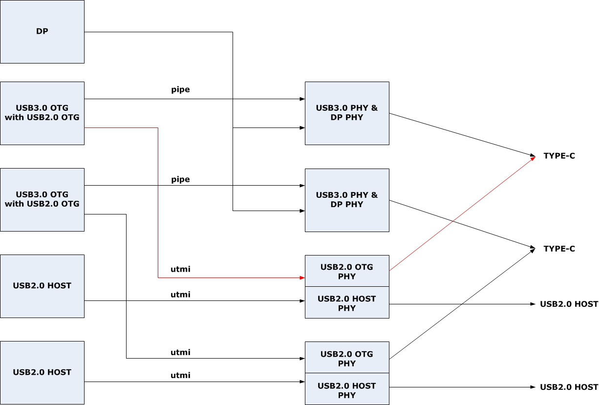

# RK3399 USB DTS 配置说明

发布版本：1.3

作者邮箱：wulf@rock-chips.com

日期：2019-12-20

文档密级：公开资料

---------
**概述**

本文档提供 RK3399 USB DTS 的配置方法。RK3399 支持两个 Type-C USB 3.0(Type-C PHY is a combination of USB 3.0 SuperSpeed PHY and DisplayPort Transmit PHY)和两个 USB 2.0 Host。其中，两个 Type-C USB 3.0 控制器硬件都可以支持 OTG(USB Peripheral 和 USB Host)，并且向下兼容 USB2.0/1.1/1.0。此外，Type-C USB 3.0 可以根据实际的应用需求，将物理接口简化设计为 Type-A USB 3.0/2.0，Micro USB 3.0/2.0 等多种接口类型，内核 USB 驱动已经兼容这几种不同类型的 USB 接口，只需要根据实际的硬件设计修改对应的板级 DTS 配置，就可以使能相应的 USB 接口。

**产品版本**

| **芯片名称** | **内核版本**          |
| ------------ | --------------------- |
| RK3399       | Linux-4.4、Linux-4.19 |

**读者对象**
本文档（本指南）主要适用于以下工程师：
软件工程师
技术支持工程师

**修订记录**

| **日期**   | **版本** | **作者** | **修改说明**                                                 |
| ---------- | -------- | -------- | ------------------------------------------------------------ |
| 2018-03-01 | V1.0     | 吴良峰   | 初始版本                                                     |
| 2019-01-09 | V1.1     | 吴良峰   | 使用 markdownlint 修订格式                                   |
| 2019-06-25 | V1.2     | 吴良峰   | 1. 增加 Type-C to Type-A USB 2.0 说明<br />2. 增加 VBUS 供电说明<br />3. 更新文档目录名称<br />4. 参考示例由 EVB 改为 Sapphire Excavator Board<br />5. 修订一些错误 |
| 2019-12-20 | V1.3     | 吴良峰   | 1. 增加 Type-C to Type-A USB 3.0 OTG DTS 的配置说明<br />2. 增加章节 《OTG 切换命令》<br />3. 增加章节 《Linux-4.4 与 4.19 USB 3.0 DTS配置的差异点》<br />3. 修订一些排版格式 |

---------
[TOC]

## 1 Type-C0/1 USB 3.0 DTS

Type-C 的接口类型如下图 1-1 所示。


图 1-1 Type-C 接口类型示意图

RK3399 SoC 内部 4 个 USB 控制器与 USB PHY 的连接如下图 1-2 所示。

其中，DP 是指 Display Port 控制器，DP 与 USB 3.0 共用 Type-C PHY。如图 1-2 所示，一个完整的 Type-C 功能，是由 Type-C USB 3.0 PHY & DP PHY 和 USB 2.0 OTG PHY 两部分组成的，这两部分 PHY 在芯片内部的硬件模块是独立的，供电也是独立的。



图 1-2 RK3399 USB 控制器&PHY 连接示意图

RK3399 SDK DTS 的默认配置，支持 Type-C0 USB 3.0 OTG 功能，Type-C1 USB 3.0 Host 功能。DTS 的配置主要包括 DWC3 控制器、Type-C USB 3.0 PHY 以及 USB 2.0 PHY。

### 1.1 Type-C0 /1 USB Controller DTS

Type-C0/1 USB 控制器硬件都支持 USB 3.0 OTG（USB Peripheral 和 USB Host）功能，并且向下兼容 USB 2.0/1.1/1.0。但由于当前内核的 USB 框架只支持一个 USB 口作为 Peripheral 功能，所以 SDK 默认配置 Type-C0 支持 OTG mode，而 Type-C1 仅支持 Host mode。如果要配置 Type-C1 支持 OTG mode，请参考：

[1.3 Type-C1 USB OTG Mode DTS](#1.3 Type-C1 USB OTG Mode DTS)

以 RK3399 Sapphire Excavator Board 的 Type-C0/C1 USB 3.0 控制器 DTS 配置为例：

`arch/arm64/boot/dts/rockchip/rk3399.dtsi`

```c
usbdrd3_0: usb0 { /* Type-C0 USB3.0 控制器DTS配置*/
                compatible = "rockchip,rk3399-dwc3";
                clocks = <&cru SCLK_USB3OTG0_REF>, <&cru SCLK_USB3OTG0_SUSPEND>,
                         <&cru ACLK_USB3OTG0>, <&cru ACLK_USB3_GRF>;
                clock-names = "ref_clk", "suspend_clk",
                              "bus_clk", "grf_clk";
                power-domains = <&power RK3399_PD_USB3>;
                resets = <&cru SRST_A_USB3_OTG0>;
                reset-names = "usb3-otg"; /* USB0 控制器的 reset */
                #address-cells = <2>;
                #size-cells = <2>;
                ranges;
                status = "disabled";
                usbdrd_dwc3_0: dwc3@fe800000 {
                        compatible = "snps,dwc3";
                        reg = <0x0 0xfe800000 0x0 0x100000>;
                        interrupts = <GIC_SPI 105 IRQ_TYPE_LEVEL_HIGH 0>;
                        dr_mode = "otg"; /* 支持OTG mode */
                        phys = <&u2phy0_otg>, <&tcphy0_usb3>; /* usb3/2 phy属性 */
                        phy-names = "usb2-phy", "usb3-phy";
                        phy_type = "utmi_wide";
                        snps,dis_enblslpm_quirk;
                        snps,dis-u2-freeclk-exists-quirk;
                        snps,dis_u2_susphy_quirk;
                        snps,dis-del-phy-power-chg-quirk;
                        snps,tx-ipgap-linecheck-dis-quirk;
                        snps,xhci-slow-suspend-quirk;
                        snps,xhci-trb-ent-quirk;
                        snps,usb3-warm-reset-on-resume-quirk;
                        status = "disabled";
                };
        };

usbdrd3_1: usb1 { /* Type-C1 USB3.0 控制器DTS配置*/
                compatible = "rockchip,rk3399-dwc3";
                clocks = <&cru SCLK_USB3OTG1_REF>, <&cru SCLK_USB3OTG1_SUSPEND>,
                         <&cru ACLK_USB3OTG1>, <&cru ACLK_USB3_GRF>;
                clock-names = "ref_clk", "suspend_clk",
                              "bus_clk", "grf_clk";
                power-domains = <&power RK3399_PD_USB3>;
                resets = <&cru SRST_A_USB3_OTG1>;
                reset-names = "usb3-otg"; /* USB1 控制器的 reset */
                #address-cells = <2>;
                #size-cells = <2>;
                ranges;
                status = "disabled";
                usbdrd_dwc3_1: dwc3@fe900000 {
                        compatible = "snps,dwc3";
                        reg = <0x0 0xfe900000 0x0 0x100000>;
                        interrupts = <GIC_SPI 110 IRQ_TYPE_LEVEL_HIGH 0>;
                        dr_mode = "host"; /* 只支持Host mode */
                        phys = <&u2phy1_otg>, <&tcphy1_usb3>; /* usb3/2 phy属性 */
                        phy-names = "usb2-phy", "usb3-phy";
                        phy_type = "utmi_wide";
                        snps,dis_enblslpm_quirk;
                        snps,dis-u2-freeclk-exists-quirk;
                        snps,dis_u2_susphy_quirk;
                        snps,dis-del-phy-power-chg-quirk;
                        snps,tx-ipgap-linecheck-dis-quirk;
                        snps,xhci-slow-suspend-quirk;
                        snps,xhci-trb-ent-quirk;
                        snps,usb3-warm-reset-on-resume-quirk;
                        status = "disabled";
                };
        };
```

`arch/arm64/boot/dts/rockchip/rk3399-sapphire.dtsi`

```c
&usbdrd3_0 {
        extcon = <&fusb0>; /* 配置extcon属性，用于接收fusb302驱动的 UFP/DFP notifier*/
        status = "okay";
};

&usbdrd3_1 {
        /* USB1 为Type-A接口，只支持USB Host，不用配置extcon属性 */
        status = "okay";
};

&usbdrd_dwc3_0 {
        status = "okay";
};

&usbdrd_dwc3_1 {
        dr_mode = "host"; /* 配置USB1 为Host only mode */
        status = "okay";
};
```

### 1.2 Type-C0 /1 USB PHY DTS

Type-C0/1 USB PHY 的硬件由 USB 3.0 PHY（只支持 Super-speed）和 USB 2.0 PHY（支持 High-speed/Full-speed/Low-speed）两部分组成。所以，对应的 USB PHY DTS 也包括 USB 3.0 PHY 和 USB 2.0 PHY 两部分。

#### 1.2.1 Type-C0 /1 USB 3.0 PHY DTS

以 RK3399 Sapphire Excavator Board Type-C0 /1 USB 3.0 PHY DTS 配置为例：

`arch/arm64/boot/dts/rockchip/rk3399.dtsi`

```c
tcphy0: phy@ff7c0000 {
                compatible = "rockchip,rk3399-typec-phy";
                reg = <0x0 0xff7c0000 0x0 0x40000>;
                #phy-cells = <1>;
                clocks = <&cru SCLK_UPHY0_TCPDCORE>,
                         <&cru SCLK_UPHY0_TCPDPHY_REF>;
                clock-names = "tcpdcore", "tcpdphy-ref";
                assigned-clocks = <&cru SCLK_UPHY0_TCPDCORE>;
                assigned-clock-rates = <50000000>;
                power-domains = <&power RK3399_PD_TCPD0>;
                resets = <&cru SRST_UPHY0>,
                         <&cru SRST_UPHY0_PIPE_L00>,
                         <&cru SRST_P_UPHY0_TCPHY>;
                reset-names = "uphy", "uphy-pipe", "uphy-tcphy";
                rockchip,grf = <&grf>;
                rockchip,typec-conn-dir = <0xe580 0 16>;
                rockchip,usb3tousb2-en = <0xe580 3 19>;
                rockchip,usb3-host-disable = <0x2434 0 16>;
                rockchip,usb3-host-port = <0x2434 12 28>;
                rockchip,external-psm = <0xe588 14 30>;
                rockchip,pipe-status = <0xe5c0 0 0>;
                rockchip,uphy-dp-sel = <0x6268 19 19>;
                status = "disabled";

                tcphy0_dp: dp-port {
                        #phy-cells = <0>;
                };

                tcphy0_usb3: usb3-port { /* Type-C0 USB3.0 port */
                        #phy-cells = <0>;
                };
        };

tcphy1: phy@ff800000 {
                compatible = "rockchip,rk3399-typec-phy";
                reg = <0x0 0xff800000 0x0 0x40000>;
                #phy-cells = <1>;
                clocks = <&cru SCLK_UPHY1_TCPDCORE>,
                         <&cru SCLK_UPHY1_TCPDPHY_REF>;
                clock-names = "tcpdcore", "tcpdphy-ref";
                assigned-clocks = <&cru SCLK_UPHY1_TCPDCORE>;
                assigned-clock-rates = <50000000>;
                power-domains = <&power RK3399_PD_TCPD1>;
                resets = <&cru SRST_UPHY1>,
                         <&cru SRST_UPHY1_PIPE_L00>,
                         <&cru SRST_P_UPHY1_TCPHY>;
                reset-names = "uphy", "uphy-pipe", "uphy-tcphy";
                rockchip,grf = <&grf>;
                rockchip,typec-conn-dir = <0xe58c 0 16>;
                rockchip,usb3tousb2-en = <0xe58c 3 19>;
                rockchip,usb3-host-disable = <0x2444 0 16>;
                rockchip,usb3-host-port = <0x2444 12 28>;
                rockchip,external-psm = <0xe594 14 30>;
                rockchip,pipe-status = <0xe5c0 16 16>;
                rockchip,uphy-dp-sel = <0x6268 3 19>;
                status = "disabled";

                tcphy1_dp: dp-port {
                        #phy-cells = <0>;
                };

                tcphy1_usb3: usb3-port { /* Type-C1 USB3.0 port */
                        #phy-cells = <0>;
                };
        };
```

`arch/arm64/boot/dts/rockchip/rk3399-sapphire.dtsi`

```c
&tcphy0 {
        extcon = <&fusb0>;
        status = "okay";
};

&tcphy1 {
        /* Type-C1 使用的是Type-A USB接口，不用配置extcon属性 */
        status = "okay";
};

&pinctrl {
        ......
        fusb30x {
                fusb0_int: fusb0-int { /* 配置TypeC0 fusb302 中断 */
                        rockchip,pins = <1 2 RK_FUNC_GPIO &pcfg_pull_up>;
                };
        };
};

&i2c4 { /* 配置fusb302芯片的i2c */
        status = "okay";
        i2c-scl-rising-time-ns = <475>;
        i2c-scl-falling-time-ns = <26>;

        fusb0: fusb30x@22 {
                compatible = "fairchild,fusb302";
                reg = <0x22>;
                pinctrl-names = "default";
                pinctrl-0 = <&fusb0_int>;
                int-n-gpios = <&gpio1 2 GPIO_ACTIVE_HIGH>;
                vbus-5v-gpios = <&gpio2 0 GPIO_ACTIVE_HIGH>;
                status = "okay";
        };
};
```

#### 1.2.2 Type-C0 /1 USB 2.0 PHY DTS

RK3399 有两个 USB 2.0 combphy（一个 PHY 支持两个 port，一个 port 连接 OTG，连接 port 连接 Host），本文档称之为 USB 2.0 PHY0 和 PHY1（参考图 1-2）。其中，PHY0 的 port0 作为 Type-C0 USB 的 USB 2.0 PHY，PHY1 的 port0 作为 Type-C1 USB 的 USB 2.0 PHY。

以 RK3399 Sapphire Excavator Board  Type-C0 /1 USB2.0 PHY DTS 配置为例：

`arch/arm64/boot/dts/rockchip/rk3399.dtsi`

```c
grf: syscon@ff770000 {
                compatible = "rockchip,rk3399-grf", "syscon", "simple-mfd";
                ......
                u2phy0: usb2-phy@e450 {
                        compatible = "rockchip,rk3399-usb2phy";
                        reg = <0xe450 0x10>;
                        clocks = <&cru SCLK_USB2PHY0_REF>;
                        clock-names = "phyclk";
                        #clock-cells = <0>;
                        clock-output-names = "clk_usbphy0_480m";
                        status = "disabled";

                        u2phy0_otg: otg-port { /* 配置Type-C0 USB2.0 PHY0 port0 */
                                #phy-cells = <0>;
                                interrupts = <GIC_SPI 103 IRQ_TYPE_LEVEL_HIGH 0>,
                                             <GIC_SPI 104 IRQ_TYPE_LEVEL_HIGH 0>,
                                             <GIC_SPI 106 IRQ_TYPE_LEVEL_HIGH 0>;
                                interrupt-names = "otg-bvalid", "otg-id",
                                                  "linestate";
                                status = "disabled";
                        };

                        ......
                };

                u2phy1: usb2-phy@e460 { /* 配置Type-C1 USB2.0 PHY1 port0 */
                        compatible = "rockchip,rk3399-usb2phy";
                        reg = <0xe460 0x10>;
                        clocks = <&cru SCLK_USB2PHY1_REF>;
                        clock-names = "phyclk";
                        #clock-cells = <0>;
                        clock-output-names = "clk_usbphy1_480m";
                        status = "disabled";

                        u2phy1_otg: otg-port { /* Type-C1 USB2.0 PHY1 port0*/
                                #phy-cells = <0>;
                                interrupts = <GIC_SPI 108 IRQ_TYPE_LEVEL_HIGH 0>,
                                             <GIC_SPI 109 IRQ_TYPE_LEVEL_HIGH 0>,
                                             <GIC_SPI 111 IRQ_TYPE_LEVEL_HIGH 0>;
                                interrupt-names = "otg-bvalid", "otg-id",
                                                  "linestate";
                                status = "disabled";
                        };

                        ......
                };
```

`arch/arm64/boot/dts/rockchip/rk3399-sapphire.dtsi`

```c
&u2phy0 {
        status = "okay";
        extcon = <&fusb0>; /* extcon 属性*/

        u2phy0_otg: otg-port {
                status = "okay";
        };
        ......
};

&u2phy1 {
        status = "okay";
        /* u2phy1 只支持USB Host，不用配置 extcon 属性 */

        u2phy1_otg: otg-port {
                status = "okay";
        };
        ......
};

```

### 1.3 Type-C1 USB OTG Mode DTS

在[1.1 Type-C0 /1 USB Controller DTS](#1.1 Type-C0 /1 USB Controller DTS)中已经提到，由于当前的内核 USB 框架只能支持一个 USB 口作为 Peripheral 功能，所以 RK3399 SDK 默认配置 Type-C0 作为 OTG mode 支持 USB Peripheral 功能，而 Type-C1 只支持 Host mode。实际产品中，可以根据应用需求，配置 Type-C1 为 OTG mode，支持 USB Peripheral 功能，需要修改的地方有两个：

- DTS 的“dr_mode”属性

  ```c
  &usbdrd_dwc3_1 {
          status = "okay";
          dr_mode = "otg";  /* 配置Type-C1 USB控制器为OTG mode */
          extcon = <&fusb1>; /* 注意：extcon 属性要根据实际的硬件电路设计来配置 */
  };
  ```

- init.rk30board.usb.rc 的 USB 控制器地址 （适用于 Android 平台）

  设置 USB 控制器的地址为 Type-C1 USB 控制器的基地址：

  `setprop sys.usb.controller "fe900000.dwc3"`

## 2 Type-C to Type-A USB 3.0 DTS

Type-C to Type-A USB 3.0 的硬件设计方案，可以细化为两种不同的实现形式，分别是：

1. [Type-C to Type-A USB 3.0 OTG DTS](#2.1 Type-C to Type-A USB 3.0 OTG DTS)
2. [Type-C to Type-A USB 3.0 Host DTS](#Type-C to Type-A USB 3.0 Host DTS)

Type-A USB 3.0 的接口类型如下图 2-1 所示。


图 2-1 Type-A USB3.0 接口类型示意图

### 2.1 Type-C to Type-A USB 3.0 OTG DTS

Type-C to Type-A USB 3.0 OTG的方案，通常应用于 RK3399 平台的 Type-C0 USB，支持 USB 3.0 OTG 功能。系统启功后，USB 控制器默认作为 OTG mode，并且无法自动切换 Device/Host mode。如果方案设计中，要求开机后 USB 默认作 Host 功能，则需要应用层通过内核提供的接口，主动设置 USB 控制器工作于 Host mode，切换命令请参考章节 [8 OTG 切换命令](#8 OTG 切换命令) 。

硬件设计时，Vbus可以设计为常供电或者通过 GPIO/PMIC 进行控制，并且Type-C 的三路供电需要正常开启，如下图 2-2 所示，才能支持 USB 3.0 Super-speed。


图 2-2 Type-C 供电电路

Type-A USB3.0 OTG DTS 配置的注意点如下：

- 对应的 fusb 节点不要配置，因为 Type-A USB3.0 不需要 fusb302 芯片

- 对应的 USB PHY 节点（tcphy 和 u2phy）都要删除 extcon 属性

- 对应的 USB 控制器父节点（usbdrd3）中，删除 extcon 属性

- 对应的 USB 控制器子节点（usbdrd_dwc3）的 dr_mode 属性要配置为"otg"

  （Note：4.19内核，还需要在USB 控制器子节点中增加 extcon 属性的配置，才能支持软件切换OTG 模式。详见 [9 Linux-4.4 与 4.19 USB 3.0 DTS配置的差异点](#9 Linux-4.4 与 4.19 USB 3.0 DTS配置的差异点)）

- 对应的 USB2 PHY 节点（u2phy）中，配置 Vbus regulator（假如需要控制Vbus）

以 Type-C0 USB 配置为 Type-C to Type-A USB 3.0 OTG mode 为例，其中，Vbus 通过 GPIO3_PC6 控制

```c
/* Enable Type-C0 USB 3.0 PHY */
&tcphy0 {
        /* Type-C0使用的是Type-A USB 3.0接口，不用配置extcon属性 */
        status = "okay";
};

/* 配置Vbus regulator属性 */
vcc_otg_vbus: otg-vbus-regulator {
                compatible = "regulator-fixed";
                gpio = <&gpio3 RK_PC6 GPIO_ACTIVE_HIGH>;
                pinctrl-names = "default";
                pinctrl-0 = <&otg_vbus_drv>;
                regulator-name = "vcc_otg_vbus";
                regulator-min-microvolt = <5000000>;
                regulator-max-microvolt = <5000000>;
                enable-active-high;
        };

&pinctrl {
        ......
        usb {
                otg_vbus_drv: otg-vbus-drv {
                        rockchip,pins = <3 RK_PC6 RK_FUNC_GPIO &pcfg_pull_none>;
                };
        };
};

/* Enable Type-C0 USB 2.0 PHY */
&u2phy0 {
        /* USB 2.0 PHY 不用配置extcon属性 */
        status = "okay";

        u2phy0_otg: otg-port {
                vbus-supply = <&vcc_otg_vbus>; /* 配置Vbus regulator属性，见Note1 */
                status = "okay";
        };
        ......
};

/* Configurate and Enable Type-C0 USB 3.0 Controller */
&usbdrd3_0 {
        /* 4.4 内核中，USB控制器不用配置extcon属性，通过内核节点来切换Peripheral mode和Host mode，见Note2 */
        status = "okay";
};

&usbdrd_dwc3_0 {
        dr_mode = "otg"; /* USB控制器的dr_mode配置为otg */
        status = "okay";
        /* 4.19内核，还需要在这里增加 extcon 属性的配置，即 extcon = <&u2phy0>，才能支持软件切换OTG 模式 */
};
```

*Note1*

假如 Vbus 为常供电（也即系统开机后，Vbus 一直为高），则不需要配置“vbus-supply”属性，但需要增加如下的 DTS 属性，否则，会出现 USB ADB 无法正常连接的情况。

以  Type-C0 USB 为例，DTS配置如下（如果是 Type-C1 USB， 应修改对应的 u2phy1_otg 节点）：

```c
&u2phy0_otg {
        rockchip,vbus-always-on;
};
```

*Note2*

切换 USB 控制器工作在 Peripheral mode 或 Host mode 的命令，请参考章节 [8 OTG 切换命令](#8 OTG 切换命令)

### 2.2 Type-C to Type-A USB 3.0 Host DTS

Type-C to Type-A USB 3.0 Host 的方案，在 RK3399 平台的 Type-C1 USB 上广泛应用。比如，RK3399 Sapphire Excavator Board 平台的 Type-C1 USB 默认设计为 Type-A USB 3.0 Host。这种设计，USB Vbus 5V 一般为常供电，不需要单独的 GPIO 控制，也不需要 fusb302 芯片，但 Type-C 的三路供电需要正常开启，如2.1章节的图 2-2 所示，才能支持 USB 3.0 Super-speed。

Type-A USB3.0 Host DTS 配置的注意点如下：

- 对应的 fusb 节点不要配置，因为 Type-A USB3.0 不需要 fusb302 芯片
- 对应的 USB 控制器父节点（usbdrd3）和 PHY 的节点（tcphy 和 u2phy）都要删除 extcon 属性
- 对应的 USB 控制器子节点（usbdrd_dwc3）的 dr_mode 属性要配置为"host"

以 RK3399 Sapphire Excavator Board 平台为例（Type-C1 配置为 Type-A USB 3.0 接口），Type-A USB 3.0 Host DTS 对应的配置方法如下：

`arch/arm64/boot/dts/rockchip/rk3399-sapphire.dtsi`

```c
/* Enable Type-C1 USB 3.0 PHY */
&tcphy1 {
        /* Type-C1 使用的是Type-A USB接口，不用配置extcon属性 */
        status = "okay";
};

/* Enable Type-C1 USB 2.0 PHY */
&u2phy1 {
        status = "okay";
        /* u2phy1 只支持USB Host，不用配置 extcon 属性 */

        u2phy1_otg: otg-port {
                status = "okay";
        };
        ......
};

/* Configurate and Enable Type-C1 USB 3.0 Controller */
&usbdrd3_1 {
        status = "okay";
};

&usbdrd_dwc3_1 {
        /* 配置dr_mode为host，表示只支持Host only mode，并且不用配置 extcon 属性 */
        dr_mode = "host";
        status = "okay";
};
```

## 3 Type-C to Micro USB 3.0 OTG Mode DTS

Micro USB 3.0 OTG 的接口类型如下图 3-1 所示。


图 3-1 Micro USB3.0 OTG 接口类型示意图

为了节省硬件成本，Type-C USB 可以配置为 Micro USB 3.0 OTG 使用。这种设计，硬件上不需要 fusb302 芯片，USB Vbus 5V 一般由 GPIO 控制，Type-C 的三路供电与[2 Type-C to Type-A USB 3.0 Host DTS](#2 Type-C to Type-A USB 3.0 Host DTS)的硬件电路一样，需要正常开启。

Micro USB3.0 OTG DTS 配置的注意点如下：

- 对应的 fusb 节点不要配置，因为 Micro USB3.0 不需要 fusb302 芯片
- 对应的 USB PHY 节点（tcphy 和 u2phy）都要删除 extcon 属性
- 对应的 USB 控制器父节点（usbdrd3）中，extcon 属性引用为 u2phy 的节点
- 对应的 USB 控制器子节点（usbdrd_dwc3）的 dr_mode 属性要配置为"otg"
- 对应的 USB2 PHY 节点（u2phy）中，配置 Vbus regulator
- Micro USB 3.0 OTG 是根据 ID 脚的电平变化（与 Micro USB 2.0 OTG 相同）来切换 Peripheral mode 和 Host mode

以 Type-C0 USB 配置为 Micro USB 3.0 OTG 为例：

```c
/* Enable Type-C0 USB 3.0 PHY */
&tcphy0 {
        /* Type-C0 使用的是Micro USB 3.0接口，不用配置extcon属性 */
        status = "okay";
};

/* Enable Type-C0 USB 2.0 PHY */
&u2phy0 {
        /* USB 2.0 PHY 不用配置extcon属性 */
        status = "okay";
        otg-vbus-gpios = <&gpio3 RK_PC6 GPIO_ACTIVE_HIGH>; /* Vbus GPIO配置，见Note1 */

        u2phy1_otg: otg-port {
                status = "okay";
        };
        ......
};

/* Configurate and Enable Type-C0 USB 3.0 Controller */
&usbdrd3_0 {
        /* USB控制器的extcon属性必须引用u2phy0，才能支持Peripheral mode和Host mode切换 */
        extcon = <&u2phy0>;
        status = "okay";
};

&usbdrd_dwc3_0 {
        /* USB控制器的dr_mode必须配置为otg */
        dr_mode = "otg";
        status = "okay";
};
```

*Note1.*

Kernel 4.4 最新的代码，已经将 OTG USB Vbus 的控制改为 regulator 的方式，对应的提交信息如下：

commit a1ca1be8f6ed “phy: rockchip-inno-usb2: use fixed-regulator for vbus power”

参考文档：

Documentation/devicetree/bindings/phy/phy-rockchip-inno-usb2.txt

DTS 中对 USB Vbus 的控制，应该改为：

```c
vcc_otg_vbus: otg-vbus-regulator {
                compatible = "regulator-fixed";
                gpio = <&gpio3 RK_PC6 GPIO_ACTIVE_HIGH>;
                pinctrl-names = "default";
                pinctrl-0 = <&otg_vbus_drv>;
                regulator-name = "vcc_otg_vbus";
                regulator-min-microvolt = <5000000>;
                regulator-max-microvolt = <5000000>;
                enable-active-high;
        };

&pinctrl {
        ......
        usb {
                otg_vbus_drv: otg-vbus-drv {
                        rockchip,pins = <3 RK_PC6 RK_FUNC_GPIO &pcfg_pull_none>;
                };
        };
};

&u2phy0 {
        status = "okay";

        u2phy0_otg: otg-port {
                vbus-supply = <&vcc_otg_vbus>; /*配置Vbus regulator属性 */
                status = "okay";
        };
        ......
};
```

## 4 Type-C to Micro USB 2.0 OTG Mode DTS

Micro USB 2.0 OTG 的接口类型如下图 4-1 所示。


图 4-1 Micro USB2.0 OTG 接口类型示意图

为了节省硬件成本，Type-C USB 可以配置为 Micro USB 2.0 OTG 使用。这种设计，硬件上不需要 fusb302 芯片，USB Vbus 5V 一般由 GPIO 控制，因为不需要支持 USB3.0，所以对应的 Type-C 三路供电（USB_AVDD_0V9，USB_AVDD_1V8，USB_AVDD_3V3）可以关闭。

Micro USB2.0 OTG DTS 配置的注意点如下:

- 对应的 fusb 节点不要配置，因为 Micro USB2.0 不需要 fusb302 芯片
- Disable 对应的 USB3 PHY 节点（tcphy）
- 对应的 USB2 PHY 节点（u2phy）要删除 extcon 属性，并且配置 Vbus regulator
- 对应的 USB 控制器父节点（usbdrd3）中，extcon 属性引用为 u2phy
- 对应的 USB 控制器子节点（usbdrd_dwc3）的 dr_mode 属性要配置为"otg"，maximum-speed 属性配置为 high-speed，phys 属性只引用 USB2 PHY 节点

以 Type-C0 USB 配置为 Micro USB2.0 OTG 为例：

```c
/* Disable Type-C0 USB 3.0 PHY */
&tcphy0 {
        status = "disabled";
};

/* Enable Type-C0 USB 2.0 PHY */
&u2phy0 {
        /* USB 2.0 PHY 不用配置extcon属性 */
        status = "okay";
        otg-vbus-gpios = <&gpio3 RK_PC6 GPIO_ACTIVE_HIGH>; /* Vbus GPIO配置，见Note1 */

        u2phy1_otg: otg-port {
                status = "okay";
        };
        ......
};

/* Configurate and Enable Type-C0 USB 3.0 Controller */
&usbdrd3_0 {
        /* USB控制器的extcon属性必须引用u2phy0，才能支持Peripheral mode和Host mode切换 */
        extcon = <&u2phy0>;
        status = "okay";
};

&usbdrd_dwc3_0 {
        dr_mode = "otg"; /* USB控制器的dr_mode配置为otg */
        maximum-speed = “high-speed”; /* maximum-speed 属性配置为high-speed */
        phys = <&u2phy0_otg>; /* phys 属性只引用USB2 PHY节点 */
        phy-names = "usb2-phy";
        status = "okay";
};
```

*Note1.*

Kernel 4.4 最新的代码，已经将 OTG USB Vbus 的控制改为 regulator 的方式（commit a1ca1be8f6ed “phy: rockchip-inno-usb2: use fixed-regulator for vbus power”），参考文档：

Documentation/devicetree/bindings/phy/phy-rockchip-inno-usb2.txt

所以，DTS 中对 OTG USB Vbus 的控制，请参考[3 Type-C to Micro USB 3.0 OTG Mode DTS](#3 Type-C to Micro USB 3.0 OTG Mode DTS)中 Vbus regulator 的配置方法。

## 5 Type-C to Type-A USB 2.0

Type-C to Type-A USB 2.0 的硬件设计方案（ ID 脚悬空），可以细化为三种不同的实现形式，分别是：

1. [Type-C to Type-A USB 2.0 OTG mode DTS](#5.1 Type-C to Type-A USB 2.0 OTG mode DTS)

2. [Type-C to Type-A USB 2.0 Host only mode DTS](#5.2 Type-C to Type-A USB 2.0 Host only mode DTS)

3. [Type-C to Type-A USB 2.0 OTG mode DTS and Support DP 4 Lane](#5.3 Type-C to Type-A USB 2.0 OTG mode DTS and Support DP 4 Lane)

以下章节详细说明上述三种 Type-C to Type-A USB 2.0 方案的 DTS 配置。

### 5.1 Type-C to Type-A USB 2.0 OTG mode DTS

该方案的特点是，支持 USB 2.0 OTG 功能。在系统启功后，USB 控制器默认作为 OTG mode，并且无法自动切换 Device/Host mode。如果方案设计中，要求开机后 USB 默认作 Host 功能，则需要应用层通过内核提供的接口，主动设置 USB 控制器工作于 Host mode，切换命令请参考章节 [8 OTG 切换命令](#8 OTG 切换命令) 。

硬件设计时，Vbus 为常供电或者通过 GPIO/PMIC 控制。Type-C 的三路供电（见章节2.1 图 2-2）可以关闭。

以 Type-C0 USB 配置为 Type-C to Type-A USB 2.0 OTG mode 为例，其中，Vbus 通过 GPIO3_PC6 控制

```c
/* Disable Type-C0 USB 3.0 PHY */
&tcphy0 {
        status = "disabled";
};

/* 配置Vbus regulator属性 */
vcc_otg_vbus: otg-vbus-regulator {
                compatible = "regulator-fixed";
                gpio = <&gpio3 RK_PC6 GPIO_ACTIVE_HIGH>;
                pinctrl-names = "default";
                pinctrl-0 = <&otg_vbus_drv>;
                regulator-name = "vcc_otg_vbus";
                regulator-min-microvolt = <5000000>;
                regulator-max-microvolt = <5000000>;
                enable-active-high;
        };

&pinctrl {
        ......
        usb {
                otg_vbus_drv: otg-vbus-drv {
                        rockchip,pins = <3 RK_PC6 RK_FUNC_GPIO &pcfg_pull_none>;
                };
        };
};

/* Enable Type-C0 USB 2.0 PHY */
&u2phy0 {
        status = "okay";

        u2phy0_otg: otg-port {
                vbus-supply = <&vcc_otg_vbus>; /* 配置Vbus regulator属性，见Note1 */
                status = "okay";
        };
        ......
};

/* Configurate and Enable Type-C0 USB 3.0 Controller */
&usbdrd3_0 {
        /* USB控制器不用配置extcon属性，通过内核节点来切换Peripheral mode和Host mode，见Note2 */
        status = "okay";
};

&usbdrd_dwc3_0 {
        dr_mode = "otg"; /* USB控制器的dr_mode配置为otg */
        maximum-speed = “high-speed”; /* maximum-speed 属性配置为high-speed */
        phys = <&u2phy0_otg>; /* phys 属性只引用USB2 PHY节点 */
        phy-names = "usb2-phy";
        status = "okay";
};
```

*Note1*

假如 Vbus 为常供电（也即系统开机后，Vbus 一直为高），则不需要配置“vbus-supply”属性，但需要增加如下的 DTS 属性，否则，会出现 USB ADB 无法正常连接的情况。

```c
&u2phy0_otg {
        rockchip,vbus-always-on;
};
```

*Note2*

切换 USB 控制器工作在 Peripheral mode 或 Host mode 的命令，请参考章节 [8 OTG 切换命令](#8 OTG 切换命令)

### 5.2 Type-C to Type-A USB 2.0 Host only mode DTS

该方案的特点是，只支持 Host 功能，Vbus 为常供电，进系统后不需要 Device 功能，但可以支持固件烧录。Type-C 的三路供电（见图 2-2）可以关闭。

以 Type-C0 USB 配置为 Type-C to Type-A USB 2.0 Host mode 为例，其中，Vbus 为常供电，不需要软件控制

```c
/* Disable Type-C0 USB 3.0 PHY */
&tcphy0 {
        status = "disabled";
};

/* Enable Type-C0 USB 2.0 PHY */
&u2phy0 {
        status = "okay";

        u2phy0_otg: otg-port {
                /* 不需要配置Vbus regulator属性 */
                status = "okay";
        };
        ......
};

/* Configurate and Enable Type-C0 USB 3.0 Controller */
&usbdrd3_0 {
        /* USB控制器不用配置extcon属性，通过内核节点来切换Peripheral mode和Host mode */
        status = "okay";
};

&usbdrd_dwc3_0 {
        dr_mode = "host"; /* USB控制器的dr_mode配置为host only mode */
        maximum-speed = “high-speed”; /* maximum-speed 属性配置为high-speed */
        phys = <&u2phy0_otg>; /* phys 属性只引用USB2 PHY节点 */
        phy-names = "usb2-phy";
        status = "okay";
};
```

### 5.3 Type-C to Type-A USB 2.0 OTG mode DTS and Support DP 4 Lane

该方案的特点是，支持 USB 2.0 OTG 功能，同时 USB 3.0 的 Tx 和 Rx 配置给 DP 使用，以支持 DP 4 lanes 的功能。Type-C 的三路供电（见图 2-2）需要正常开启。Rockchip SDK Kernel 默认没有支持该方案，如果要支持该方案，需要正确配置 DTS，同时，还要增加新的驱动`drivers/extcon/extcon-pd-virtual.c`，该驱动的作用是替代 fusb302 驱动，发通知给 Type-C PHY 驱动和 DP 驱动，以配置 DP 4 lanes。如果有该功能需求，请提交 Issue 到 Rockchip 的 Redmine 平台，或者发邮件给本文档的作者 wulf@rock-chips.com

DTS 配置参考如下：

```c
/* 配置VPD驱动，用于发送通知给Type-C PHY驱动和DP驱动，以配置DP 4 lanes */
vpd0:virtual-pd0{
        compatible = "linux,extcon-pd-virtual";
        pinctrl-names = "default";
        pinctrl-0 = <&vpd0_int>;
        dp-det-gpios = <&gpio4 25 GPIO_ACTIVE_LOW>;
        hdmi-5v-gpios = <&gpio4 29 GPIO_ACTIVE_LOW>;

        /* 0: positive, 1: negative*/
        vpd,init-flip = <0>;
        /* 0: u2, 1: u3*/
        vpd,init-ss = <0>;
        /* 0: dfp, 1: ufp, 2: dp 3: dp/ufp */
        vpd,init-mode = <2>;
        status = "okay";
};

&pinctrl {
        vpd {
                vpd0_int: vpd0-int {
                        rockchip,pins =
                                <4 25 RK_FUNC_GPIO &pcfg_pull_up>;
                };
        };
};

/* 配置DP */
&cdn_dp {
        status = "okay";
        extcon = <&vpd0>;
        dp_vop_sel = <1>;
};

/* 配置Type-C0 PHY */
&tcphy0 {
        extcon = <&vpd0>;
        status = "okay";
};

/* 配置USB2 PHY */
&u2phy0 {
        status = "okay";
        /* 这里不需要配置extcon属性 */

        u2phy0_otg: otg-port {
                status = "okay";
        };

        u2phy0_host: host-port {
                phy-supply = <&vcc5v0_host>;
                status = "okay";
        };
};

/* 配置USB控制器 */
&usbdrd3_0 {
        /* extcon不是必要的。如果用micro OTG接口，需要配置。如果用Type-A接口，不用配置，见Note1 */
        extcon = <&u2phy0>;
        status = "okay";
};

&usbdrd_dwc3_0 {
        dr_mode = "otg"; /* 配置为otg mode，支持peripheral和host切换 */
        maximum-speed = "high-speed"; /* 配置最高支持 high-speed */
        phys = <&u2phy0_otg>, <&tcphy0_usb3>; /* 必须要配置U2和U3 PHY */
        phy-names = "usb2-phy", "usb3-phy";
        status = "okay";
};
```

*Note1*

如果用 Type-A 接口，系统启动后，需要应用层通过内核提供的 OTG mode 切换节点，配置 USB 控制器工作 Peripheral mode 或者 Host mode。配置方法参考[5.1 Type-C to Type-A USB 2.0 OTG mode DTS](#5.1 Type-C to Type-A USB 2.0 OTG mode DTS)

## 6 USB 2.0 Host DTS

RK3399 支持两个 USB2.0 Host 接口，对应的 USB 控制器为 EHCI&OHCI，相比 Type-C 接口的多种硬件设计方案，USB2.0 Host 的接口一般只有一种设计方案，即 Type-A USB2.0 Host 接口，对应的 DTS 配置，包括控制器 DTS 配置和 PHY DTS 配置。

实际方案中，用户一般不用重新配置 Host Controller DTS，只需要根据实际硬件电路的 USB VBUS 设计，修改 Host PHY DTS 的 “phy-supply ” 属性。

### 6.1 USB 2.0 Host Controller DTS

以 RK3399 Sapphire Excavator Board  USB2.0 Host 控制器 DTS 配置为例:

`arch/arm64/boot/dts/rockchip/rk3399.dtsi`

```c
usb_host0_ehci: usb@fe380000 {
                compatible = "generic-ehci";
                reg = <0x0 0xfe380000 0x0 0x20000>;
                interrupts = <GIC_SPI 26 IRQ_TYPE_LEVEL_HIGH 0>;
                clocks = <&cru HCLK_HOST0>, <&cru HCLK_HOST0_ARB>,
                         <&cru SCLK_USBPHY0_480M_SRC>;
                clock-names = "hclk_host0", "hclk_host0_arb", "usbphy0_480m";
                phys = <&u2phy0_host>;
                phy-names = "usb";
                power-domains = <&power RK3399_PD_PERIHP>;
                status = "disabled";
        };

usb_host0_ohci: usb@fe3a0000 {
                compatible = "generic-ohci";
                reg = <0x0 0xfe3a0000 0x0 0x20000>;
                interrupts = <GIC_SPI 28 IRQ_TYPE_LEVEL_HIGH 0>;
                clocks = <&cru HCLK_HOST0>, <&cru HCLK_HOST0_ARB>,
                         <&cru SCLK_USBPHY0_480M_SRC>;
                clock-names = "hclk_host0", "hclk_host0_arb", "usbphy0_480m";
                phys = <&u2phy0_host>;
                phy-names = "usb";
                power-domains = <&power RK3399_PD_PERIHP>;
                status = "disabled";
        };

usb_host1_ehci: usb@fe3c0000 {
                compatible = "generic-ehci";
                reg = <0x0 0xfe3c0000 0x0 0x20000>;
                interrupts = <GIC_SPI 30 IRQ_TYPE_LEVEL_HIGH 0>;
                clocks = <&cru HCLK_HOST1>, <&cru HCLK_HOST1_ARB>,
                         <&cru SCLK_USBPHY1_480M_SRC>;
                clock-names = "hclk_host1", "hclk_host1_arb", "usbphy1_480m";
                phys = <&u2phy1_host>;
                phy-names = "usb";
                power-domains = <&power RK3399_PD_PERIHP>;
                status = "disabled";
        };

usb_host1_ohci: usb@fe3e0000 {
                compatible = "generic-ohci";
                reg = <0x0 0xfe3e0000 0x0 0x20000>;
                interrupts = <GIC_SPI 32 IRQ_TYPE_LEVEL_HIGH 0>;
                clocks = <&cru HCLK_HOST1>, <&cru HCLK_HOST1_ARB>,
                         <&cru SCLK_USBPHY1_480M_SRC>;
                clock-names = "hclk_host1", "hclk_host1_arb", "usbphy1_480m";
                phys = <&u2phy1_host>;
                phy-names = "usb";
                power-domains = <&power RK3399_PD_PERIHP>;
                status = "disabled";
        };

```

`arch/arm64/boot/dts/rockchip/rk3399-sapphire.dtsi`

```c
&usb_host0_ehci {
        status = "okay";
};

&usb_host0_ohci {
        status = "okay";
};

&usb_host1_ehci {
        status = "okay";
};

&usb_host1_ohci {
        status = "okay";
};
```

### 6.2 USB 2.0 Host PHY DTS

以 RK3399 Sapphire Excavator Board USB2.0 Host PHY DTS 配置为例:

`arch/arm64/boot/dts/rockchip/rk3399.dtsi`

```c
grf: syscon@ff770000 {
                compatible = "rockchip,rk3399-grf", "syscon", "simple-mfd";
                reg = <0x0 0xff770000 0x0 0x10000>;
                #address-cells = <1>;
                #size-cells = <1>;
                ......
                u2phy0: usb2-phy@e450 {
                        compatible = "rockchip,rk3399-usb2phy";
                        reg = <0xe450 0x10>;
                        clocks = <&cru SCLK_USB2PHY0_REF>;
                        clock-names = "phyclk";
                        #clock-cells = <0>;
                        clock-output-names = "clk_usbphy0_480m";
                        status = "disabled";
                        ......
                        u2phy0_host: host-port { /* 配置USB2.0 Host0 PHY节点 */
                                #phy-cells = <0>;
                                interrupts = <GIC_SPI 27 IRQ_TYPE_LEVEL_HIGH 0>;
                                interrupt-names = "linestate";
                                status = "disabled";
                        };
                };

                u2phy1: usb2-phy@e460 {
                        compatible = "rockchip,rk3399-usb2phy";
                        reg = <0xe460 0x10>;
                        clocks = <&cru SCLK_USB2PHY1_REF>;
                        clock-names = "phyclk";
                        #clock-cells = <0>;
                        clock-output-names = "clk_usbphy1_480m";
                        status = "disabled";
                        ......
                        u2phy1_host: host-port { /* 配置USB2.0 Host1 PHY节点 */
                                #phy-cells = <0>;
                                interrupts = <GIC_SPI 31 IRQ_TYPE_LEVEL_HIGH 0>;
                                interrupt-names = "linestate";
                                status = "disabled";
                        };
                };
```

`arch/arm64/boot/dts/rockchip/rk3399-sapphire.dtsi`

```c
/* 配置USB2.0 Host Vbus regulator */
vcc5v0_host: vcc5v0-host-regulator {
                compatible = "regulator-fixed";
                enable-active-high;
                gpio = <&gpio4 25 GPIO_ACTIVE_HIGH>;
                pinctrl-names = "default";
                pinctrl-0 = <&host_vbus_drv>;
                regulator-name = "vcc5v0_host";
                regulator-always-on;
        };

&pinctrl {
        ......
        usb2 {
                host_vbus_drv: host-vbus-drv {
                        rockchip,pins =
                                <4 25 RK_FUNC_GPIO &pcfg_pull_none>;
                };
        };
        ......
};

&u2phy0 {
        status = "okay";
        ...
        u2phy0_host: host-port {
                /* 配置USB2.0 Host0 phy-supply属性，用于控制Vbus */
                phy-supply = <&vcc5v0_host>;
                status = "okay";
        };
};

&u2phy1 {
        status = "okay";
        ...
        u2phy1_host: host-port {
                /* 配置USB2.0 Host1 phy-supply属性，用于控制Vbus */
                phy-supply = <&vcc5v0_host>;
                status = "okay";
        };
};
```

## 7 USB 3.0 force to USB 2.0

该功能是指在 USB 3.0 Tx/Rx 连接的情况下 ，要强制让 USB 运行在 USB 2.0 的速率。这种应用场景，一般用于硬件设计问题导致 USB 3.0 工作异常或者某些特殊的场景需求，需要去掉 USB 3.0 功能，只要支持 USB 2.0。 由于这不是常规功能，所以 SDK 驱动默认没有支持该功能。Rockchip 以独立的补丁形式，发布给有这类需求的客户。如果有该功能需求，请提交 Issue 到 Rockchip 的 Redmine 平台，或者发邮件给本文档的作者 wulf@rock-chips.com

## 8 OTG 切换命令

- Linux-4.4 内核切换 USB 控制器工作在 Peripheral mode 或 Host mode 的方法

  旧的接口使用方法(用于Type-C0)：

  ```shell
  1.Force host mode
    echo host > sys/kernel/debug/usb@fe800000/rk_usb_force_mode
  2.Force peripheral mode
    echo peripheral > sys/kernel/debug/usb@fe800000/rk_usb_force_mode
  ```

  新的接口使用方法(用于Type-C0)：

  ```shell
  1.Force host mode
    echo host > sys/devices/platform/usb0/dwc3_mode
  2.Force peripheral mode
    echo peripheral > sys/devices/platform/usb0/dwc3_mode
  ```

- Linux-4.19 内核切换 USB 控制器工作在 Peripheral mode 或 Host mode 的方法

  ```shell
  1.Force host mode
    echo host > sys/devices/platform/ff770000.syscon/ff770000.syscon:usb2-phy@e450/otg_mode
  2.Force peripheral mode
    echo peripheral > sys/devices/platform/ff770000.syscon/ff770000.syscon:usb2-phy@e450/otg_mode
  ```

  上述切换命令，都只适用于 RK3399 Type-C0 USB 控制器。假如用户需要使用 Type-C1 作为 OTG（不建议这么使用），只需要修改切换命令中 Type-C1 对应的 USB 节点路径即可。

## 9 Linux-4.4 与 4.19 USB 3.0 DTS配置的差异点

Linux-4.19 USB DWC3 控制器驱动相比 Linux-4.4 进行了较大的升级，所以 ，USB DWC3 对应的 DTS 配置也有所改动。Linux-4.4 和 Linux-4.19 之间 DWC3 DTS 存在差异点，主要如下：

1. DWC3 的power-domains属性，resets  属性，extcon 属性 引用位置不同。在Linux-4.4内核，这三个属性是放在 DWC3 控制器的父节点（usbdrd3），而在Linux-4.19内核，这三个属性移到了 DWC3 控制器的子节点（usbdrd_dwc3）。
2. 在配置 Type-C to Type-A USB 2.0/3.0 OTG DTS 时，Linux-4.19内核需要在USB 控制器子节点（usbdrd_dwc3）中增加 extcon 属性的配置，才能支持软件切换OTG 模式，而Linux-4.4 内核无此要求。

## 10 关于 USB VBUS 供电的说明

RK3399 平台的 USB Vbus 供电硬件电路设计，主要有三种方案：

1. 使用 GPIO 控制电源稳压芯片输出 Vbus 5V 供电电压；

   方案 1 是 Rockchip 平台常用的方案，可以用于 Type-C USB 接口，Type-A USB 接口，Micro USB 接口等，不同接口，对应的 DTS 配置方案不同，具体如下：

   （1）Type-C USB 接口的 Vbus GPIO 配置，参考[1.2.1 Type-C0 /1 USB 3.0 PHY DTS](#1.2.1 Type-C0 /1 USB 3.0 PHY DTS)中“vbus-5v-gpios”属性的配置；

   （2）Type-A USB 接口的 Vbus GPIO 配置，参考[6.2 USB 2.0 Host PHY DTS](#6.2 USB 2.0 Host PHY DTS)

   （3）Micro USB 的 Vbus GPIO 配置，参考[3 Type-C to Micro USB 3.0 OTG Mode DTS](#3 Type-C to Micro USB 3.0 OTG Mode DTS)

2. 使用 PMIC（如 RK817/RK818）输出 Vbus 5V 供电电压；

   （1）如果 PMIC 使用的是 RK8xx（RK809 除外），DTS 不用配置 Vbus 的属性，如果配置，反而可能会导致 Vbus 供电异常。这种方案，驱动会通过发送 EXTCON_USB_VBUS_EN 的通知给 PMIC 驱动，以控制 Vbus 的供电。

   （2）如果 PMIC 使用的是其他 Vendor 的芯片，请参考驱动 drivers/power/rk818_charger.c 实现接收 EXTCON_USB_VBUS_EN 通知的逻辑。

   （3）如果 PMIC 使用的是 RK809，由于该 PMIC 只有 Vbus 输出 5V 的供电功能，没有充电功能，所以不适用于使用发送 EXTCON_USB_VBUS_EN 的通知的方法。可参考：

   `arch/arm64/boot/dts/rockchip/rk3326-evb-ai-va-v11.dts`

   ```c
   rk809: pmic@20 {
           regulators {
                   vcc5v0_host: SWITCH_REG1 {
                           regulator-name = "vcc5v0_host";
                   };
           }；
   }；
   &u2phy {
           status = "okay";
           u2phy_host: host-port {
                   status = "okay";
           };
           u2phy_otg: otg-port {
                   vbus-supply = <&vcc5v0_host>;
                   status = "okay";
           };
   };
   ```

3. 开机后，硬件直接输出 Vbus 5V 供电电压，不需要软件控制，一般用于 USB Host 接口；

## 11 参考文档

1. Documentation/devicetree/bindings/usb/generic.txt
2. Documentation/devicetree/bindings/usb/dwc3.txt
3. Documentation/devicetree/bindings/usb/rockchip,dwc3.txt
4. Documentation/devicetree/bindings/usb/usb-ehci.txt
5. Documentation/devicetree/bindings/usb/usb-ohci.txt
6. Documentation/devicetree/bindings/phy/phy-rockchip-typec.txt
7. Documentation/devicetree/bindings/phy/phy-rockchip-inno-usb2.txt
