# Rockchip RK356x USB 开发指南

文件标识：RK-SM-YF-142

发布版本：V1.2.0

日期：2021-03-15

文件密级：□绝密   □秘密   □内部资料   ■公开

**免责声明**

本文档按“现状”提供，瑞芯微电子股份有限公司（“本公司”，下同）不对本文档的任何陈述、信息和内容的准确性、可靠性、完整性、适销性、特定目的性和非侵权性提供任何明示或暗示的声明或保证。本文档仅作为使用指导的参考。

由于产品版本升级或其他原因，本文档将可能在未经任何通知的情况下，不定期进行更新或修改。

**商标声明**

“Rockchip”、“瑞芯微”、“瑞芯”均为本公司的注册商标，归本公司所有。

本文档可能提及的其他所有注册商标或商标，由其各自拥有者所有。

**版权所有© 2021瑞芯微电子股份有限公司**

超越合理使用范畴，非经本公司书面许可，任何单位和个人不得擅自摘抄、复制本文档内容的部分或全部，并不得以任何形式传播。

瑞芯微电子股份有限公司

Rockchip Electronics Co., Ltd.

地址：     福建省福州市铜盘路软件园A区18号

网址：     [www.rock-chips.com](http://www.rock-chips.com)

客户服务电话： +86-4007-700-590

客户服务传真： +86-591-83951833

客户服务邮箱： [fae@rock-chips.com](mailto:fae@rock-chips.com)

---

**前言**

**概述**

本文档提供 RK356x USB 模块的开发指南，目的是让工程师理解 RK356x USB 控制器和 USB PHY 的硬件设计和软件驱动设计，以便开发者根据产品的 USB 应用需求进行灵活设计和快速开发。

| **芯片名称**   | **内核版本** |
| -------------- | ------------ |
| RK3566、RK3568 | Linux-4.19   |

**读者对象**

本文档（本指南）主要适用于以下工程师：

技术支持工程师

软件开发工程师

硬件开发工程师

**修订记录**

| **日期**   | **版本** | **作者** | **修改说明**                                                 |
| ---------- | -------- | -------- | ------------------------------------------------------------ |
| 2021-01-18 | V1.0.0   | 吴良峰   | 初始版本                                                     |
| 2021-03-10 | V1.1.0   | 吴良峰   | 1. 根据 Rockchip 文档编写规范，修改文件标识<br />2. 修改 USB 2.0 PHYs 功耗优化方法 |
| 2021-03-15 | V1.2.0   | 吴良峰   | 增加 USB 2.0 PHYs 功耗优化的软件修改说明                     |

---

**目录**

[TOC]

---

## RK356x USB 控制器和 PHY 简介

RK356x USB 控制器支持列表如下表 1

表 1 RK356x USB 控制器列表

| 芯片/控制器 | **USB 2.0 HOST (EHCI/OHCI)** | **USB 3.0/2.0 OTG (DWC3/xHCI)** |
| :---------: | :--------------------------: | :-----------------------------: |
|   RK3566    |              2               |     2 (OTG 2.0 + Host 3.0)      |
|   RK3568    |              2               |      2 (OTG 3.0+ Host 3.0)      |

RK356x USB PHY支持列表如下表 2

表 2 RK356x USB PHY 列表

| 芯片/PHY | USB 2.0 ComboPHY | USB 3.0/SATA/QSGMII ComboPHY |
| :------: | :--------------: | :--------------------------: |
|  RK3566  |   2 [2 × port]   |              1               |
|  RK3568  |   2 [2 × port]   |              2               |

**Note:**

1. 表格中，数字 N 表示支持 N 个独立的 USB 控制器；
2. 表格中，[2 × ports] 表示一个 PHY 支持两个 USB port；
3. 表格中，“EHCI/OHCI” 表示该 USB 控制器集成了 EHCI 控制器和 OHCI 控制器；“DWC3/xHCI” 表示该 USB 控制器集成了 DWC3 控制器和 xHCI 控制器；
4. RK3566 的 DWC3 OTG 控制器只支持 OTG 2.0，不支持 OTG 3.0，也即最高只能支持 USB 2.0 480Mbps 传输；

RK3566 和 RK3568 的 USB 模块区别是，RK3568 支持 OTG 3.0，而 RK3566 只支持 OTG 2.0，但都支持 1 个 USB 3.0 Host，2 个 USB 2.0 Host。如下图 1 是 RK3568 USB 控制器和 PHY 的连接示意图。由图 1 可以看出：

1. USB 3.0 OTG 控制器与 SATA_0 控制器复用 USB3/SATA Combo PHY_0;
2. USB 3.0 Host_1 控制器与 SATA_1/QSGMII 控制器复用 USB3/SATA/QSGMII Combo PHY_1;
3. USB 3.0 OTG 控制器与 USB 3.0 Host_1 控制器分别使用 USB 2.0 Comb PHY_0 的 port0 和 port1；
4. USB 2.0 Host_2 控制器与 USB 2.0 Host_3 控制器分别使用 USB 2.0 Comb PHY_1 的 port0 和 port1；

需要注意的是，USB3/SATA Combo PHY_0 和 USB3/SATA/QSGMII Combo PHY_1 在同一时刻，只能支持一种工作模式，也即 USB3 与SATA, QSGMII 接口是互斥的，开发者可以根据产品形态，灵活配置内核的 DTS, 使能对应的外设接口。USB 的 DTS 配置方法，请参考 [RK356x USB DTS 配置](#RK356x USB DTS 配置)。

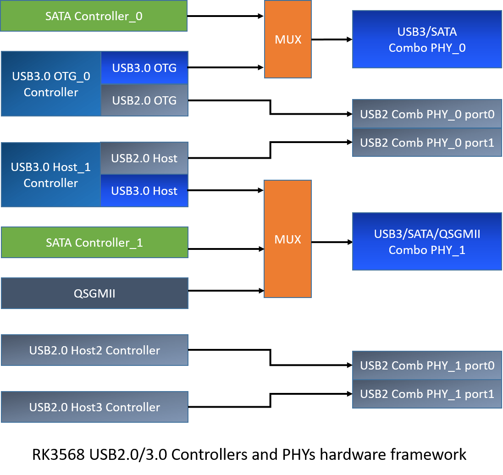

图 1  RK3568 USB 控制器和 PHY 的连接示意图

## RK356x USB 硬件电路设计

本章节主要说明 RK356x USB 在实际应用中，可以支持不同硬件电路设计方案。如下图 2 是 RK3568 USB 接口框图，可以看到，RK3568 USB 总共支持 4 个 USB 外设接口，包括 1 个 USB 3.0 OTG 接口，1 个 USB 3.0 Host 接口，以及 2 个 USB 2.0 Host 接口。而 RK3566 USB 同样支持 4 个 USB 外设接口，包括 1 个 USB 2.0 OTG 接口，1 个 USB 3.0 Host 接口，以及 2 个 USB 2.0 Host 接口。

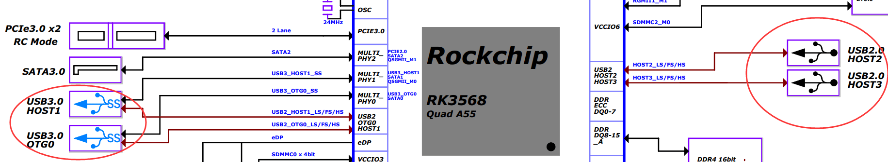

图 2 RK3568 原理图的USB 外设接口

### RK356x USB 2.0/3.0 供电及功耗控制

功耗控制的原则是：

1. 硬件电路设计中，如果可以直接断开 USB 2.0 PHY或者 Combo PHY 的供电，则 PHY 功耗为0，PHY 对应的 DTS 节点配置为disable 即可；
2. 硬件电路设计中，如果必须保证 USB 2.0 PHY 的供电，**则 DTS 中需要将 PHY 对应的两个 port 节点都配置为enable 状态**，以便 PHY 驱动中设置不使用的 port 进入suspend mode；
3. 不使用的 USB 控制器，对应的控制器 DTS 节点配置为 disable 即可；
4. 不使用的 Combo PHY，对应的 Combo PHY DTS 节点配置为 disable 即可；

#### RK356x USB 2.0/3.0 控制器供电及功耗控制

RK356x USB 2.0/3.0 控制器的供电是 VDD_LOGIC，并且 USB 3.0 控制器与 PCIE/SATA/XPCS 一起使用芯片内部的 power domain PD_PIPE，可以根据 USB 3.0 接口的工作情况，动态控制 PD_PIPE 的开关，以降低 USB 3.0 控制器的功耗。但 USB 2.0 控制器没有 power domain。

需要注意的是，RK356x Linux 内核已经支持 USB 3.0 OTG 的 PD_PIPE 动态开关，以及支持 USB Host auto suspend功能（指 USB Host 接口不接任何外设时，Host  控制器自动进入 suspend 低功耗状态），因此开发者不用对 USB 2.0/3.0 控制器的功耗控制进行调试工作。

如果产品上不需要使用所有的 USB 接口，建议在内核中，将未使用的 USB 控制器的 DTS 配置为 disable，以降低 USB 控制器的功耗。如下是 disable USB 2.0 Host_2 和 USB 2.0 Host_3 的方法：

```c
&usb_host0_ehci {
        status = "disabled";
};

&usb_host0_ohci {
        status = "disabled";
};

&usb_host1_ehci {
        status = "disabled";
};

&usb_host1_ohci {
        status = "disabled";
};
```

#### RK356x USB 2.0 PHYs 供电及功耗控制

RK356x 包含 2 个 USB 2.0 Combo PHY。其中，USB OTG 和 USB Host_1 使用USB 2.0 Comb PHY_0；USB Host_2 和 USB Host_3 使用 USB 2.0 Comb PHY_1。每一个 USB 2.0 Combo PHY 的供电有三路：3.3V，1.8V 和 0.9V，如下表 3 所示。

需要注意的是，实际电路中，这三路电压值超过规定的最大值或者低于规定的最小值（电压最大允许上下波动±10%），都可能会导致 USB 连接异常。

表 3 USB2.0 PHY power supplies

| Supply Voltage | Min  | Typ  | Max  | Unit |
| :------------: | :--: | :--: | :--: | :--: |
|  USB_AVDD_3V3  | 3.0  | 3.3  | 3.6  |  V   |
|  USB_AVDD_1V8  | 1.62 | 1.8  | 1.98 |  V   |
|  USB_AVDD_0V9  | 0.81 | 0.9  | 0.99 |  V   |

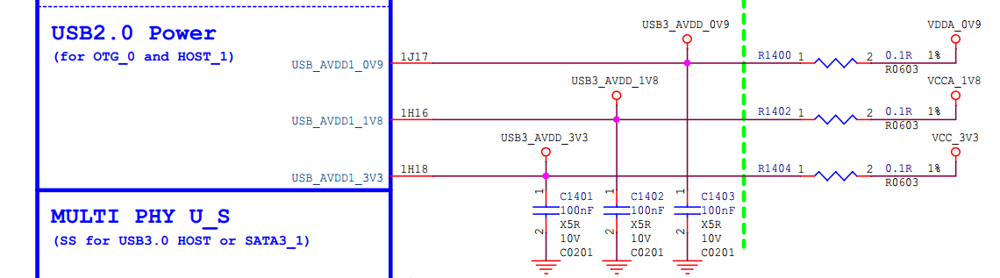

图 3 USB 2.0 Comb PHY_0 (for OTG and Host_1) 供电电路

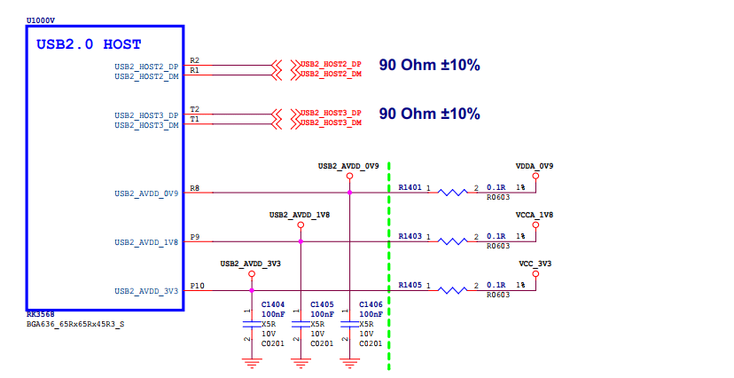

图 4 USB 2.0 Comb PHY_1  (for Host_2 and Host_3) 供电电路

上电后，USB 2.0 Comb PHY 的默认配置是处于正常工作的状态，因此需要在 USB PHY 驱动中做动态功耗控制（PHY 驱动代码已经支持），或者断开 USB PHY 的供电。需要注意的是，**USB 2.0 Comb PHY_0  用于 USB OTG，因为至少需要支持 USB 下载固件的功能，所以 USB 2.0 Comb PHY_0 的供电一定不能断**。

在 RK356x 实际的产品中，一种常见 USB 2.0 PHY 功耗优化场景是：

产品只需要支持 USB OTG 功能，不需要 USB 3.0 Host_1/USB 2.0 Host_2/USB 2. 0 Host_3，建议 USB 2.0 PHY 功耗优化如下：

1. 在内核 DTS 中，disable u2phy0_host 节点

   目的是，避免在 PHY 驱动 的 probe 流程中，执行 u2phy0_host 的初始化，导致 u2phy0_host  功耗增加。

2. 断开 USB 2.0 Comb PHY_1 的供电

   如下图 5 的硬件电路所示，将 Comb PHY_1 的三路供电接地。


图 5 USB 2.0 Comb PHY_1 (for Host_2 and Host_3) 断开供电电路

因为 Comb PHY_1 对一个 USB 2.0 Host2 和 USB 2.0 Host3，所以，软件上需要相应修改内核 DTS，必须 disable 内核 DTS 中的 PHY 节点 u2phy1_host 和 u2phy1_otg，以及对应的 USB 控制器节点 usb_host1_ehci 和 usb_host1_ohci，参考方法如下：

```c
&usb_host1_ehci {
	status = "disabled";
};

&usb_host1_ohci {
	status = "disabled";
};

&u2phy1_host {
	status = "disabled";
};

&u2phy1_otg {
	status = "disabled";
};
```

需要特别注意的是，在 USB PHY 未供电的情况下，如果没有 disable 内核 DTS 中 PHY 对应的 USB 控制器节点，将会导致内核初始化时，卡死在 USB 控制器的初始化，对应的典型 log 如下：

```c
[    1.240101] ohci_hcd: USB 1.1 'Open' Host Controller (OHCI) Driver
[    1.241896] ohci-platform: OHCI generic platform driver
[    1.242698] ohci-platform fd8c0000.usb: Generic Platform OHCI controller
[    1.243686] ohci-platform fd8c0000.usb: new USB bus registered, assigned bus number 3
```

#### RK356x USB 3.0 PHYs 供电及功耗控制

RK3566 USB 3.0 Host_1 使用 USB3/SATA/QSGMII Combo PHY_1 (对应原理图中的 MULTI_PHY1 );

RK3568 USB 3.0 OTG 使用 USB3/SATA Combo PHY_0 (对应原理图中的 MULTI_PHY0 )，USB 3.0 Host_1 使用 USB3/SATA/QSGMII Combo PHY_1 (对应原理图中的 MULTI_PHY1);

RK356x MULTI_PHY0/MULTI_PHY1/MULTI_PHY2 使用同样的供电电源，如下图 6 所示，有两路供电：0.9V 和 1.8V。对这两路供电电源的电压要求，请参考表 4。

表 4 USB 3.0 Combo PHY power supplies

|   Supply Voltage   | Min  | Typ  | Max  | Unit |
| :----------------: | :--: | :--: | :--: | :--: |
| MULTI_PHY_AVDD_1V8 | 1.62 | 1.8  | 1.98 |  V   |
| MULTI_PHY_AVDD_0V9 | 0.81 | 0.9  | 0.99 |  V   |

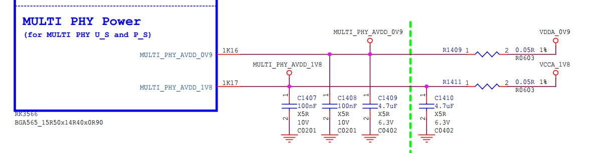

图 6 RK356x Multi PHYs 供电电路

芯片上电时，三个  MULTI_PHY0/MULTI_PHY1/MULTI_PHY2 默认处于工作状态。在 UBoot 中，会通过软件设置三个 PHY 处于 reset 状态，以保持 PHY 处于最低功耗。进入内核后，USB 3.0/SATA/PCIE/QSGMII 控制器驱动会调用 rockchip_combphy_init() 函数释放 PHY 的 reset。

当 Combo PHY 工作在 USB 3.0 mode 时，PHY 的 PIPE state (P0/P1/P2/P3) 由 USB 3.0 控制器硬件自动控制，根据不同的工作场景，动态进入和退出 P0/P1/P2/P3 state。比如，USB 3.0 Host 未插入任何 USB 设备时，则 PIPE处于 P3 state；插入 U3 disk 时，则切换到 P0 state；当接 USB 3.0 HUB 时，只要 HUB 的下行端口没有接其他 USB 外设，则 PIPE state 会自动进入 P3 state。当有 USB 外设插入USB3 HUB，则 PIPE state 切为 P0。(注：P0 为正常工作状态，P3 为最低功耗状态)

当 Combo PHY 未作任何功能使用时，建议在内核 DTS 中，将对应的 USB 3.0 控制器和 PHY 节点 disable，以保证 PHY 处于最低功耗状态。DTS 的配置方法，请参考章节[RK356x USB DTS 配置](#RK356x USB DTS 配置)。

### RK3566 USB 2.0 OTG Micro-B 接口硬件电路

RK3566 USB 2.0 OTG Micro-B 接口硬件电路如下图 7、8、9，与 Rockchip 其他平台的 SDK 中常见的 USB 2.0 OTG 电路设计类似，因此，这里不详细介绍电路设计原理。

有三点需要注意：

1. DP/DM 必须分别串接 2.2 Ω 电阻，提高 DP/DM 的抗压/抗静电能力；
2. 如果要支持 USB Device 动态拔插检测和充电类型检测功能，则 VBUSDET 脚一定要连接到 USB Micro接口；
3. 如果不需要支持 USB Device 动态拔插检测和充电类型检测功能，可以允许 VBUSDET 脚固定拉高到 3.3V 或者悬空 (推荐拉高到 3.3V)。由于 RK356x Maskrom USB 的连接不依赖于 VBUSDET 信号的检测，所以即使  VBUSDET 脚悬空，Maskrom USB 仍然可以正常工作并下载固件；

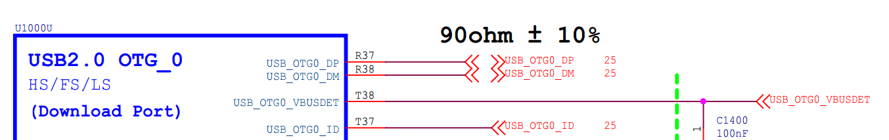

图 7 RK3566 USB2.0 OTG Pins

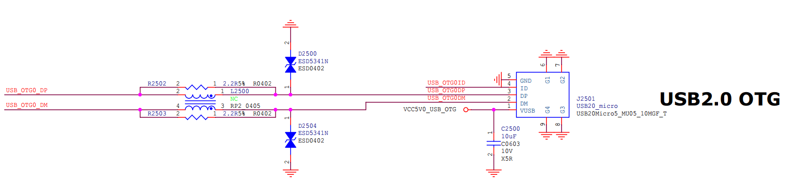

图 8 RK3566 USB2.0 OTG Micro-B 接口

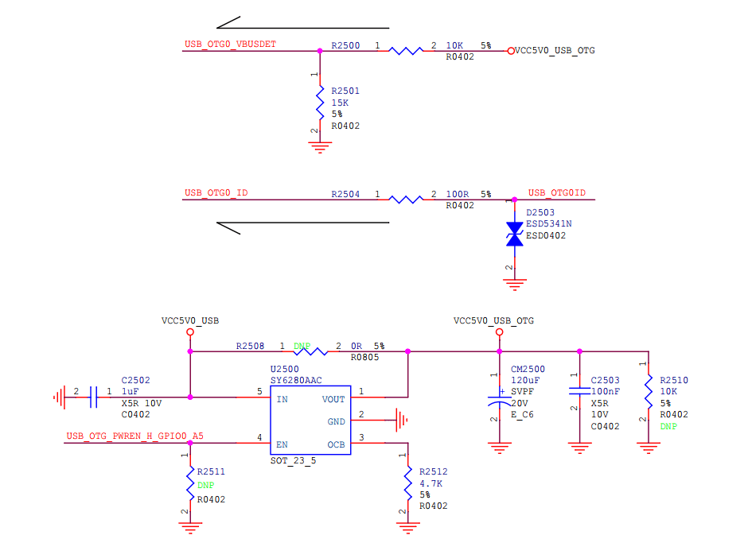

图 9 RK3566 USB2.0 OTG VBUS 和 OTG_ID 控制电路

### RK3566 USB 2.0 OTG Type-C 接口硬件电路

RK3566 提供了 USB 2.0 OTG Type-C 接口硬件电路参考设计。在该电路设计中，Type-C 接口的 DP1/DM1 和 DP2/DM2 直接连接到 RK3566 芯片的 USB_OTG0_DP/USB_OTG0_DM，所以不需要检测 Type-C 的正反插。电路设计的关键点在于通过 CC1/CC2 检测 UFP/DFP 类型（对应 USB Device/Host mode），参考图 12。CC 检测电路的设计原理是基于 USB Type-C Specification<sup>[1]</sup> 文档中的 3.5.2 USB Type-C to USB 2.0 Standard-A Cable Assembly 和 3.6.1 USB Type-C to USB 3.1 Standard-A Receptacle Adapter Assembly 的设计规范：

1. Type-C to USB 2.0 Standard-A Cable，Pin A5 (CC) of the USB Type-C plug shall be connected to VBUS through a resistor Rp (56 kΩ ± 5%) ；
2. Type-C to USB 3.1 Standard-A Receptacle，Pin A5 (CC) of the USB Type-C plug shall be connected to GND through a resistor Rd (5.1 kΩ ± 20%)；


图 10 RK3566 USB2.0 OTG Pins

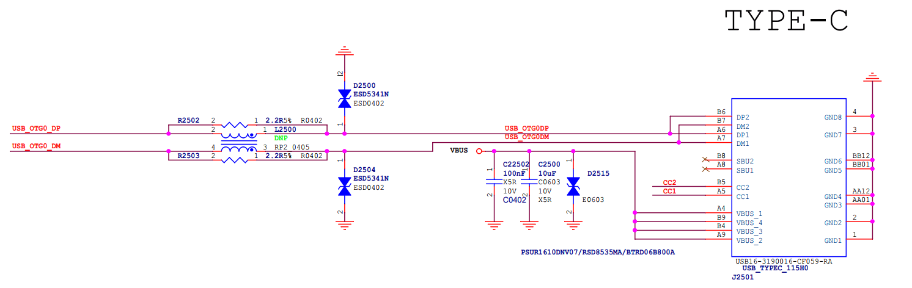

图11 RK3566 USB 2.0 OTG Type-C 接口

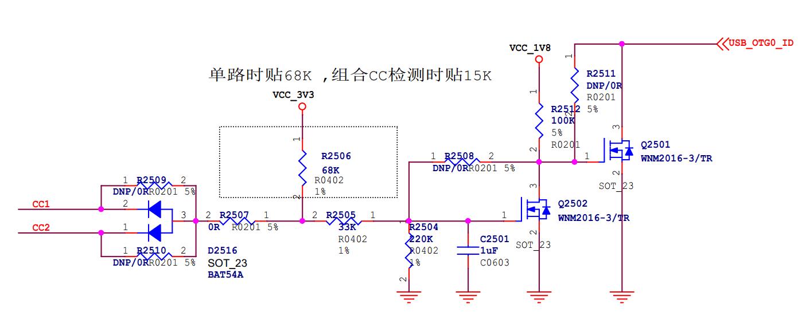

图 12 RK3566 USB 2.0 OTG Type-C CC 检测电路

Note：

1. RK3566 芯片内部 USB_OTG0_ID 内部上拉电压 1.8V，内部上拉电阻 155K ohm；
2. 当插入 Type-C to USB 2.0 Standard-A Plug cable 时，cable 的 CC 线弱上拉到 VBUS 5V，保证 USB_OTG0_ID 为高电平，因此 USB 2.0 OTG 工作于 Device 模式；
3. 当插入 Type-C to USB 2.0 Standard-A Receptacle cable 时，cable 的 CC 线弱下拉到 GND，USB_OTG0_ID 也会被拉到低电平，因此 USB 2.0 OTG 根据 ID 中断，切换为 Host 模式；

### RK356x USB 2.0 Host Type-A 接口硬件电路

RK356x USB 2.0 Host Type-A 接口硬件电路如下图 13 和图 14 所示，与 Rockchip 其他平台的 SDK 中常见的 USB 2.0 Host 电路设计类似，因此，这里不详细介绍电路设计原理。

需要注意的是，如果产品上不使用 USB 2.0 Host，建议断开 USB 2.0 Host PHY 的供电，具体方法参考章节[RK356x USB 2.0 PHYs 供电及功耗控制](#RK356x USB 2.0 PHYs 供电及功耗控制)和图 5 的电路设计。

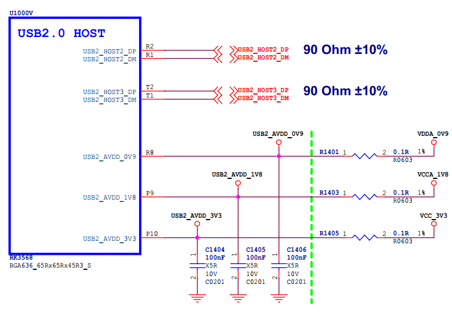

图 13 RK356x USB 2.0 Host pins

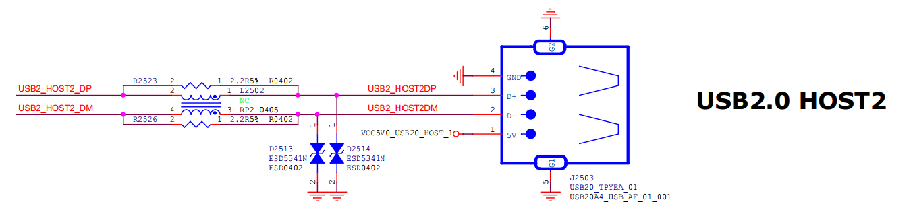

图 14 RK356x USB 2.0 Host 接口

### RK3568 USB 3.0 OTG Type-A 接口硬件电路

RK3568 USB 3.0 OTG Type-A 的接口电路设计如图 15、图 16 和图 17 所示。这种电路设计的优点是物理接口比 Micro USB 3.0 尺寸小，并且方便接 USB 外设。但缺点是，没有支持 USB3_OTG0_ID 的检测，因此无法支持硬件自动切换 OTG Host mode，需要通过软件切换 mode，切换命令参考章节 [RK356x USB OTG mode 切换命令](#RK356x USB OTG mode 切换命令)。通常情况下，USB 3.0 OTG 默认是配置为 OTG mode，当作为 Device mode 连接 PC 时，USB 驱动支持自动切换为 Device mode。如果要连接 USB 外设（如 U 盘）时，则需要软件强制切换为 Host mode。当需要从 Host mode 切换回 Device mode 时，同样需要软件强制切换。

需要注意的是，有些 USB 3.0 外设（如 USB 3.0 机械硬盘和 USB 3.0 Camera）对工作电流要求较高，所以当 USB 3.0 OTG 作 Host mode 时，需要保证 VBUS 的供电电流达到 1A 以上，如图 17 所示，电源芯片 SY6280AAC 的输出限流配置为 1.446 A，满足大部分 USB 3.0 外设的工作电流需求。

有四点需要注意：

1. DP/DM 必须分别串接 2.2 Ω 电阻，提高 DP/DM 的抗压/抗静电能力；
2. 如果要支持 USB Device 动态拔插检测和充电类型检测功能，则 VBUSDET 脚一定要连接到 USB Type-A 接口；
3. 如果不需要支持 USB Device 动态拔插检测和充电类型检测功能，可以允许 VBUSDET 脚固定拉高到 3.3V 或者悬空 (推荐拉高到 3.3V)。由于 RK356x Maskrom USB 的连接不依赖于 VBUSDET 信号的检测，所以即使  VBUSDET 脚悬空，Maskrom USB 仍然可以正常工作并下载固件；
4. USB3_OTG0_ID 未使用，悬空即可，芯片内部拉高到 1.8V；

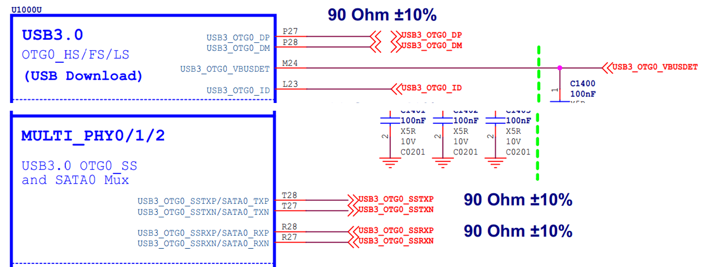

图 15 RK3568 USB 3.0 OTG Pins

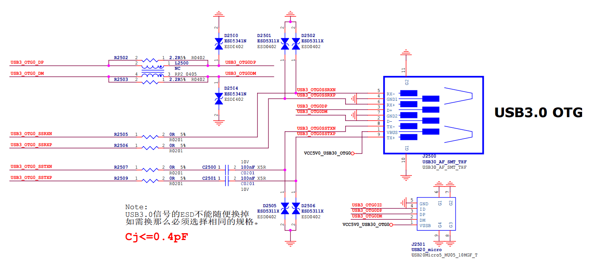

图 16 RK3568 USB 3.0 OTG Type-A 接口

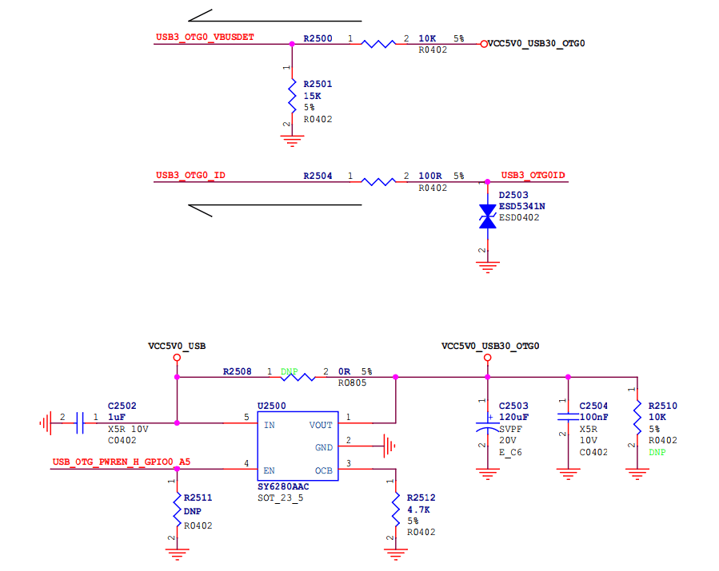

图 17 RK3568 USB 3.0 OTG VBUS 和 OTG ID 控制电路

### RK3568 USB 3.0 OTG Type-C 接口硬件电路

RK3568 SDK 未提供 USB 3.0 OTG Type-C 接口的硬件参考电路。如果开发者要支持该接口，需要在 RK3568 USB 3.0 OTG 和 Type-C 接口中间增加一个 USB 3.1 Switch 芯片（如 FUSB340）和一个 CC 通信芯片（如 FUSB302）。

### RK356x USB 3.0  HOST Type-A 接口硬件电路

RK3566/RK3568 USB 3.0  HOST Type-A 接口硬件电路与前面章节 [RK3568 USB 3.0 OTG Type-A 接口硬件电路](#RK3568 USB 3.0 OTG Type-A 接口硬件电路) 基本一样，不同点在于 RK3566/RK3568 USB 3.0  HOST 没有 VBUSDET pin 和 ID pin。电路设计的注意事项，请参考 RK3568 USB 3.0 OTG Type-A 接口硬件电路。

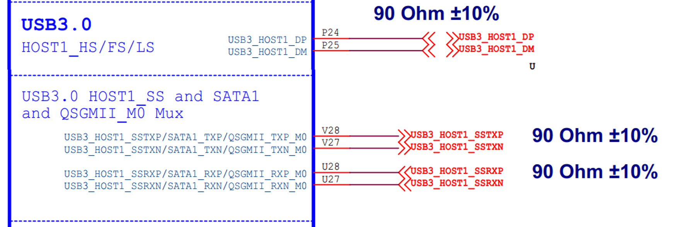

图 18 RK356x USB3.0 HOST1 Pins

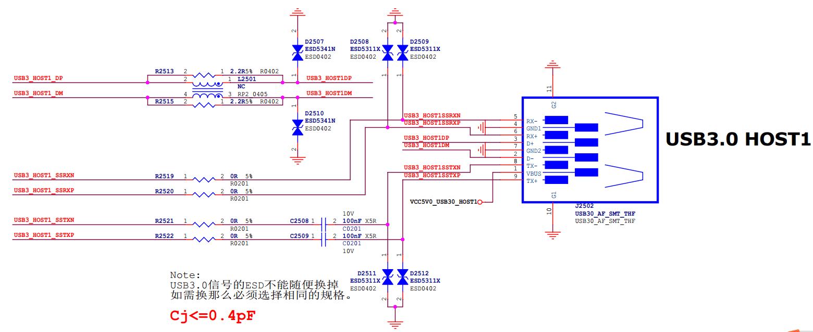

图 19 RK356x USB3.0 HOST1 Type-A 接口

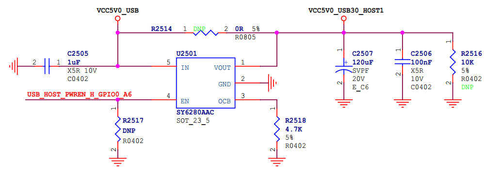

图 20 RK356x USB3.0 HOST1 VBUS 控制电路

## RK356x USB DTS 配置

RK356x USB 硬件电路具有多样化的特点，尤其是灵活多变的 USB OTG 口的硬件电路，以及复杂的 USB 3.0/SATA/QSGMII Combo PHY 复用关系。因此，建议开发者要在理解硬件电路设计的基础上，正确配置 USB 相关的控制器和 PHY 的 DTS 节点。

本文档主要说明 USB DTS 的配置方法，没有说明 USB 控制器和 PHY 的驱动。如果开发者需要了解 USB 控制器和 PHY 的详细设计，请参考 SDK 的 USB 开发指南<sup>[2]</sup>。

### RK3568 USB 控制器和 PHY DTSI 节点

RK3568 USB 控制器和 PHY 的 DTS 详细配置方法，请参考内核文档<sup>[4]~[10]</sup>。

如下代码是 DTSI 中 USB 控制器和 PHY 相关的主要节点。

```c
/* USB 3.0 OTG/SATA Combo PHY_0 */
combphy0_us: phy@fe820000 {
        compatible = "rockchip,rk3568-naneng-combphy";
        reg = <0x0 0xfe820000 0x0 0x100>;
        #phy-cells = <1>;
        clocks = <&pmucru CLK_PCIEPHY0_REF>, <&cru PCLK_PIPEPHY0>,
                 <&cru PCLK_PIPE>;
        clock-names = "refclk", "apbclk", "pipe_clk";
        assigned-clocks = <&pmucru CLK_PCIEPHY0_REF>;
        assigned-clock-rates = <24000000>;
        resets = <&cru SRST_P_PIPEPHY0>, <&cru SRST_PIPEPHY0>;
        reset-names = "combphy-apb", "combphy";
        rockchip,pipe-grf = <&pipegrf>;
        rockchip,pipe-phy-grf = <&pipe_phy_grf0>;
        status = "disabled";
};
/* USB 3.0 Host/SATA/QSGMII Combo PHY_1 */
combphy1_usq: phy@fe830000 {
        compatible = "rockchip,rk3568-naneng-combphy";
        reg = <0x0 0xfe830000 0x0 0x100>;
        #phy-cells = <1>;
        clocks = <&pmucru CLK_PCIEPHY1_REF>, <&cru PCLK_PIPEPHY1>,
                 <&cru PCLK_PIPE>;
        clock-names = "refclk", "apbclk", "pipe_clk";
        assigned-clocks = <&pmucru CLK_PCIEPHY1_REF>;
        assigned-clock-rates = <24000000>;
        resets = <&cru SRST_P_PIPEPHY1>, <&cru SRST_PIPEPHY1>;
        reset-names = "combphy-apb", "combphy";
        rockchip,pipe-grf = <&pipegrf>;
        rockchip,pipe-phy-grf = <&pipe_phy_grf1>;
        status = "disabled";
};
/* USB OTG/USB Host_1 USB 2.0 Comb PHY_0 */
usb2phy0: usb2-phy@fe8a0000 {
        compatible = "rockchip,rk3568-usb2phy";
        reg = <0x0 0xfe8a0000 0x0 0x10000>;
        interrupts = <GIC_SPI 135 IRQ_TYPE_LEVEL_HIGH>;
        clocks = <&pmucru CLK_USBPHY0_REF>;
        clock-names = "phyclk";
        #clock-cells = <0>;
        assigned-clocks = <&cru USB480M>;
        assigned-clock-parents = <&usb2phy0>;
        clock-output-names = "usb480m_phy";
        rockchip,usbgrf = <&usb2phy0_grf>;
        status = "disabled";

        u2phy0_host: host-port {
                #phy-cells = <0>;
                status = "disabled";
        };

        u2phy0_otg: otg-port {
                #phy-cells = <0>;
                status = "disabled";
        };
};
/* USB Host_1/USB Host_2 USB 2.0 Comb PHY_0 */
usb2phy1: usb2-phy@fe8b0000 {
        compatible = "rockchip,rk3568-usb2phy";
        reg = <0x0 0xfe8b0000 0x0 0x10000>;
        interrupts = <GIC_SPI 136 IRQ_TYPE_LEVEL_HIGH>;
        clocks = <&pmucru CLK_USBPHY1_REF>;
        clock-names = "phyclk";
        #clock-cells = <0>;
        rockchip,usbgrf = <&usb2phy1_grf>;
        status = "disabled";

        u2phy1_host: host-port {
                #phy-cells = <0>;
                status = "disabled";
        };

        u2phy1_otg: otg-port {
                #phy-cells = <0>;
                status = "disabled";
        };
};
/* USB 3.0 OTG controller */
usbdrd30: usbdrd {
        compatible = "rockchip,rk3568-dwc3", "rockchip,rk3399-dwc3";
        clocks = <&cru CLK_USB3OTG0_REF>, <&cru CLK_USB3OTG0_SUSPEND>,
                 <&cru ACLK_USB3OTG0>, <&cru PCLK_PIPE>;
        clock-names = "ref_clk", "suspend_clk",
                      "bus_clk", "pipe_clk";
        #address-cells = <2>;
        #size-cells = <2>;
        ranges;
        status = "disabled";

        usbdrd_dwc3: dwc3@fcc00000 {
                compatible = "snps,dwc3";
                reg = <0x0 0xfcc00000 0x0 0x400000>;
                interrupts = <GIC_SPI 169 IRQ_TYPE_LEVEL_HIGH>;
                dr_mode = "otg";
                phys = <&u2phy0_otg>, <&combphy0_us PHY_TYPE_USB3>;
                phy-names = "usb2-phy", "usb3-phy";
                phy_type = "utmi_wide";
                power-domains = <&power RK3568_PD_PIPE>;
                resets = <&cru SRST_USB3OTG0>;
                reset-names = "usb3-otg";
                snps,dis_enblslpm_quirk;
                snps,dis-u2-freeclk-exists-quirk;
                snps,dis-del-phy-power-chg-quirk;
                snps,dis-tx-ipgap-linecheck-quirk;
                snps,xhci-trb-ent-quirk;
                status = "disabled";
        };
};
/* USB 3.0 Host_1 controller */
usbhost30: usbhost {
        compatible = "rockchip,rk3568-dwc3", "rockchip,rk3399-dwc3";
        clocks = <&cru CLK_USB3OTG1_REF>, <&cru CLK_USB3OTG1_SUSPEND>,
                 <&cru ACLK_USB3OTG1>, <&cru PCLK_PIPE>;
        clock-names = "ref_clk", "suspend_clk",
                      "bus_clk", "pipe_clk";
        #address-cells = <2>;
        #size-cells = <2>;
        ranges;
        status = "disabled";

        usbhost_dwc3: dwc3@fd000000 {
                compatible = "snps,dwc3";
                reg = <0x0 0xfd000000 0x0 0x400000>;
                interrupts = <GIC_SPI 170 IRQ_TYPE_LEVEL_HIGH>;
                dr_mode = "host";
                phys = <&u2phy0_host>, <&combphy1_usq PHY_TYPE_USB3>;
                phy-names = "usb2-phy", "usb3-phy";
                phy_type = "utmi_wide";
                power-domains = <&power RK3568_PD_PIPE>;
                resets = <&cru SRST_USB3OTG1>;
                reset-names = "usb3-host";
                snps,dis_enblslpm_quirk;
                snps,dis-u2-freeclk-exists-quirk;
                snps,dis-del-phy-power-chg-quirk;
                snps,dis-tx-ipgap-linecheck-quirk;
                snps,xhci-trb-ent-quirk;
                status = "disabled";
        };
};
/* USB 2.0 Host_2 EHCI controller for high speed */
usb_host0_ehci: usb@fd800000 {
        compatible = "generic-ehci";
        reg = <0x0 0xfd800000 0x0 0x40000>;
        interrupts = <GIC_SPI 130 IRQ_TYPE_LEVEL_HIGH>;
        clocks = <&cru HCLK_USB2HOST0>, <&cru HCLK_USB2HOST0_ARB>,
                 <&cru PCLK_USB>, <&usb2phy1>;
        clock-names = "usbhost", "arbiter", "pclk", "utmi";
        phys = <&u2phy1_otg>;
        phy-names = "usb2-phy";
        status = "disabled";
};
/* USB 2.0 Host_2 OHCI controller for full/low speed */
usb_host0_ohci: usb@fd840000 {
        compatible = "generic-ohci";
        reg = <0x0 0xfd840000 0x0 0x40000>;
        interrupts = <GIC_SPI 131 IRQ_TYPE_LEVEL_HIGH>;
        clocks = <&cru HCLK_USB2HOST0>, <&cru HCLK_USB2HOST0_ARB>,
                 <&cru PCLK_USB>, <&usb2phy1>;
        clock-names = "usbhost", "arbiter", "pclk", "utmi";
        phys = <&u2phy1_otg>;
        phy-names = "usb2-phy";
        status = "disabled";
};
/* USB 2.0 Host_3 EHCI controller for high speed */
usb_host1_ehci: usb@fd880000 {
        compatible = "generic-ehci";
        reg = <0x0 0xfd880000 0x0 0x40000>;
        interrupts = <GIC_SPI 133 IRQ_TYPE_LEVEL_HIGH>;
        clocks = <&cru HCLK_USB2HOST1>, <&cru HCLK_USB2HOST1_ARB>,
                 <&cru PCLK_USB>, <&usb2phy1>;
        clock-names = "usbhost", "arbiter", "pclk", "utmi";
        phys = <&u2phy1_host>;
        phy-names = "usb2-phy";
        status = "disabled";
};
/* USB 2.0 Host_3 OHCI controller for full/low speed */
usb_host1_ohci: usb@fd8c0000 {
        compatible = "generic-ohci";
        reg = <0x0 0xfd8c0000 0x0 0x40000>;
        interrupts = <GIC_SPI 134 IRQ_TYPE_LEVEL_HIGH>;
        clocks = <&cru HCLK_USB2HOST1>, <&cru HCLK_USB2HOST1_ARB>,
                 <&cru PCLK_USB>, <&usb2phy1>;
        clock-names = "usbhost", "arbiter", "pclk", "utmi";
        phys = <&u2phy1_host>;
        phy-names = "usb2-phy";
        status = "disabled";
};
```

### RK3568 USB 3.0 OTG to USB 2.0 only 配置

USB 3.0 OTG 的 USB 3.0 PHY 与 SATA_0 控制器复用 Comb PHY_0，当 Comb PHY_0 配置给 SATA_0 用时，需要配置 USB 3.0 OTG 工作在 USB 2.0 only 模式，对应的 DTS 配置如下（控制器和PHY的驱动不用改动）：

```c
&usbdrd_dwc3 {
        phys = <&u2phy0_otg>; /* 配置 phys 属性只引用 usb 2.0 phy 节点 */
        phy-names = "usb2-phy";
        extcon = <&usb2phy0>;
        maximum-speed = "high-speed"; /* 配置 dwc3 控制器最高支持 high speed */
        snps,dis_u2_susphy_quirk; /* 配置 dwc3 控制器不支持自动 suspend usb2 phy */
};

&combphy0_us {
        rockchip,dis-u3otg0-port; /* 配置 dwc3_0 控制器最高支持 high speed */
        status = "okay";
};
```

### RK356x USB 3.0 Host to USB 2.0 only 配置

USB 3.0 Host 的 USB 3.0 PHY 与 SATA_1/QSGMII 控制器复用 Comb PHY_1，当 Comb PHY_1 配置给 SATA_1 或者 QSGMII 用时，需要配置 USB 3.0 Host 工作在 USB 2.0 only 模式，对应的 DTS 配置如下（控制器和PHY的驱动不用改动）：

```c
&usbhost_dwc3 {
        phys = <&u2phy0_host>; /* 配置 phys 属性只引用 usb 2.0 phy 节点 */
        phy-names = "usb2-phy";
        maximum-speed = "high-speed"; /* 配置 dwc3 控制器最高支持 high speed */
        status = "okay";
};

&combphy1_usq {
        rockchip,dis-u3otg1-port; /* 配置 dwc3_1 控制器最高支持 high speed */
        status = "okay";
};
```

### USB VBUS 配置

Rockchip 平台的 USB VBUS 控制电路，主要有三种方案<sup>[3]</sup>：

1. 使用 GPIO 控制电源稳压芯片输出 Vbus 5V 供电电压；
2. 使用 PMIC（如RK809/RK817/RK818）输出 Vbus 5V 供电电压；
3. 开机后，硬件直接输出 Vbus 5V 供电电压，不需要软件控制，一般用于 USB Host 接口；

RK356x SDK 主要使用的是第 1 种方案，以 RK3568 EVB 的 OTG 口和 HOST 口的 VBUS 配置为例：

```c
vcc5v0_host: vcc5v0-host-regulator {
        compatible = "regulator-fixed";
        enable-active-high;
        gpio = <&gpio0 RK_PA6 GPIO_ACTIVE_HIGH>;
        pinctrl-names = "default";
        pinctrl-0 = <&vcc5v0_host_en>;
        regulator-name = "vcc5v0_host";
        regulator-always-on; /* Host Vbus 为常供电，所以配置属性为 regulator-always-on */
};

vcc5v0_otg: vcc5v0-otg-regulator {
        compatible = "regulator-fixed";
        enable-active-high;
        gpio = <&gpio0 RK_PA5 GPIO_ACTIVE_HIGH>;
        pinctrl-names = "default";
        pinctrl-0 = <&vcc5v0_otg_en>;
        regulator-name = "vcc5v0_otg";
};

&pinctrl {
        usb {
                vcc5v0_host_en: vcc5v0-host-en {
                        rockchip,pins = <0 RK_PA6 RK_FUNC_GPIO &pcfg_pull_none>;
                };

                vcc5v0_otg_en: vcc5v0-otg-en {
                        rockchip,pins = <0 RK_PA5 RK_FUNC_GPIO &pcfg_pull_none>;
                };
        };
};

/* 注意： host 控制 vbus 的属性是 phy-supply */
&u2phy0_host {
        phy-supply = <&vcc5v0_host>;
        status = "okay";
};

/* 注意： otg 控制 vbus 的属性是 vbus-supply */
&u2phy0_otg {
        vbus-supply = <&vcc5v0_otg>;
        status = "okay";
};

&u2phy1_host {
        phy-supply = <&vcc5v0_host>;
        status = "okay";
};

&u2phy1_otg {
        phy-supply = <&vcc5v0_host>;
        status = "okay";
};
```

## RK356x USB OTG mode 切换命令

RK356x SDK 支持通过软件方法，强制设置 USB 2.0/3.0 OTG 切换到 Host mode 或者 Peripheral mode，而不受 USB 硬件电路的 OTG ID 电平或者 Type-C 接口的影响。

RK356x Linux-4.19 内核切换 USB 控制器工作在 Peripheral mode 或 Host mode 的方法

```shell
#1.Force host mode
  echo host > /sys/devices/platform/fe8a0000.usb2-phy/otg_mode
#2.Force peripheral mode
  echo peripheral > /sys/devices/platform/fe8a0000.usb2-phy/otg_mode
#3.Force otg mode
  echo otg > /sys/devices/platform/fe8a0000.usb2-phy/otg_mode
```

## 参考文献

1. 《Universal Serial Bus Type-C Cable and Connector Specification》
2. 《Rockchip_Developer_Guide_USB_CN》
3. 《Rockchip_RK3399_Developer_Guide_USB_CN》
4. kernel/Documentation/devicetree/bindings/usb/generic.txt
5. kernel/Documentation/devicetree/bindings/usb/dwc3.txt
6. kernel/Documentation/devicetree/bindings/usb/rockchip,dwc3.txt
7. kernel/Documentation/devicetree/bindings/usb/usb-ehci.txt
8. kernel/Documentation/devicetree/bindings/usb/usb-ohci.txt
9. kernel/Documentation/devicetree/bindings/phy/phy-rockchip-naneng-combphy.txt
10. kernel/Documentation/devicetree/bindings/phy/phy-rockchip-inno-usb2.txt
