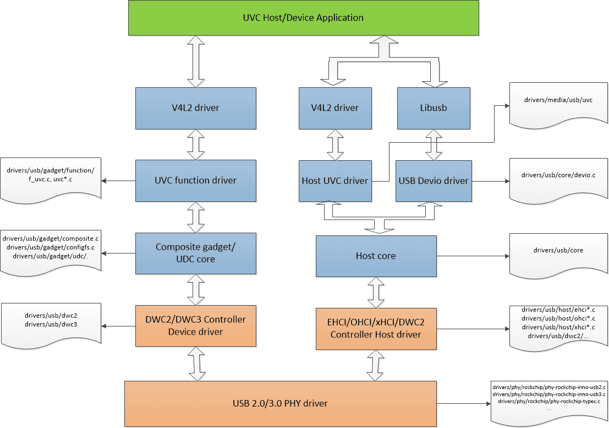
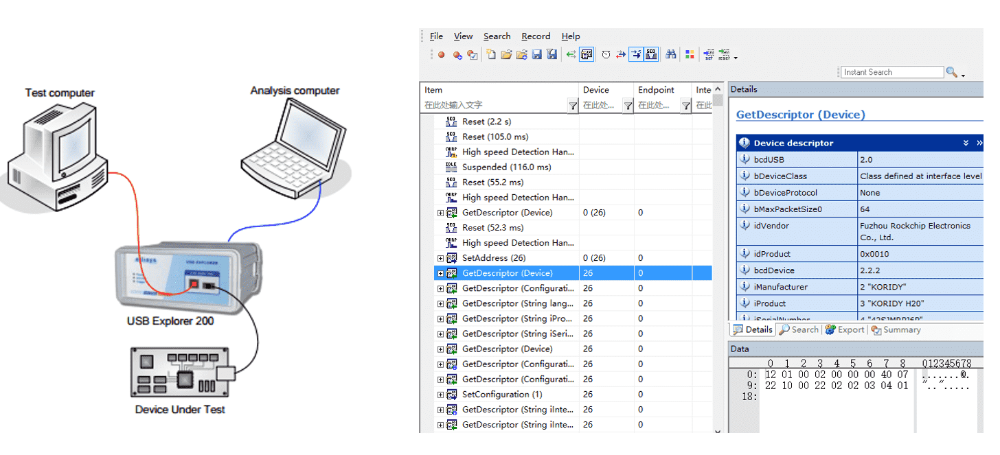
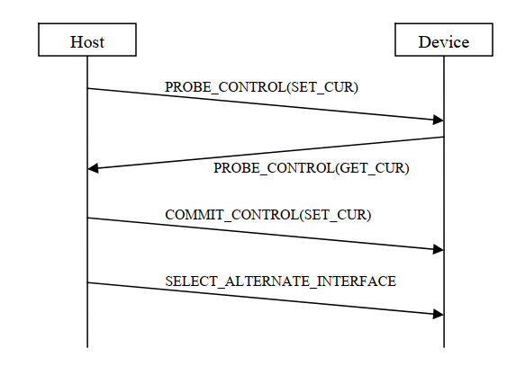

# Rockchip Linux4.19 USB Gadget UVC 问题排查

文件标识：RK-PC-YF-165

发布版本：V1.0.0

日期：2021-03-01

文件密级：□绝密   □秘密   □内部资料   ■公开

**免责声明**

本文档按“现状”提供，瑞芯微电子股份有限公司（“本公司”，下同）不对本文档的任何陈述、信息和内容的准确性、可靠性、完整性、适销性、特定目的性和非侵权性提供任何明示或暗示的声明或保证。本文档仅作为使用指导的参考。

由于产品版本升级或其他原因，本文档将可能在未经任何通知的情况下，不定期进行更新或修改。

**商标声明**

“Rockchip”、“瑞芯微”、“瑞芯”均为本公司的注册商标，归本公司所有。

本文档可能提及的其他所有注册商标或商标，由其各自拥有者所有。

**版权所有© 2021瑞芯微电子股份有限公司**

超越合理使用范畴，非经本公司书面许可，任何单位和个人不得擅自摘抄、复制本文档内容的部分或全部，并不得以任何形式传播。

瑞芯微电子股份有限公司

Rockchip Electronics Co., Ltd.

地址：     福建省福州市铜盘路软件园A区18号

网址：     [www.rock-chips.com](http://www.rock-chips.com)

客户服务电话： +86-4007-700-590

客户服务传真： +86-591-83951833

客户服务邮箱： [fae@rock-chips.com](mailto:fae@rock-chips.com)

---

**前言**

**概述**

本文档提供基于 Linux-4.19 内核的 USB Gadget UVC (USB Video Class) 常见问题的调试方法。目的是帮助软件开发工程师和技术支持工程师快速分析和定位 UVC 相关问题。

| **芯片名称**                           | **内核版本** |
| -------------------------------------- | ------------ |
| RK1808、RK3399、RV1109、RV1126、RK356X | Linux-4.19   |

**读者对象**

本文档（本指南）主要适用于以下工程师：

技术支持工程师

软件开发工程师

**修订记录**

| **日期**   | **版本** | **作者** | **修改说明** |
| ---------- | -------- | -------- | ------------ |
| 2021-03-01 | V1.0.0   | 吴良峰   | 初始版本     |

---

**目录**

[TOC]

---

## Linux-4.19 UVC 通信流程

如下图 1 是基于 Linux-4.19 内核的 UVC 数据流通信流程。图 1 左侧描述的是 USB Device 端的 UVC 相关模块和对应的内核代码路径。图 1 右侧描述的是 USB Host 端的 UVC 相关模块和对应的内核代码路径。本文档主要描述 USB Device 端的 UVC 问题排查方法，并且所给出的调试方法是基于 Rockchip 平台 Linux-4.19 内核，因此，不适用于所有内核版本，也不适用于排查 UVC 应用相关的问题。



图 1  Linux-4.19 UVC 通信流程

## UVC 常用调试方法

### USB 协议分析仪

USB 协议分析仪可以用于实时捕获 USB 总线上的通信数据，实现 USB 数据抓包和协议分析。如下图 2 是常见的 USB 2.0 协议分析仪的连接方法，使用时，需要将 USB 分析仪串接在 USB Device 和 Host 中间，同时，需要在电脑端安装相应的协议分析软件。USB 协议分析仪是用于定位问题点在 Device 还是 Host 端的最有效和最直观的方法。



图 2 USB 协议分析仪的连接示意图

- USB 协议分析仪可以用于分析 UVC 常见的几类问题：

1. UVC 打开预览图像失败问题；
2. UVC 预览图像延时问题；
3. UVC 预览图像卡住问题；
4. UVC 帧率统计和图像数据解析；
5. UVC 驱动加载失败的问题；

- USB 协议分析仪不适用于分析 UVC 常见的几类问题：

1. USB 信号质量问题；
2. UVC 异常断开问题；
3. UVC 通信过程中触发 USB 控制器 EMI 报错问题；

可以使用高带宽的示波器，测量 USB 眼图信号质量、USB 高速握手信号、USB VBUS 电源塌陷情况等，来分析 USB 信号问题、异常断开问题以及 EMI 问题。

### USB 抓包和分析工具

本章节提到的 USB 抓包工具，是指运行于电脑的工具软件，用于监听 USB 总线数据。虽然无法替代 USB 协议分析仪监听 USB 通信过程中的各种事务处理，但也能够满足很多应用场合。

#### Windows 抓包和分析工具

Bus Hound：用于抓取 USB 总线通信数据的工具，优点是安装和使用方便，缺点是没有详细的解析协议，不直观。

Wireshark：用于抓取 USB 总线通信数据的工具，相比 Bus Hound，可以更详细地解析 USB 通信协议，比如可以解析 UVC 协议的 PROBE_CONTROL（SET_CUR）和 COMMIT_CONTROL（SET_CUR）命令。

Usbview：用于查看 USB 设备的详细描述符信息。下载地址：[www.uwe-sieber.de](https://www.uwe-sieber.de/usbtreeview_e.html)

#### Linux 抓包和分析工具

usbmon：用于抓取 USB 总线通信数据的工具
vusb-analyzer：用于解析usbmon所抓取的数据
lsusb：用于查看USB设备的详细描述符信息

#### MacOS 抓包和分析工具

Wireshark：用于抓取 USB 总线通信数据的工具

### 常用的内核 UVC 调试接口

#### USB DWC2 OTG 控制器调试接口

`/sys/kernel/debug/[dwc2_controller_base_addr].usb`

以 Linux-4.19 RK3328 SoC DWC2 OTG 为例<sup>[1]</sup>：

```
rk3328_box:/sys/kernel/debug/ff580000.usb # ls
ep0   ep2out ep4out ep6out ep8in  ep9in  fifo    state
ep1in ep3in  ep5in  ep7in  ep8out ep9out regdump testmode
```

**ep*in/out:** 用于查询 Device 模式下，每个端点的状态信息；

**fifo:** 用于查询 DWC2 硬件FIFO的配置，如 RXFIFO Size，NPTXFIFO Size，每个端点的 TXFIFO Size；

**state:** 用于查询 DWC2 控制器的中断 MASK寄存器，Device 模式的控制和配置寄存器信息；

**regdump:** 打印 DWC2 控制器的所有寄存器状态信息；

**testmode:** 设置 USB 进入测试模式，主要用于 USB 眼图测试；

#### USB DWC3 OTG 控制器调试接口

`/sys/kernel/debug/[dwc3_controller_base_addr].dwc3`

以 Linux-4.19 RV1109/RV1126 SoC DWC3 OTG 为例<sup>[1~4]</sup>:

```
[root@RV1126_RV1109:/sys/kernel/debug/ffd00000.dwc3]# ls
ep0in   ep1in   ep2in   ep3in   ep4in   ep5in   ep6in       lsp_dump  regdump
ep0out  ep1out  ep2out  ep3out  ep4out  ep5out  link_state  mode      testmode
```

常用的调试节点：

**regdump:** 打印 DWC3 控制器的寄存器状态信息，包括每个端点的 TXFIFOSIZ；

**link_state:** 打印 DWC3 的 USB3 链路状态；

**mode:** 打印 DWC3 的工作模式；

**testmode:** 设置 DWC3 进入HighSpeed的测试模式，用于眼图测试；

此外，DWC3 控制器驱动还实现了基于内核 trace 框架的  tracepoint<sup>[5]</sup>，支持动态使能并保存 DWC3 驱动关键信息。

内核需要使能如下 Trace 相关配置

```c
Kernel hacking  --->
	[*] Tracers  --->
		[*]   Trace process context switches and events
		[*]   Enable uprobes-based dynamic events
		[*]   Trace gpio events
```

DWC3 驱动支持如下的 trace events：

```c
/sys/kernel/debug/tracing/events/dwc3# ls
dwc3_alloc_request  dwc3_event              dwc3_gadget_generic_cmd  enable
dwc3_complete_trb   dwc3_free_request       dwc3_gadget_giveback     filter
dwc3_ctrl_req       dwc3_gadget_ep_cmd      dwc3_prepare_trb
dwc3_ep_dequeue     dwc3_gadget_ep_disable  dwc3_readl
dwc3_ep_queue       dwc3_gadget_ep_enable   dwc3_writel
```

使用方法，请参考 `/sys/kernel/debug/tracing/README`

#### USB UDC core 调试接口

UDC core 实现了基于内核 trace 框架的 tracepoint，可以用于跟踪 UVC Function Driver 与 USB Controller Driver 之间交互的 USB Request 数据流。

内核需要使能 Trace 相关配置，参考[USB DWC3 OTG 控制器调试接口](#USB DWC3 OTG 控制器调试接口)章节描述的方法。

UDC core 支持如下的 trace events：

```
/sys/kernel/debug/tracing/events/gadget# ls
enable                usb_ep_free_request           usb_gadget_disconnect
filter                usb_ep_queue                  usb_gadget_frame_number
usb_ep_alloc_request  usb_ep_set_halt               usb_gadget_giveback_request
usb_ep_clear_halt     usb_ep_set_maxpacket_limit    usb_gadget_set_selfpowered
usb_ep_dequeue        usb_ep_set_wedge              usb_gadget_vbus_connect
usb_ep_disable        usb_gadget_activate           usb_gadget_vbus_disconnect
usb_ep_enable         usb_gadget_clear_selfpowered  usb_gadget_vbus_draw
usb_ep_fifo_flush     usb_gadget_connect            usb_gadget_wakeup
usb_ep_fifo_status    usb_gadget_deactivate
```

使用方法，请参考 `/sys/kernel/debug/tracing/README`

其中，usb_ep_alloc_request，usb_ep_free_request，usb_ep_queue 和 usb_ep_dequeue 是与 USB Request 相关的 events，需要重点关注。

#### UVC 驱动调试接口

UVC Funtion driver 提供了基于 system module 的调试接口，可以用于动态使能 UVC 控制命令（control request）的信息跟踪。

`/sys/module/usb_f_uvc/parameters/trace`

默认是关闭信息跟踪，可以通过如下命令打开 UVC 控制命令的信息跟踪：

`echo 4 > /sys/module/usb_f_uvc/parameters/trace`

信息打印等级为 KERN_DEBUG，可以通过执行命令 dmesg 来查看 UVC trace 信息。

以 RV1109 UVC 打开预览图像时的 UVC trace 为例，打印的信息如下：

```c
[root@RV1126_RV1109:/]# dmesg
[  426.441316] uvcvideo: setup request a1 81 value 0100 index 0003 001a
[  426.450280] uvcvideo: uvc_send_response: req len 26
[  426.450444] uvcvideo: event_setup_out 0, data len 26
[  426.451545] uvcvideo: setup request 21 01 value 0100 index 0003 001a
[  426.460862] uvcvideo: uvc_send_response: req len 26
[  426.461014] uvcvideo: event_setup_out 1, data len 26
[  426.461173] uvcvideo: setup request a1 81 value 0100 index 0003 001a
[  426.485791] uvcvideo: uvc_send_response: req len 26
[  426.486672] uvcvideo: event_setup_out 0, data len 26
[  426.487145] uvcvideo: setup request a1 83 value 0100 index 0003 001a
[  426.496529] uvcvideo: uvc_send_response: req len 26
[  426.496655] uvcvideo: event_setup_out 0, data len 26
[  426.497485] uvcvideo: setup request a1 82 value 0100 index 0003 001a
[  426.506737] uvcvideo: uvc_send_response: req len 26
[  426.507195] uvcvideo: event_setup_out 0, data len 26
```

#### V4L2 调试接口

Linux-4.19 UVC 基于 V4L2 框架，实现与 UVC 应用程序进行 queue buf 和 dequeue buf 的操作。

V4L2 框架实现了基于内核 trace 框架的 tracepoint，可以用于跟踪 queue buf，dequeue buf 以及 buf done 的流程。

内核需要使能 Trace 相关配置，参考[USB DWC3 OTG 控制器调试接口](#USB DWC3 OTG 控制器调试接口)章节描述的方法。

V4L2 支持如下的 trace events：

```c
/sys/kernel/debug/tracing/events/vb2# ls
enable  filter  vb2_buf_done  vb2_buf_queue  vb2_dqbuf  vb2_qbuf

/sys/kernel/debug/tracing/events/v4l2]# ls
enable  v4l2_dqbuf  vb2_v4l2_buf_done   vb2_v4l2_dqbuf
filter  v4l2_qbuf   vb2_v4l2_buf_queue  vb2_v4l2_qbuf
```

使用方法，请参考 `/sys/kernel/debug/tracing/README`

#### USB 设备连接状态的查询接口

查询当前的枚举速率

`/sys/class/udc/[usb_controller_name]/current_speed`

查询当前的枚举状态（如：not attached/configured）

`/sys/class/udc/[usb_controller_name]/state`

Note：命令中 '[usb_controller_name]' 需要修改为芯片对应的 USB Device 控制器的名称。

#### USB 控制器动态初始化的调试接口

`/sys/bus/platform/drivers/[usb_controller_name]/bind, unbind`

Note：命令中 '[usb_controller_name]' 需要修改为芯片对应的 USB Device 控制器的名称。

当 UVC 数据传输出现异常，且无法自动恢复传输时，可以尝试通过手动触发 USB 控制器重新初始化，来定位是否与 USB 控制器异常有关。

以 RV1109/RV1126 UVC SDK 平台为例，USB Gadget UVC 异常恢复的流程如下：

```shell
1. kill uvc_app /* 杀掉 uvc 应用*/
2. rm -rf /sys/kernel/config/usb_gadget/rockchip/configs/b.1/f* /* 移除已绑定的 usb function */
3. echo ffd00000.dwc3  > /sys/bus/platform/drivers/dwc3/unbind /* unbind usb 控制器 */
4. echo ffd00000.dwc3  > /sys/bus/platform/drivers/dwc3/bind /* bind usb 控制器 */
5. cd /sys/kernel/config/usb_gadget/rockchip/configs/b.1 /* 绑定 usb function */
   ln -s ../../functions/rndis.gs0 f1
   ln -s ../../functions/uvc.gs6/ f2
6. echo ffd00000.dwc3 > /sys/kernel/config/usb_gadget/rockchip/UDC /* 使能 usb 控制器连接 */
7. restart uvc_app /* 重新启动 uvc 应用 */
```

#### USB Gadget ConfigFS 配置接口

Linux-4.19 UVC 基于 ConfigFS 框架实现 UVC function 的功能和配置。

关于如何使用 ConfigFS Gadgets 功能，请参考如下文档和资料：

```
Documentation/ABI/testing/configfs-usb-gadget-xxxx.txt
Documentation/filesystems/configfs/configfs.txt
Documentation/usb/gadget_configfs.txt
Documentation/usb/gadget-testing.txt
```

[Kernel USB Gadget Configfs Interface](https://events.static.linuxfound.org/sites/events/files/slides/USB%20Gadget%20Configfs%20API_0.pdf)

以 RV1109/RV1126 UVC SDK 平台为例，UVC Gadget 的配置接口如下：

```shell
[root@RV1126_RV1109:/sys/kernel/config/usb_gadget/rockchip]# ls
UDC              bDeviceSubClass  bcdUSB     idProduct  strings
bDeviceClass     bMaxPacketSize0  configs    idVendor
bDeviceProtocol  bcdDevice        functions  os_desc

[root@RV1126_RV1109:/sys/kernel/config/usb_gadget/rockchip/functions/uvc.gs6]#
control    streaming_bulk      streaming_maxburst   uvc_num_request
streaming  streaming_interval  streaming_maxpacket
```

几个重要的 UVC 参数：

uvc_num_request：配置 UVC 驱动与 USB 控制器驱动交互的 request 和 buffer 数量；

streaming_maxpacket：配置 USB 2.0 物理总线上每个微帧传输的数据包大小，最大为 3072；

streaming_bulk：配置 UVC 使用 bulk 传输类型（默认使用 isoc 传输类型）；

### 常见的 UVC 问题排查方法

#### UVC 驱动无法加载

UVC 驱动加载失败的问题，通常发生在 Windows 系统中，一般有如下两种情况：

1. **问题分析：** 如果Windows 系统提示无法识别 USB 设备，则可能是 USB 信号质量问题

   **解决方法：** 建议先尝试更换不同的 USB 连接线测试，如果要进一步分析，需要使用示波器测试和分析 USB 的眼图；

2. **问题分析：** 如果 Windows 没有提示无法识别 USB 设备，但通过查看设备管理器，发现对应的 UVC 设备图标呈现黄色感叹号，则一般是因为 UVC 复合设备的描述符不满足 Windows 的要求。

   **解决方法：** 在大部分的应用场景中，UVC 可以与 RNDIS, ADB, UAC 等 function 组合成一个复合设备，在通过 ConfigFS 框架配置 UVC 复合设备时，需要严格遵守如下的配置顺序（也即 ln -s 的执行顺序），否则容易出现 Windows USB 驱动加载失败的问题。

   UVC, RNDIS, ADB 复合设备的配置顺序：RNDIS, UVC, ADB （保证 RNDIS 描述符在前）

   UVC, UAC 复合设备的配置顺序：UAC, UVC （保证 UAC 描述符在前）

#### UVC 异常断开问题

UVC 异常断开的问题，一般有如下三种原因：

1. **问题分析：** 由 USB 接口的 VBUS （或芯片的 OTG_VBUS pin）供电电压塌陷引起。

   当电压塌陷到低于 USB PHY 的 Bvalid 判决阈值，就会触发 USB PHY 的 disconnect 信号。排查这类问题，通常要使用示波器实时监测 VBUS

   的电压。

   对于使用 DWC3 控制器的芯片（如 RV1109/RV1126/RK1808/RK3399/RK356X），可以通过观察异常断开时的串口 log，如果有打印如下关键log，则说明是这类问题。

   `dwc3 ffd00000.dwc3:  dwc3 device disconnect`

   **解决方法：** 通过修改硬件电路，从根本上解决 VBUS 电压塌陷问题。通过修改软件，降低系统在高负载下的功耗，或者通过软件调整 USB PHY 的 Bvalid 判决阈值（注：RV1109/RV1126 不支持 Bvalid 阈值调整）。

2. **问题分析：** 由 UVC device 端的应用层通过 ConfigFS 接口重新配置和使能 USB 功能引起。

   Configfs 框架提供的接口 `/sys/kernel/config/usb_gadget/rockchip/UDC` 会通过 USB 控制器提供的 udc_start() 和 udc_stop() 接口直接操作 USB 控制器，触发 UVC 断开。但这类问题，不会触发 USB PHY 的 disconnect 信号。

   **解决方法：** 排查 UVC device 端的应用层的代码逻辑，避免在 UVC 通信过程重新配置和使能 USB 功能。

3. **问题分析：** 由 UVC Host 端主动断开 UVC 通信引起。

   **解决方法：** 需要使用 USB 协议分析仪或者 Host 端的抓包工具，并结合 Host 端的 log，分析 Host 端的行为。

#### UVC 预览打开失败问题

UVC 预览打开失败的问题，一般有如下五种原因：

1. **问题分析：** USB 高速握手失败问题

   UVC 只能工作在高速（high-speed）或者超高速 （super-speed）模式下。如果因为信号问题，导致 UVC 降速到全速模式（full-speed），则 UVC 无法正常预览。

   可以通过串口，查看 USB 的枚举 log，如果打印如下 full-speed log，则说明高速握手失败。

   `configfs-gadget gadget: full-speed config #1: b`

   此外，还可以通过[USB 设备连接状态的查询接口](#USB 设备连接状态的查询接口)来查询枚举速率。

   **解决方法：** 通过示波器分析高速握手信号，明确高速握手失败的原因，再通过硬件手段解决高速握手失败的问题。

2. **问题分析：** UVC probe control 和 commit control 带宽协商出错

   UVC 在打开预览前，Host 和 Device 需要进行带宽的协商<sup>[6]</sup>，流程如下图 3 所示。

   

   图 3 UVC 参数协商流程

   (1) Host 先将期望的设置发送给 USB 设备 (PROBE)

   (2) 设备将 Host 期望设置在自身能力范围之内进行修改，返回给 Host (PROBE)

   (3) Host 认为设置可行的话，Commit 提交 (COMMIT)

   (4) USB 设备根据 Host 的 Commit 信息设置格式、分辨率和带宽参数等

   **带宽协商出错的典型案例：**

   **问题分析：** Mac OS 10.14 以及更早的版本，无法兼容 RV1109 UVC 3KB/微帧的方案。分析该问题时，可以使用 USB 协议分析仪或者 Wireshark 抓包工具，监听 UVC 参数协商流程的通信数据，通过分析交互流程的数据，发现 UVC 的端点描述符配置 wMaxPacketSize 配置为 3 * 1024 bytes，也即 UVC 端点支持 3KB/微帧的高带宽传输。但在 UVC 参数协商流程中，UVC 设备在 PROBE_CONTROL（GET_CUR）阶段，回复 UVC Host 的 dwMaxPayloadTransferSize 参数值为 1024，导致 Mac OS 按照 1KB/微帧的带宽向 UVC 设备请求图像流数据。因为带宽协商异常，导致 UVC 预览失败。

   还需要保证 USB 设备在 probe 阶段回复给 Host 端的 dwMaxPayloadTransferSize 和描述符微帧配置一致，才能在 Mac OS 10.14 以及更早的版本上正常使用 UVC。而 RV1109 UVC APP 的dwMaxPayloadTransferSize 默认配置一直为 1024，所以在 Mac OS 10.14 上无法兼容。

   **解决方法：** 修改 UVC 设备的应用层代码逻辑，读取 UVC 设备的端点描述符实际配置的最大包大小，并赋值给 dwMaxPayloadTransferSize，然后在 PROBE_CONTROL（GET_CUR）阶段，正确回复 dwMaxPayloadTransferSize 参数值 3072 给 Mac OS，可解决 Mac OS 兼容性问题。

3. **问题分析：** USB 控制器异常

   UVC 设备的 USB 控制器负责与 USB Host 进行 UVC 控制命令和图像流的数据传输。如果 USB 控制器异常，将会导致 UVC 预览失败。

   **解决方法：**

   分析 USB 控制器异常的问题，最有效的方法是使用 USB 协议分析仪抓通信异常时的 USB 总线数据包，并结合 USB 控制器驱动代码进行分析。如果实际应用场景中，不方便使用 USB 协议分析仪进行调试，可以基于内核 UVC 调试接口，使能 USB 控制器的 trace 机制，跟踪异常时的 USB 控制器驱动的执行流程，同时，查看异常时的 USB 控制器的寄存器状态信息。

   具体方法请参考：[USB DWC2 OTG 控制器调试接口](#USB DWC2 OTG 控制器调试接口)、[USB DWC3 OTG 控制器调试接口](#USB DWC3 OTG 控制器调试接口)

4. **问题分析：** UVC Device 应用层处理 class request 异常

   UVC 的 class request 是在 UVC Device 应用层进行解析和处理。当 UVC Device 内核收到 Host 端发送的 class request 请求后，通过 V4L2 的 event 框架发送 class request 给 UVC Device 应用层进行解析，当 UVC Device 应用层处理完 class request 后，再通过 ioctl 操作 UVC 驱动，回复 class request 的处理结果给 UVC Host。这个交互过程中，如果 UVC Device 应用层没有正确处理 class request，会导致 UVC Host 无法正常枚举 UVC 设备。

   分析 class request 交互问题时，如果仅使用 USB 协议分析仪抓通信异常时的 USB 总线数据包，只能界定问题点是 UVC Device 端没有正确应答 class request，但无法进一步分析是 USB Device 应用层的问题，还是 USB 控制器的问题。因此，需要使能 UVC 控制命令的信息跟踪，以便进一步定位问题点。具体方法，请参考 [UVC 驱动调试接口](#UVC 驱动调试接口)。如果 UVC 控制命令的信息中，关键 log "setup request" 之后，缺少 log "uvc_send_response"，则说明是 UVC Device 应用层的问题。

   **解决方法：** 修改 UVC Device 应用层处理 class request 的代码逻辑，确保应用层能够正确处理且实时应答 class request。

5. **问题分析：** UVC Host 端异常

   根据 USB 2.0 协议规范，所有的 USB 事务传输都是由 USB Host 端发起，USB Device 不能主动向 Host 发送数据。因此，如果 Host 端工作异常，比如：在打开 UVC 预览操作时，没有执行 streaming on 的 SetInterface 命令，或者在执行  SetInterface 命令后，没有向 Device 的 Streaming 端点发送 IN packet 请求，那么 Device 就无法传输图像流。

   在分析这类问题时，需要使用 USB 协议分析仪抓 USB 总线的完整事务传输，才能明确问题点。在无法使用 USB 协议分析仪的前提下，建议 Host 端参考 [USB 抓包和分析工具](#USB 抓包和分析工具)，监听 Host 端的 USB 行为，同时，对于使用 DWC3 控制器的芯片（如 RV1109/RV1126/RK1808/RK3399/RK356X），Device 端可参考 [USB DWC3 OTG 控制器调试接口](#USB DWC3 OTG 控制器调试接口) 打印 USB 控制器驱动信息。

   **解决方法：** Host 端的问题处理方法，不属于本文档的范畴。

#### UVC 预览卡住问题

**问题分析：** UVC 预览卡住的问题，通常与应用场景有密切关系，复现问题和搭建调试环境比较困难。因此，UVC 预览卡住属于最难分析和定位的一类问题。

UVC 预览卡住的问题，从现象看，表现为 USB 控制器没有持续输出图像流，但实际不一定是 USB 控制器异常。需要具体问题，具体分析。常见的问题点，有如下三种：

1. UVC 设备的图像编码模块异常；
2. UVC 设备的应用层 queue buf 和 dequeue buf 处理异常，没有 queue buf 给 UVC 驱动；
3. UVC 控制器异常；

在分析上述第 2 和第 3 种问题点时，需要基于内核 UVC 调试接口进行分析。具体方法是：

参考 [V4L2 调试接口](#V4L2 调试接口)，跟踪 queue buf，dequeue buf 以及 buf done 的流程。

参考 [USB UDC core 调试接口](#USB UDC core 调试接口) 和 [USB DWC3 OTG 控制器调试接口](#USB DWC3 OTG 控制器调试接口)，跟踪 USB 控制器驱动的处理流程。

**解决方法：** UVC 预览卡住的问题，没有通用的解决方法。在无法通过有效的方法，解决预览卡住的问题时，可以参考 [USB 控制器动态初始化的调试接口](#USB 控制器动态初始化的调试接口)，进行出错恢复处理。

#### UVC 预览延时问题

UVC 图像传输的完整路径很长，传输路径中，各个模块的延时，最终都会对预览延时造成影响。因此，分析 UVC 预览延时问题，需要先使用 USB 协议分析仪抓预览启动阶段的完整图像流，大致定位问题点，如果是 Device 端的问题，再对 Device 端的各个模块延时（如：Sensor -> ISP -> UVC APP -> V4L2 -> UVC 驱动 -> USB Device 控制器）进行独立分解。

1. **问题分析：** UVC 驱动传输第一帧图像为全 0 的图像帧

   启动预览时，UVC 应用层还没有准备好第一帧图像，但仍然会执行 queue buf 的操作，只是 buf 的 bytesused 参数为 0，用于表明 buf 的 data 为空。然后，在内核 V4L2 框架中，当检测到 bytesused 为 0时，默认会先将 bytesused 的值转换为由实际图像分辨率计算得到的图像帧大小，再通过 USB 控制器传输给 Host 端。因为 USB 控制器传输全 0 的图像帧，一般需要几十 ~ 几百 ms，因此，增加了预览延时。

   **解决方法：** Rockchip 的 USB Device 控制器支持传输 data 长度为 0 的空包给Host。因此，只需要在 UVC 驱动中，设置 allow_zero_bytesused 的值为 1，可以避免传输全 0 的图像帧。

   参考 Linux-4.19 分支的如下提交：

   ```
   commit 124b7feb0eeff964978842322f0b1e6faab1f742
   Author: William Wu <william.wu@rock-chips.com>
   Date:   Thu Jun 18 18:26:35 2020 +0800

       usb: gadget: uvc: allow zero bytesused for rockchip uvc

       For rockchip platforms, the userspace uvc application use
       bytesused == 0 as a way to indicate that the data is all
       zero and unused. In that case, the uvc driver should use
       the allow_zero_bytesused flag to keep bytesused 0 rather
       than use the buf actual size instead. This can help to
       preview 1080P@MJPG faster.

       Change-Id: Ic4d561f18e85d759b5a2405db4f6fb48533e1781
       Signed-off-by: William Wu <william.wu@rock-chips.com>
   ```

2. **问题分析：** UVC 的传输路径中，存在图像缓存，缓存的行为可能在 Device 端或者 Host 端

   **UVC 预览延时的典型案例1.**

   **案例1 问题分析：** RV1109 客户项目的 UVC 配置为 3KB/微帧的高带宽传输方式，在 Host 端使用 potplayer 应用软件进行预览图像，延时较大。改为 1KB/微帧的传输方式后，延时有改善。

   经分析，该问题与 Host 端缓存图像数据有关系。因为客户项目的 iq 默认配置为 0，所以开流时 ISP 模块按驱动默认 60fps 输出，1s 内 UVC 设置 30fps 过来后再切到 30fps 输出，但前面的数据按 60fps 传输。因为 USB BUS 3K 传输方式，一帧耗时 13ms，Host 端实际接收可以超过 30fps 数据，而 potplayer 应用仍然按照 30fps 显示图像，所以图像显示有延时。相比较，当 UVC 配置为 1KB/微帧的传输方式时，USB BUS 传输一帧图像耗时约为  33ms，传输性能受 USB 带宽限制，实际按照 30fps 传输，Host 端收到数据都是 30fps，没有图像缓存，也就没有明显延时。

   **案例1 解决方法：** 修改 iq 默认配置，按照 UVC 协议严格输出 30fps。

   **UVC 预览延时的典型案例2.**

   **案例2 问题分析：** 结构光模组发持续输出指令导致时延问题

   根据实验结果，“单路/三路 + 发持续输出指令”会比“单路/三路 + 不发持续输出指令” 多180ms左右。原因是，结构光模组接收到持续输出指令后，会做三路 Video 同步的操作，该操作会导致模组端的延时 180ms 左右才发送下一帧图像的数据，而 CIF 模块也会因此缓存了 4 帧完整的图像数据，正是缓存了4帧的图像导致时延问题。

   **案例2 解决方法：** 对于不需要三路 Video 同步的方案，可以通过关闭结构光模组端的同步操作，或者 APK 不发送持续输出指令来规避该问题。但如果需要同步的方案，需要考虑如果处理 CIF 模块缓存的图像数据，从根本上解决时延问题。

   **UVC 预览延时的典型案例3.**

   **案例3 问题分析：** 结构光模组 MJPEG 1080P 时延问题

   根据实验结果，“单路 + 不发持续输出指令 + 1080P” 会比 “单路 + 不发持续输出指令 + 480P” 慢 180ms 左右。原因是 Host 端 APK libuvc 接收到内核的图像数据后，会做 memcopy 的操作，放到应用自己管理的 frame queue 中，该 frame queue 和内核的 urb（10 个 urb，用于轮转接收图像数据）是异步。由于Host 端的 1080P 软解和显示比较耗时，当内核已经收到 6~7 帧图像，并且 APK libuvc 已经全部收到并放到 frame queue 后，才开始显示第一帧图像。Host 端的 frame queue 缓存了几帧图像，导致时延问题。

   **案例3 解决方法：** 提高 Host 端图像软解的效率，避免图像缓存。

#### UVC EMI 问题

**问题分析：** EMI 问题通常与 USB 设备的硬件电路设计有关系，当发生 EMI 问题时，会影响到 UVC 的正常通信，比如 UVC 无法打开预览或者预览图像卡住等现象。

如果 USB Host 端使用的是 Linux 内核，当发生 EMI 问题时，Host 端内核一般会打印如下 log：

`usb usb1-port1: disabled by hub (EMI?), re-enabling...`

需要说明的是，Linux USB Host 的软件驱动检测 EMI 的原理是：USB Host 控制器（如 EHCI 控制器）会不断轮询寄存器的 port enable 状态，当软件检测到 USB 控制器的 port 状态突然从 enable 变成 disable，并且寄存器的外设连接状态仍然显示为连接，则软件端就会认为可能是 EMI 错误导致控制器状态异常，并打印上述 EMI log。因此，软件端提示 EMI 错误，只能作为排查问题的一个重要方向，但并不能明确一定是由 EMI 问题导致。

**解决方法：**

1. 使用示波器测试 USB 眼图，并生成测试报告给硬件工程师和 USB 驱动工程师。工程师根据测试报告，修改 USB 硬件电路和调整 USB PHY 寄存器来提高 USB 信号质量，从而改善 EMI 问题。
2. 使用示波器测试共模噪声，如果噪声偏大，会影响 USB DP/DM 信号质量，触发 EMI 问题。可以通过 DP/DM 串联共模电感，以及增加共地连接，来改善共模噪声问题。

## 参考文献

1. 《Rockchip_Developer_Guide_USB_CN》
2. kernel/Documentation/devicetree/bindings/usb/generic.txt
3. kernel/Documentation/devicetree/bindings/usb/dwc3.txt
4. kernel/Documentation/devicetree/bindings/usb/rockchip,dwc3.txt
5. kernel/Documentation/trace/ftrace.rst
6. [USB Video Class v1.1](https://usb.org/document-library/video-class-v11-document-set)
